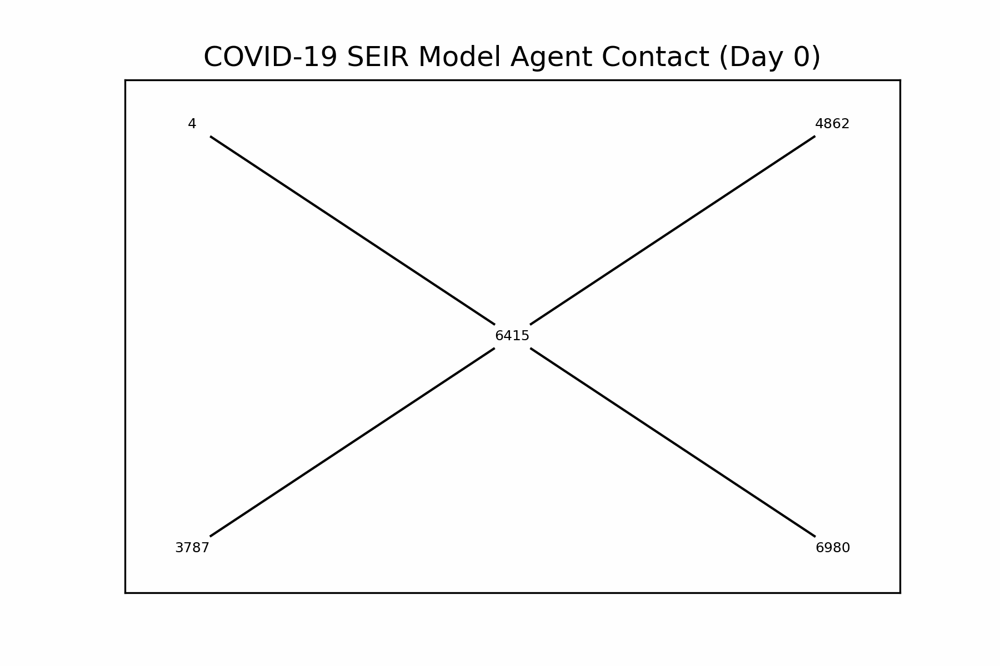

# epiworldpy


- [Installation](#installation)
- [Examples](#examples)
  - [SIR model using a random graph](#sir-model-using-a-random-graph)
  - [SEIR model with a fully connected
    graph](#seir-model-with-a-fully-connected-graph)
  - [Transmission Network](#transmission-network)
  - [Multiple Simulations](#multiple-simulations)
  - [Saving Database Results](#saving-database-results)
- [API](#api)
- [Existing Alternatives](#existing-alternatives)
- [Code of Conduct](#code-of-conduct)

[](https://github.com/UofUEpiBio/epiworldpy/actions/workflows/pip.yaml)
[](https://pypi.org/project/epiworldpy)

This Python package is a wrapper of the C++ library
[epiworld](https://github.com/UofUEpiBio/epiworld). It provides a
general framework for modeling disease transmission using agent-based
models. Some of the main features include:

- Fast simulation with an average of 30 million agents/day per second.
- One model can include multiple diseases.
- Policies (tools) can be multiple and user-defined.
- Transmission can be a function of agents’ features.
- Out-of-the-box parallelization for multiple simulations.

From the package’s description:

> A flexible framework for Agent-Based Models (ABM), the epiworldR
> package provides methods for prototyping disease outbreaks and
> transmission models using a C++ backend, making it very fast. It
> supports multiple epidemiological models, including the
> Susceptible-Infected-Susceptible (SIS), Susceptible-Infected-Removed
> (SIR), Susceptible-Exposed-Infected-Removed (SEIR), and others,
> involving arbitrary mitigation policies and multiple-disease models.
> Users can specify infectiousness/susceptibility rates as a function of
> agents’ features, providing great complexity for the model dynamics.
> Furthermore, epiworldR is ideal for simulation studies featuring large
> populations.

Current available models:

1.  `ModelDiffNet`
2.  `ModelSEIR`
3.  `ModelSEIRCONN`
4.  `ModelSEIRD`
5.  `ModelSEIRDCONN`
6.  `ModelSEIRMixing`
7.  `ModelSIR`
8.  `ModelSIRCONN`
9.  `ModelSIRD`
10. `ModelSIRDCONN`
11. `ModelSIRLogit`
12. `ModelSIRMixing`
13. `ModelSIS`
14. `ModelSISD`
15. `ModelSURV`

Bindings exist for other languages, [namely
R](https://uofuepibio.github.io/epiworldR).

# Installation

Installation can be preformed through pip (pip installs packages).

`pip install epiworldpy`

If there’s a feature that’s only available on the repository, and hasn’t
yet been published to PyPi, please create an issue so we know to get on
publishing. In the meantime, you can clone the repository though Git,
and install locally.

``` bash
git clone https://github.com/uofUEpiBio/epiworldpy
cd epiworldpy

git checkout $WANTED_COMMIT
pip install .
```

# Examples

This Python package includes several popular epidemiological models,
including SIS, SIR, and SEIR using either a fully connected graph
(similar to a compartmental model) or a user-defined network.

## SIR model using a random graph

This Susceptible-Infected-Recovered model features a population of
100,000 agents simulated in a small-world network. Each agent is
connected to ten other agents. One percent of the population has the
virus, with a 70% chance of transmission. Infected individuals recover
at a 0.3 rate:

``` python
# Loading the module
import epiworldpy as epiworld
import epiworldpy.epimodels as epimodels

# Create a SIR model (susceptible, infectious, recovered).
virus = epimodels.ModelSIR(
  name              = 'hypothetical',
  prevalence        = 0.01,
  transmission_rate = 0.7,
  recovery_rate     = 0.3
)

# Adding a Small world population.
virus.agents_smallworld(n = 100000, k = 10, d = False, p = .01)

# Run for 50 days with a seed of 1912.
virus.run(50, 1912)
```

    _________________________________________________________________________
    |Running the model...
    |||||||||||||||||||||||||||||||||||||||||||||||||||||||||||||||||||||||||

    <epiworldpy._core.epimodels.ModelSIR at 0x10fd11cf0>

We can now visualize the model’s compartments/outputs:

``` python
import numpy as np
import matplotlib.pyplot as plt

# Get the data from the database
history = virus.get_db().get_hist_total()

# Extract unique states and dates; states is already unique, since epiworldpy
# encodes lists of strings as a list of unique strings ('values') and an array
# of indices ('indexes').
states = history['states']['values'][history['states']['indexes']]
dates = history['dates']
counts = history['counts']
unique_states = np.unique(states)
unique_dates = np.unique(dates)

# Remove some data that will mess with scaling
unique_states = np.delete(unique_states, np.where(unique_states == 'Susceptible'))

# Initialize a dictionary to store time series data for each state
time_series_data = {state: [] for state in unique_states}

# Populate the time series data for each state
for state in unique_states:
  for date in unique_dates:
    # Get the count for the current state and date
    mask = (states == state) & (dates == date)
    count = counts[mask][0]
    time_series_data[state].append(count)

# Start the plotting!
plt.figure(figsize=(10, 6))

for state in unique_states:
  plt.plot(unique_dates, time_series_data[state], label=state)

plt.xlabel('Day')
plt.ylabel('Count')
plt.title('COVID-19 SEIR Model Data')
plt.legend()
plt.grid(True)
plt.show()
```

<img
src="data:image/svg+xml;base64,PD94bWwgdmVyc2lvbj0iMS4wIiBlbmNvZGluZz0idXRmLTgiIHN0YW5kYWxvbmU9Im5vIj8+CjwhRE9DVFlQRSBzdmcgUFVCTElDICItLy9XM0MvL0RURCBTVkcgMS4xLy9FTiIKICAiaHR0cDovL3d3dy53My5vcmcvR3JhcGhpY3MvU1ZHLzEuMS9EVEQvc3ZnMTEuZHRkIj4KPHN2ZyB4bWxuczp4bGluaz0iaHR0cDovL3d3dy53My5vcmcvMTk5OS94bGluayIgd2lkdGg9IjYzMS4yNTMxMjVwdCIgaGVpZ2h0PSIzOTIuNTE0Mzc1cHQiIHZpZXdCb3g9IjAgMCA2MzEuMjUzMTI1IDM5Mi41MTQzNzUiIHhtbG5zPSJodHRwOi8vd3d3LnczLm9yZy8yMDAwL3N2ZyIgdmVyc2lvbj0iMS4xIj4KIDxtZXRhZGF0YT4KICA8cmRmOlJERiB4bWxuczpkYz0iaHR0cDovL3B1cmwub3JnL2RjL2VsZW1lbnRzLzEuMS8iIHhtbG5zOmNjPSJodHRwOi8vY3JlYXRpdmVjb21tb25zLm9yZy9ucyMiIHhtbG5zOnJkZj0iaHR0cDovL3d3dy53My5vcmcvMTk5OS8wMi8yMi1yZGYtc3ludGF4LW5zIyI+CiAgIDxjYzpXb3JrPgogICAgPGRjOnR5cGUgcmRmOnJlc291cmNlPSJodHRwOi8vcHVybC5vcmcvZGMvZGNtaXR5cGUvU3RpbGxJbWFnZSIvPgogICAgPGRjOmRhdGU+MjAyNS0wOS0yMlQxNDozMDoyOS42MjE4NDI8L2RjOmRhdGU+CiAgICA8ZGM6Zm9ybWF0PmltYWdlL3N2Zyt4bWw8L2RjOmZvcm1hdD4KICAgIDxkYzpjcmVhdG9yPgogICAgIDxjYzpBZ2VudD4KICAgICAgPGRjOnRpdGxlPk1hdHBsb3RsaWIgdjMuMTAuNiwgaHR0cHM6Ly9tYXRwbG90bGliLm9yZy88L2RjOnRpdGxlPgogICAgIDwvY2M6QWdlbnQ+CiAgICA8L2RjOmNyZWF0b3I+CiAgIDwvY2M6V29yaz4KICA8L3JkZjpSREY+CiA8L21ldGFkYXRhPgogPGRlZnM+CiAgPHN0eWxlIHR5cGU9InRleHQvY3NzIj4qe3N0cm9rZS1saW5lam9pbjogcm91bmQ7IHN0cm9rZS1saW5lY2FwOiBidXR0fTwvc3R5bGU+CiA8L2RlZnM+CiA8ZyBpZD0iZmlndXJlXzEiPgogIDxnIGlkPSJwYXRjaF8xIj4KICAgPHBhdGggZD0iTSAwIDM5Mi41MTQzNzUgCkwgNjMxLjI1MzEyNSAzOTIuNTE0Mzc1IApMIDYzMS4yNTMxMjUgMCAKTCAwIDAgCnoKIiBzdHlsZT0iZmlsbDogI2ZmZmZmZiIvPgogIDwvZz4KICA8ZyBpZD0iYXhlc18xIj4KICAgPGcgaWQ9InBhdGNoXzIiPgogICAgPHBhdGggZD0iTSA2Ni4wNTMxMjUgMzU0Ljk1ODEyNSAKTCA2MjQuMDUzMTI1IDM1NC45NTgxMjUgCkwgNjI0LjA1MzEyNSAyMi4zMTgxMjUgCkwgNjYuMDUzMTI1IDIyLjMxODEyNSAKegoiIHN0eWxlPSJmaWxsOiAjZmZmZmZmIi8+CiAgIDwvZz4KICAgPGcgaWQ9Im1hdHBsb3RsaWIuYXhpc18xIj4KICAgIDxnIGlkPSJ4dGlja18xIj4KICAgICA8ZyBpZD0ibGluZTJkXzEiPgogICAgICA8cGF0aCBkPSJNIDkxLjQxNjc2MSAzNTQuOTU4MTI1IApMIDkxLjQxNjc2MSAyMi4zMTgxMjUgCiIgY2xpcC1wYXRoPSJ1cmwoI3A0ZjM5YTllYzUyKSIgc3R5bGU9ImZpbGw6IG5vbmU7IHN0cm9rZTogI2IwYjBiMDsgc3Ryb2tlLXdpZHRoOiAwLjg7IHN0cm9rZS1saW5lY2FwOiBzcXVhcmUiLz4KICAgICA8L2c+CiAgICAgPGcgaWQ9ImxpbmUyZF8yIj4KICAgICAgPGRlZnM+CiAgICAgICA8cGF0aCBpZD0ibWYzZWNhNmU5ZGQiIGQ9Ik0gMCAwIApMIDAgMy41IAoiIHN0eWxlPSJzdHJva2U6ICMwMDAwMDA7IHN0cm9rZS13aWR0aDogMC44Ii8+CiAgICAgIDwvZGVmcz4KICAgICAgPGc+CiAgICAgICA8dXNlIHhsaW5rOmhyZWY9IiNtZjNlY2E2ZTlkZCIgeD0iOTEuNDE2NzYxIiB5PSIzNTQuOTU4MTI1IiBzdHlsZT0ic3Ryb2tlOiAjMDAwMDAwOyBzdHJva2Utd2lkdGg6IDAuOCIvPgogICAgICA8L2c+CiAgICAgPC9nPgogICAgIDxnIGlkPSJ0ZXh0XzEiPgogICAgICA8IS0tIDAgLS0+CiAgICAgIDxnIHRyYW5zZm9ybT0idHJhbnNsYXRlKDg4LjIzNTUxMSAzNjkuNTU2NTYyKSBzY2FsZSgwLjEgLTAuMSkiPgogICAgICAgPGRlZnM+CiAgICAgICAgPHBhdGggaWQ9IkRlamFWdVNhbnMtMzAiIGQ9Ik0gMjAzNCA0MjUwIApRIDE1NDcgNDI1MCAxMzAxIDM3NzAgClEgMTA1NiAzMjkxIDEwNTYgMjMyOCAKUSAxMDU2IDEzNjkgMTMwMSA4ODkgClEgMTU0NyA0MDkgMjAzNCA0MDkgClEgMjUyNSA0MDkgMjc3MCA4ODkgClEgMzAxNiAxMzY5IDMwMTYgMjMyOCAKUSAzMDE2IDMyOTEgMjc3MCAzNzcwIApRIDI1MjUgNDI1MCAyMDM0IDQyNTAgCnoKTSAyMDM0IDQ3NTAgClEgMjgxOSA0NzUwIDMyMzMgNDEyOSAKUSAzNjQ3IDM1MDkgMzY0NyAyMzI4IApRIDM2NDcgMTE1MCAzMjMzIDUyOSAKUSAyODE5IC05MSAyMDM0IC05MSAKUSAxMjUwIC05MSA4MzYgNTI5IApRIDQyMiAxMTUwIDQyMiAyMzI4IApRIDQyMiAzNTA5IDgzNiA0MTI5IApRIDEyNTAgNDc1MCAyMDM0IDQ3NTAgCnoKIiB0cmFuc2Zvcm09InNjYWxlKDAuMDE1NjI1KSIvPgogICAgICAgPC9kZWZzPgogICAgICAgPHVzZSB4bGluazpocmVmPSIjRGVqYVZ1U2Fucy0zMCIvPgogICAgICA8L2c+CiAgICAgPC9nPgogICAgPC9nPgogICAgPGcgaWQ9Inh0aWNrXzIiPgogICAgIDxnIGlkPSJsaW5lMmRfMyI+CiAgICAgIDxwYXRoIGQ9Ik0gMTkyLjg3MTMwNyAzNTQuOTU4MTI1IApMIDE5Mi44NzEzMDcgMjIuMzE4MTI1IAoiIGNsaXAtcGF0aD0idXJsKCNwNGYzOWE5ZWM1MikiIHN0eWxlPSJmaWxsOiBub25lOyBzdHJva2U6ICNiMGIwYjA7IHN0cm9rZS13aWR0aDogMC44OyBzdHJva2UtbGluZWNhcDogc3F1YXJlIi8+CiAgICAgPC9nPgogICAgIDxnIGlkPSJsaW5lMmRfNCI+CiAgICAgIDxnPgogICAgICAgPHVzZSB4bGluazpocmVmPSIjbWYzZWNhNmU5ZGQiIHg9IjE5Mi44NzEzMDciIHk9IjM1NC45NTgxMjUiIHN0eWxlPSJzdHJva2U6ICMwMDAwMDA7IHN0cm9rZS13aWR0aDogMC44Ii8+CiAgICAgIDwvZz4KICAgICA8L2c+CiAgICAgPGcgaWQ9InRleHRfMiI+CiAgICAgIDwhLS0gMTAgLS0+CiAgICAgIDxnIHRyYW5zZm9ybT0idHJhbnNsYXRlKDE4Ni41MDg4MDcgMzY5LjU1NjU2Mikgc2NhbGUoMC4xIC0wLjEpIj4KICAgICAgIDxkZWZzPgogICAgICAgIDxwYXRoIGlkPSJEZWphVnVTYW5zLTMxIiBkPSJNIDc5NCA1MzEgCkwgMTgyNSA1MzEgCkwgMTgyNSA0MDkxIApMIDcwMyAzODY2IApMIDcwMyA0NDQxIApMIDE4MTkgNDY2NiAKTCAyNDUwIDQ2NjYgCkwgMjQ1MCA1MzEgCkwgMzQ4MSA1MzEgCkwgMzQ4MSAwIApMIDc5NCAwIApMIDc5NCA1MzEgCnoKIiB0cmFuc2Zvcm09InNjYWxlKDAuMDE1NjI1KSIvPgogICAgICAgPC9kZWZzPgogICAgICAgPHVzZSB4bGluazpocmVmPSIjRGVqYVZ1U2Fucy0zMSIvPgogICAgICAgPHVzZSB4bGluazpocmVmPSIjRGVqYVZ1U2Fucy0zMCIgdHJhbnNmb3JtPSJ0cmFuc2xhdGUoNjMuNjIzMDQ3IDApIi8+CiAgICAgIDwvZz4KICAgICA8L2c+CiAgICA8L2c+CiAgICA8ZyBpZD0ieHRpY2tfMyI+CiAgICAgPGcgaWQ9ImxpbmUyZF81Ij4KICAgICAgPHBhdGggZD0iTSAyOTQuMzI1ODUyIDM1NC45NTgxMjUgCkwgMjk0LjMyNTg1MiAyMi4zMTgxMjUgCiIgY2xpcC1wYXRoPSJ1cmwoI3A0ZjM5YTllYzUyKSIgc3R5bGU9ImZpbGw6IG5vbmU7IHN0cm9rZTogI2IwYjBiMDsgc3Ryb2tlLXdpZHRoOiAwLjg7IHN0cm9rZS1saW5lY2FwOiBzcXVhcmUiLz4KICAgICA8L2c+CiAgICAgPGcgaWQ9ImxpbmUyZF82Ij4KICAgICAgPGc+CiAgICAgICA8dXNlIHhsaW5rOmhyZWY9IiNtZjNlY2E2ZTlkZCIgeD0iMjk0LjMyNTg1MiIgeT0iMzU0Ljk1ODEyNSIgc3R5bGU9InN0cm9rZTogIzAwMDAwMDsgc3Ryb2tlLXdpZHRoOiAwLjgiLz4KICAgICAgPC9nPgogICAgIDwvZz4KICAgICA8ZyBpZD0idGV4dF8zIj4KICAgICAgPCEtLSAyMCAtLT4KICAgICAgPGcgdHJhbnNmb3JtPSJ0cmFuc2xhdGUoMjg3Ljk2MzM1MiAzNjkuNTU2NTYyKSBzY2FsZSgwLjEgLTAuMSkiPgogICAgICAgPGRlZnM+CiAgICAgICAgPHBhdGggaWQ9IkRlamFWdVNhbnMtMzIiIGQ9Ik0gMTIyOCA1MzEgCkwgMzQzMSA1MzEgCkwgMzQzMSAwIApMIDQ2OSAwIApMIDQ2OSA1MzEgClEgODI4IDkwMyAxNDQ4IDE1MjkgClEgMjA2OSAyMTU2IDIyMjggMjMzOCAKUSAyNTMxIDI2NzggMjY1MSAyOTE0IApRIDI3NzIgMzE1MCAyNzcyIDMzNzggClEgMjc3MiAzNzUwIDI1MTEgMzk4NCAKUSAyMjUwIDQyMTkgMTgzMSA0MjE5IApRIDE1MzQgNDIxOSAxMjA0IDQxMTYgClEgODc1IDQwMTMgNTAwIDM4MDMgCkwgNTAwIDQ0NDEgClEgODgxIDQ1OTQgMTIxMiA0NjcyIApRIDE1NDQgNDc1MCAxODE5IDQ3NTAgClEgMjU0NCA0NzUwIDI5NzUgNDM4NyAKUSAzNDA2IDQwMjUgMzQwNiAzNDE5IApRIDM0MDYgMzEzMSAzMjk4IDI4NzMgClEgMzE5MSAyNjE2IDI5MDYgMjI2NiAKUSAyODI4IDIxNzUgMjQwOSAxNzQyIApRIDE5OTEgMTMwOSAxMjI4IDUzMSAKegoiIHRyYW5zZm9ybT0ic2NhbGUoMC4wMTU2MjUpIi8+CiAgICAgICA8L2RlZnM+CiAgICAgICA8dXNlIHhsaW5rOmhyZWY9IiNEZWphVnVTYW5zLTMyIi8+CiAgICAgICA8dXNlIHhsaW5rOmhyZWY9IiNEZWphVnVTYW5zLTMwIiB0cmFuc2Zvcm09InRyYW5zbGF0ZSg2My42MjMwNDcgMCkiLz4KICAgICAgPC9nPgogICAgIDwvZz4KICAgIDwvZz4KICAgIDxnIGlkPSJ4dGlja180Ij4KICAgICA8ZyBpZD0ibGluZTJkXzciPgogICAgICA8cGF0aCBkPSJNIDM5NS43ODAzOTggMzU0Ljk1ODEyNSAKTCAzOTUuNzgwMzk4IDIyLjMxODEyNSAKIiBjbGlwLXBhdGg9InVybCgjcDRmMzlhOWVjNTIpIiBzdHlsZT0iZmlsbDogbm9uZTsgc3Ryb2tlOiAjYjBiMGIwOyBzdHJva2Utd2lkdGg6IDAuODsgc3Ryb2tlLWxpbmVjYXA6IHNxdWFyZSIvPgogICAgIDwvZz4KICAgICA8ZyBpZD0ibGluZTJkXzgiPgogICAgICA8Zz4KICAgICAgIDx1c2UgeGxpbms6aHJlZj0iI21mM2VjYTZlOWRkIiB4PSIzOTUuNzgwMzk4IiB5PSIzNTQuOTU4MTI1IiBzdHlsZT0ic3Ryb2tlOiAjMDAwMDAwOyBzdHJva2Utd2lkdGg6IDAuOCIvPgogICAgICA8L2c+CiAgICAgPC9nPgogICAgIDxnIGlkPSJ0ZXh0XzQiPgogICAgICA8IS0tIDMwIC0tPgogICAgICA8ZyB0cmFuc2Zvcm09InRyYW5zbGF0ZSgzODkuNDE3ODk4IDM2OS41NTY1NjIpIHNjYWxlKDAuMSAtMC4xKSI+CiAgICAgICA8ZGVmcz4KICAgICAgICA8cGF0aCBpZD0iRGVqYVZ1U2Fucy0zMyIgZD0iTSAyNTk3IDI1MTYgClEgMzA1MCAyNDE5IDMzMDQgMjExMiAKUSAzNTU5IDE4MDYgMzU1OSAxMzU2IApRIDM1NTkgNjY2IDMwODQgMjg3IApRIDI2MDkgLTkxIDE3MzQgLTkxIApRIDE0NDEgLTkxIDExMzAgLTMzIApRIDgxOSAyNSA0ODggMTQxIApMIDQ4OCA3NTAgClEgNzUwIDU5NyAxMDYyIDUxOSAKUSAxMzc1IDQ0MSAxNzE2IDQ0MSAKUSAyMzA5IDQ0MSAyNjIwIDY3NSAKUSAyOTMxIDkwOSAyOTMxIDEzNTYgClEgMjkzMSAxNzY5IDI2NDIgMjAwMSAKUSAyMzUzIDIyMzQgMTgzOCAyMjM0IApMIDEyOTQgMjIzNCAKTCAxMjk0IDI3NTMgCkwgMTg2MyAyNzUzIApRIDIzMjggMjc1MyAyNTc1IDI5MzkgClEgMjgyMiAzMTI1IDI4MjIgMzQ3NSAKUSAyODIyIDM4MzQgMjU2NyA0MDI2IApRIDIzMTMgNDIxOSAxODM4IDQyMTkgClEgMTU3OCA0MjE5IDEyODEgNDE2MiAKUSA5ODQgNDEwNiA2MjggMzk4OCAKTCA2MjggNDU1MCAKUSA5ODggNDY1MCAxMzAyIDQ3MDAgClEgMTYxNiA0NzUwIDE4OTQgNDc1MCAKUSAyNjEzIDQ3NTAgMzAzMSA0NDIzIApRIDM0NTAgNDA5NyAzNDUwIDM1NDEgClEgMzQ1MCAzMTUzIDMyMjggMjg4NiAKUSAzMDA2IDI2MTkgMjU5NyAyNTE2IAp6CiIgdHJhbnNmb3JtPSJzY2FsZSgwLjAxNTYyNSkiLz4KICAgICAgIDwvZGVmcz4KICAgICAgIDx1c2UgeGxpbms6aHJlZj0iI0RlamFWdVNhbnMtMzMiLz4KICAgICAgIDx1c2UgeGxpbms6aHJlZj0iI0RlamFWdVNhbnMtMzAiIHRyYW5zZm9ybT0idHJhbnNsYXRlKDYzLjYyMzA0NyAwKSIvPgogICAgICA8L2c+CiAgICAgPC9nPgogICAgPC9nPgogICAgPGcgaWQ9Inh0aWNrXzUiPgogICAgIDxnIGlkPSJsaW5lMmRfOSI+CiAgICAgIDxwYXRoIGQ9Ik0gNDk3LjIzNDk0MyAzNTQuOTU4MTI1IApMIDQ5Ny4yMzQ5NDMgMjIuMzE4MTI1IAoiIGNsaXAtcGF0aD0idXJsKCNwNGYzOWE5ZWM1MikiIHN0eWxlPSJmaWxsOiBub25lOyBzdHJva2U6ICNiMGIwYjA7IHN0cm9rZS13aWR0aDogMC44OyBzdHJva2UtbGluZWNhcDogc3F1YXJlIi8+CiAgICAgPC9nPgogICAgIDxnIGlkPSJsaW5lMmRfMTAiPgogICAgICA8Zz4KICAgICAgIDx1c2UgeGxpbms6aHJlZj0iI21mM2VjYTZlOWRkIiB4PSI0OTcuMjM0OTQzIiB5PSIzNTQuOTU4MTI1IiBzdHlsZT0ic3Ryb2tlOiAjMDAwMDAwOyBzdHJva2Utd2lkdGg6IDAuOCIvPgogICAgICA8L2c+CiAgICAgPC9nPgogICAgIDxnIGlkPSJ0ZXh0XzUiPgogICAgICA8IS0tIDQwIC0tPgogICAgICA8ZyB0cmFuc2Zvcm09InRyYW5zbGF0ZSg0OTAuODcyNDQzIDM2OS41NTY1NjIpIHNjYWxlKDAuMSAtMC4xKSI+CiAgICAgICA8ZGVmcz4KICAgICAgICA8cGF0aCBpZD0iRGVqYVZ1U2Fucy0zNCIgZD0iTSAyNDE5IDQxMTYgCkwgODI1IDE2MjUgCkwgMjQxOSAxNjI1IApMIDI0MTkgNDExNiAKegpNIDIyNTMgNDY2NiAKTCAzMDQ3IDQ2NjYgCkwgMzA0NyAxNjI1IApMIDM3MTMgMTYyNSAKTCAzNzEzIDExMDAgCkwgMzA0NyAxMTAwIApMIDMwNDcgMCAKTCAyNDE5IDAgCkwgMjQxOSAxMTAwIApMIDMxMyAxMTAwIApMIDMxMyAxNzA5IApMIDIyNTMgNDY2NiAKegoiIHRyYW5zZm9ybT0ic2NhbGUoMC4wMTU2MjUpIi8+CiAgICAgICA8L2RlZnM+CiAgICAgICA8dXNlIHhsaW5rOmhyZWY9IiNEZWphVnVTYW5zLTM0Ii8+CiAgICAgICA8dXNlIHhsaW5rOmhyZWY9IiNEZWphVnVTYW5zLTMwIiB0cmFuc2Zvcm09InRyYW5zbGF0ZSg2My42MjMwNDcgMCkiLz4KICAgICAgPC9nPgogICAgIDwvZz4KICAgIDwvZz4KICAgIDxnIGlkPSJ4dGlja182Ij4KICAgICA8ZyBpZD0ibGluZTJkXzExIj4KICAgICAgPHBhdGggZD0iTSA1OTguNjg5NDg5IDM1NC45NTgxMjUgCkwgNTk4LjY4OTQ4OSAyMi4zMTgxMjUgCiIgY2xpcC1wYXRoPSJ1cmwoI3A0ZjM5YTllYzUyKSIgc3R5bGU9ImZpbGw6IG5vbmU7IHN0cm9rZTogI2IwYjBiMDsgc3Ryb2tlLXdpZHRoOiAwLjg7IHN0cm9rZS1saW5lY2FwOiBzcXVhcmUiLz4KICAgICA8L2c+CiAgICAgPGcgaWQ9ImxpbmUyZF8xMiI+CiAgICAgIDxnPgogICAgICAgPHVzZSB4bGluazpocmVmPSIjbWYzZWNhNmU5ZGQiIHg9IjU5OC42ODk0ODkiIHk9IjM1NC45NTgxMjUiIHN0eWxlPSJzdHJva2U6ICMwMDAwMDA7IHN0cm9rZS13aWR0aDogMC44Ii8+CiAgICAgIDwvZz4KICAgICA8L2c+CiAgICAgPGcgaWQ9InRleHRfNiI+CiAgICAgIDwhLS0gNTAgLS0+CiAgICAgIDxnIHRyYW5zZm9ybT0idHJhbnNsYXRlKDU5Mi4zMjY5ODkgMzY5LjU1NjU2Mikgc2NhbGUoMC4xIC0wLjEpIj4KICAgICAgIDxkZWZzPgogICAgICAgIDxwYXRoIGlkPSJEZWphVnVTYW5zLTM1IiBkPSJNIDY5MSA0NjY2IApMIDMxNjkgNDY2NiAKTCAzMTY5IDQxMzQgCkwgMTI2OSA0MTM0IApMIDEyNjkgMjk5MSAKUSAxNDA2IDMwMzggMTU0MyAzMDYxIApRIDE2ODEgMzA4NCAxODE5IDMwODQgClEgMjYwMCAzMDg0IDMwNTYgMjY1NiAKUSAzNTEzIDIyMjggMzUxMyAxNDk3IApRIDM1MTMgNzQ0IDMwNDQgMzI2IApRIDI1NzUgLTkxIDE3MjIgLTkxIApRIDE0MjggLTkxIDExMjMgLTQxIApRIDgxOSA5IDQ5NCAxMDkgCkwgNDk0IDc0NCAKUSA3NzUgNTkxIDEwNzUgNTE2IApRIDEzNzUgNDQxIDE3MDkgNDQxIApRIDIyNTAgNDQxIDI1NjUgNzI1IApRIDI4ODEgMTAwOSAyODgxIDE0OTcgClEgMjg4MSAxOTg0IDI1NjUgMjI2OCAKUSAyMjUwIDI1NTMgMTcwOSAyNTUzIApRIDE0NTYgMjU1MyAxMjA0IDI0OTcgClEgOTUzIDI0NDEgNjkxIDIzMjIgCkwgNjkxIDQ2NjYgCnoKIiB0cmFuc2Zvcm09InNjYWxlKDAuMDE1NjI1KSIvPgogICAgICAgPC9kZWZzPgogICAgICAgPHVzZSB4bGluazpocmVmPSIjRGVqYVZ1U2Fucy0zNSIvPgogICAgICAgPHVzZSB4bGluazpocmVmPSIjRGVqYVZ1U2Fucy0zMCIgdHJhbnNmb3JtPSJ0cmFuc2xhdGUoNjMuNjIzMDQ3IDApIi8+CiAgICAgIDwvZz4KICAgICA8L2c+CiAgICA8L2c+CiAgICA8ZyBpZD0idGV4dF83Ij4KICAgICA8IS0tIERheSAtLT4KICAgICA8ZyB0cmFuc2Zvcm09InRyYW5zbGF0ZSgzMzUuMTc5Njg4IDM4My4yMzQ2ODcpIHNjYWxlKDAuMSAtMC4xKSI+CiAgICAgIDxkZWZzPgogICAgICAgPHBhdGggaWQ9IkRlamFWdVNhbnMtNDQiIGQ9Ik0gMTI1OSA0MTQ3IApMIDEyNTkgNTE5IApMIDIwMjIgNTE5IApRIDI5ODggNTE5IDM0MzYgOTU2IApRIDM4ODQgMTM5NCAzODg0IDIzMzggClEgMzg4NCAzMjc1IDM0MzYgMzcxMSAKUSAyOTg4IDQxNDcgMjAyMiA0MTQ3IApMIDEyNTkgNDE0NyAKegpNIDYyOCA0NjY2IApMIDE5MjUgNDY2NiAKUSAzMjgxIDQ2NjYgMzkxNSA0MTAyIApRIDQ1NTAgMzUzOCA0NTUwIDIzMzggClEgNDU1MCAxMTMxIDM5MTIgNTY1IApRIDMyNzUgMCAxOTI1IDAgCkwgNjI4IDAgCkwgNjI4IDQ2NjYgCnoKIiB0cmFuc2Zvcm09InNjYWxlKDAuMDE1NjI1KSIvPgogICAgICAgPHBhdGggaWQ9IkRlamFWdVNhbnMtNjEiIGQ9Ik0gMjE5NCAxNzU5IApRIDE0OTcgMTc1OSAxMjI4IDE2MDAgClEgOTU5IDE0NDEgOTU5IDEwNTYgClEgOTU5IDc1MCAxMTYxIDU3MCAKUSAxMzYzIDM5MSAxNzA5IDM5MSAKUSAyMTg4IDM5MSAyNDc3IDczMCAKUSAyNzY2IDEwNjkgMjc2NiAxNjMxIApMIDI3NjYgMTc1OSAKTCAyMTk0IDE3NTkgCnoKTSAzMzQxIDE5OTcgCkwgMzM0MSAwIApMIDI3NjYgMCAKTCAyNzY2IDUzMSAKUSAyNTY5IDIxMyAyMjc1IDYxIApRIDE5ODEgLTkxIDE1NTYgLTkxIApRIDEwMTkgLTkxIDcwMSAyMTEgClEgMzg0IDUxMyAzODQgMTAxOSAKUSAzODQgMTYwOSA3NzkgMTkwOSAKUSAxMTc1IDIyMDkgMTk1OSAyMjA5IApMIDI3NjYgMjIwOSAKTCAyNzY2IDIyNjYgClEgMjc2NiAyNjYzIDI1MDUgMjg4MCAKUSAyMjQ0IDMwOTcgMTc3MiAzMDk3IApRIDE0NzIgMzA5NyAxMTg3IDMwMjUgClEgOTAzIDI5NTMgNjQxIDI4MDkgCkwgNjQxIDMzNDEgClEgOTU2IDM0NjMgMTI1MyAzNTIzIApRIDE1NTAgMzU4NCAxODMxIDM1ODQgClEgMjU5MSAzNTg0IDI5NjYgMzE5MCAKUSAzMzQxIDI3OTcgMzM0MSAxOTk3IAp6CiIgdHJhbnNmb3JtPSJzY2FsZSgwLjAxNTYyNSkiLz4KICAgICAgIDxwYXRoIGlkPSJEZWphVnVTYW5zLTc5IiBkPSJNIDIwNTkgLTMyNSAKUSAxODE2IC05NTAgMTU4NCAtMTE0MCAKUSAxMzUzIC0xMzMxIDk2NiAtMTMzMSAKTCA1MDYgLTEzMzEgCkwgNTA2IC04NTAgCkwgODQ0IC04NTAgClEgMTA4MSAtODUwIDEyMTIgLTczNyAKUSAxMzQ0IC02MjUgMTUwMyAtMjA2IApMIDE2MDYgNTYgCkwgMTkxIDM1MDAgCkwgODAwIDM1MDAgCkwgMTg5NCA3NjMgCkwgMjk4OCAzNTAwIApMIDM1OTcgMzUwMCAKTCAyMDU5IC0zMjUgCnoKIiB0cmFuc2Zvcm09InNjYWxlKDAuMDE1NjI1KSIvPgogICAgICA8L2RlZnM+CiAgICAgIDx1c2UgeGxpbms6aHJlZj0iI0RlamFWdVNhbnMtNDQiLz4KICAgICAgPHVzZSB4bGluazpocmVmPSIjRGVqYVZ1U2Fucy02MSIgdHJhbnNmb3JtPSJ0cmFuc2xhdGUoNzcuMDAxOTUzIDApIi8+CiAgICAgIDx1c2UgeGxpbms6aHJlZj0iI0RlamFWdVNhbnMtNzkiIHRyYW5zZm9ybT0idHJhbnNsYXRlKDEzOC4yODEyNSAwKSIvPgogICAgIDwvZz4KICAgIDwvZz4KICAgPC9nPgogICA8ZyBpZD0ibWF0cGxvdGxpYi5heGlzXzIiPgogICAgPGcgaWQ9Inl0aWNrXzEiPgogICAgIDxnIGlkPSJsaW5lMmRfMTMiPgogICAgICA8cGF0aCBkPSJNIDY2LjA1MzEyNSAzMzkuODM4MTI1IApMIDYyNC4wNTMxMjUgMzM5LjgzODEyNSAKIiBjbGlwLXBhdGg9InVybCgjcDRmMzlhOWVjNTIpIiBzdHlsZT0iZmlsbDogbm9uZTsgc3Ryb2tlOiAjYjBiMGIwOyBzdHJva2Utd2lkdGg6IDAuODsgc3Ryb2tlLWxpbmVjYXA6IHNxdWFyZSIvPgogICAgIDwvZz4KICAgICA8ZyBpZD0ibGluZTJkXzE0Ij4KICAgICAgPGRlZnM+CiAgICAgICA8cGF0aCBpZD0ibWJkNjcwMjlhODkiIGQ9Ik0gMCAwIApMIC0zLjUgMCAKIiBzdHlsZT0ic3Ryb2tlOiAjMDAwMDAwOyBzdHJva2Utd2lkdGg6IDAuOCIvPgogICAgICA8L2RlZnM+CiAgICAgIDxnPgogICAgICAgPHVzZSB4bGluazpocmVmPSIjbWJkNjcwMjlhODkiIHg9IjY2LjA1MzEyNSIgeT0iMzM5LjgzODEyNSIgc3R5bGU9InN0cm9rZTogIzAwMDAwMDsgc3Ryb2tlLXdpZHRoOiAwLjgiLz4KICAgICAgPC9nPgogICAgIDwvZz4KICAgICA8ZyBpZD0idGV4dF84Ij4KICAgICAgPCEtLSAwIC0tPgogICAgICA8ZyB0cmFuc2Zvcm09InRyYW5zbGF0ZSg1Mi42OTA2MjUgMzQzLjYzNzM0NCkgc2NhbGUoMC4xIC0wLjEpIj4KICAgICAgIDx1c2UgeGxpbms6aHJlZj0iI0RlamFWdVNhbnMtMzAiLz4KICAgICAgPC9nPgogICAgIDwvZz4KICAgIDwvZz4KICAgIDxnIGlkPSJ5dGlja18yIj4KICAgICA8ZyBpZD0ibGluZTJkXzE1Ij4KICAgICAgPHBhdGggZD0iTSA2Ni4wNTMxMjUgMjc4LjYwMDYxNyAKTCA2MjQuMDUzMTI1IDI3OC42MDA2MTcgCiIgY2xpcC1wYXRoPSJ1cmwoI3A0ZjM5YTllYzUyKSIgc3R5bGU9ImZpbGw6IG5vbmU7IHN0cm9rZTogI2IwYjBiMDsgc3Ryb2tlLXdpZHRoOiAwLjg7IHN0cm9rZS1saW5lY2FwOiBzcXVhcmUiLz4KICAgICA8L2c+CiAgICAgPGcgaWQ9ImxpbmUyZF8xNiI+CiAgICAgIDxnPgogICAgICAgPHVzZSB4bGluazpocmVmPSIjbWJkNjcwMjlhODkiIHg9IjY2LjA1MzEyNSIgeT0iMjc4LjYwMDYxNyIgc3R5bGU9InN0cm9rZTogIzAwMDAwMDsgc3Ryb2tlLXdpZHRoOiAwLjgiLz4KICAgICAgPC9nPgogICAgIDwvZz4KICAgICA8ZyBpZD0idGV4dF85Ij4KICAgICAgPCEtLSAyMDAwMCAtLT4KICAgICAgPGcgdHJhbnNmb3JtPSJ0cmFuc2xhdGUoMjcuMjQwNjI1IDI4Mi4zOTk4MzYpIHNjYWxlKDAuMSAtMC4xKSI+CiAgICAgICA8dXNlIHhsaW5rOmhyZWY9IiNEZWphVnVTYW5zLTMyIi8+CiAgICAgICA8dXNlIHhsaW5rOmhyZWY9IiNEZWphVnVTYW5zLTMwIiB0cmFuc2Zvcm09InRyYW5zbGF0ZSg2My42MjMwNDcgMCkiLz4KICAgICAgIDx1c2UgeGxpbms6aHJlZj0iI0RlamFWdVNhbnMtMzAiIHRyYW5zZm9ybT0idHJhbnNsYXRlKDEyNy4yNDYwOTQgMCkiLz4KICAgICAgIDx1c2UgeGxpbms6aHJlZj0iI0RlamFWdVNhbnMtMzAiIHRyYW5zZm9ybT0idHJhbnNsYXRlKDE5MC44NjkxNDEgMCkiLz4KICAgICAgIDx1c2UgeGxpbms6aHJlZj0iI0RlamFWdVNhbnMtMzAiIHRyYW5zZm9ybT0idHJhbnNsYXRlKDI1NC40OTIxODggMCkiLz4KICAgICAgPC9nPgogICAgIDwvZz4KICAgIDwvZz4KICAgIDxnIGlkPSJ5dGlja18zIj4KICAgICA8ZyBpZD0ibGluZTJkXzE3Ij4KICAgICAgPHBhdGggZD0iTSA2Ni4wNTMxMjUgMjE3LjM2MzEwOSAKTCA2MjQuMDUzMTI1IDIxNy4zNjMxMDkgCiIgY2xpcC1wYXRoPSJ1cmwoI3A0ZjM5YTllYzUyKSIgc3R5bGU9ImZpbGw6IG5vbmU7IHN0cm9rZTogI2IwYjBiMDsgc3Ryb2tlLXdpZHRoOiAwLjg7IHN0cm9rZS1saW5lY2FwOiBzcXVhcmUiLz4KICAgICA8L2c+CiAgICAgPGcgaWQ9ImxpbmUyZF8xOCI+CiAgICAgIDxnPgogICAgICAgPHVzZSB4bGluazpocmVmPSIjbWJkNjcwMjlhODkiIHg9IjY2LjA1MzEyNSIgeT0iMjE3LjM2MzEwOSIgc3R5bGU9InN0cm9rZTogIzAwMDAwMDsgc3Ryb2tlLXdpZHRoOiAwLjgiLz4KICAgICAgPC9nPgogICAgIDwvZz4KICAgICA8ZyBpZD0idGV4dF8xMCI+CiAgICAgIDwhLS0gNDAwMDAgLS0+CiAgICAgIDxnIHRyYW5zZm9ybT0idHJhbnNsYXRlKDI3LjI0MDYyNSAyMjEuMTYyMzI4KSBzY2FsZSgwLjEgLTAuMSkiPgogICAgICAgPHVzZSB4bGluazpocmVmPSIjRGVqYVZ1U2Fucy0zNCIvPgogICAgICAgPHVzZSB4bGluazpocmVmPSIjRGVqYVZ1U2Fucy0zMCIgdHJhbnNmb3JtPSJ0cmFuc2xhdGUoNjMuNjIzMDQ3IDApIi8+CiAgICAgICA8dXNlIHhsaW5rOmhyZWY9IiNEZWphVnVTYW5zLTMwIiB0cmFuc2Zvcm09InRyYW5zbGF0ZSgxMjcuMjQ2MDk0IDApIi8+CiAgICAgICA8dXNlIHhsaW5rOmhyZWY9IiNEZWphVnVTYW5zLTMwIiB0cmFuc2Zvcm09InRyYW5zbGF0ZSgxOTAuODY5MTQxIDApIi8+CiAgICAgICA8dXNlIHhsaW5rOmhyZWY9IiNEZWphVnVTYW5zLTMwIiB0cmFuc2Zvcm09InRyYW5zbGF0ZSgyNTQuNDkyMTg4IDApIi8+CiAgICAgIDwvZz4KICAgICA8L2c+CiAgICA8L2c+CiAgICA8ZyBpZD0ieXRpY2tfNCI+CiAgICAgPGcgaWQ9ImxpbmUyZF8xOSI+CiAgICAgIDxwYXRoIGQ9Ik0gNjYuMDUzMTI1IDE1Ni4xMjU2MDEgCkwgNjI0LjA1MzEyNSAxNTYuMTI1NjAxIAoiIGNsaXAtcGF0aD0idXJsKCNwNGYzOWE5ZWM1MikiIHN0eWxlPSJmaWxsOiBub25lOyBzdHJva2U6ICNiMGIwYjA7IHN0cm9rZS13aWR0aDogMC44OyBzdHJva2UtbGluZWNhcDogc3F1YXJlIi8+CiAgICAgPC9nPgogICAgIDxnIGlkPSJsaW5lMmRfMjAiPgogICAgICA8Zz4KICAgICAgIDx1c2UgeGxpbms6aHJlZj0iI21iZDY3MDI5YTg5IiB4PSI2Ni4wNTMxMjUiIHk9IjE1Ni4xMjU2MDEiIHN0eWxlPSJzdHJva2U6ICMwMDAwMDA7IHN0cm9rZS13aWR0aDogMC44Ii8+CiAgICAgIDwvZz4KICAgICA8L2c+CiAgICAgPGcgaWQ9InRleHRfMTEiPgogICAgICA8IS0tIDYwMDAwIC0tPgogICAgICA8ZyB0cmFuc2Zvcm09InRyYW5zbGF0ZSgyNy4yNDA2MjUgMTU5LjkyNDgyKSBzY2FsZSgwLjEgLTAuMSkiPgogICAgICAgPGRlZnM+CiAgICAgICAgPHBhdGggaWQ9IkRlamFWdVNhbnMtMzYiIGQ9Ik0gMjExMyAyNTg0IApRIDE2ODggMjU4NCAxNDM5IDIyOTMgClEgMTE5MSAyMDAzIDExOTEgMTQ5NyAKUSAxMTkxIDk5NCAxNDM5IDcwMSAKUSAxNjg4IDQwOSAyMTEzIDQwOSAKUSAyNTM4IDQwOSAyNzg2IDcwMSAKUSAzMDM0IDk5NCAzMDM0IDE0OTcgClEgMzAzNCAyMDAzIDI3ODYgMjI5MyAKUSAyNTM4IDI1ODQgMjExMyAyNTg0IAp6Ck0gMzM2NiA0NTYzIApMIDMzNjYgMzk4OCAKUSAzMTI4IDQxMDAgMjg4NiA0MTU5IApRIDI2NDQgNDIxOSAyNDA2IDQyMTkgClEgMTc4MSA0MjE5IDE0NTEgMzc5NyAKUSAxMTIyIDMzNzUgMTA3NSAyNTIyIApRIDEyNTkgMjc5NCAxNTM3IDI5MzkgClEgMTgxNiAzMDg0IDIxNTAgMzA4NCAKUSAyODUzIDMwODQgMzI2MSAyNjU3IApRIDM2NjkgMjIzMSAzNjY5IDE0OTcgClEgMzY2OSA3NzggMzI0NCAzNDMgClEgMjgxOSAtOTEgMjExMyAtOTEgClEgMTMwMyAtOTEgODc1IDUyOSAKUSA0NDcgMTE1MCA0NDcgMjMyOCAKUSA0NDcgMzQzNCA5NzIgNDA5MiAKUSAxNDk3IDQ3NTAgMjM4MSA0NzUwIApRIDI2MTkgNDc1MCAyODYxIDQ3MDMgClEgMzEwMyA0NjU2IDMzNjYgNDU2MyAKegoiIHRyYW5zZm9ybT0ic2NhbGUoMC4wMTU2MjUpIi8+CiAgICAgICA8L2RlZnM+CiAgICAgICA8dXNlIHhsaW5rOmhyZWY9IiNEZWphVnVTYW5zLTM2Ii8+CiAgICAgICA8dXNlIHhsaW5rOmhyZWY9IiNEZWphVnVTYW5zLTMwIiB0cmFuc2Zvcm09InRyYW5zbGF0ZSg2My42MjMwNDcgMCkiLz4KICAgICAgIDx1c2UgeGxpbms6aHJlZj0iI0RlamFWdVNhbnMtMzAiIHRyYW5zZm9ybT0idHJhbnNsYXRlKDEyNy4yNDYwOTQgMCkiLz4KICAgICAgIDx1c2UgeGxpbms6aHJlZj0iI0RlamFWdVNhbnMtMzAiIHRyYW5zZm9ybT0idHJhbnNsYXRlKDE5MC44NjkxNDEgMCkiLz4KICAgICAgIDx1c2UgeGxpbms6aHJlZj0iI0RlamFWdVNhbnMtMzAiIHRyYW5zZm9ybT0idHJhbnNsYXRlKDI1NC40OTIxODggMCkiLz4KICAgICAgPC9nPgogICAgIDwvZz4KICAgIDwvZz4KICAgIDxnIGlkPSJ5dGlja181Ij4KICAgICA8ZyBpZD0ibGluZTJkXzIxIj4KICAgICAgPHBhdGggZD0iTSA2Ni4wNTMxMjUgOTQuODg4MDkzIApMIDYyNC4wNTMxMjUgOTQuODg4MDkzIAoiIGNsaXAtcGF0aD0idXJsKCNwNGYzOWE5ZWM1MikiIHN0eWxlPSJmaWxsOiBub25lOyBzdHJva2U6ICNiMGIwYjA7IHN0cm9rZS13aWR0aDogMC44OyBzdHJva2UtbGluZWNhcDogc3F1YXJlIi8+CiAgICAgPC9nPgogICAgIDxnIGlkPSJsaW5lMmRfMjIiPgogICAgICA8Zz4KICAgICAgIDx1c2UgeGxpbms6aHJlZj0iI21iZDY3MDI5YTg5IiB4PSI2Ni4wNTMxMjUiIHk9Ijk0Ljg4ODA5MyIgc3R5bGU9InN0cm9rZTogIzAwMDAwMDsgc3Ryb2tlLXdpZHRoOiAwLjgiLz4KICAgICAgPC9nPgogICAgIDwvZz4KICAgICA8ZyBpZD0idGV4dF8xMiI+CiAgICAgIDwhLS0gODAwMDAgLS0+CiAgICAgIDxnIHRyYW5zZm9ybT0idHJhbnNsYXRlKDI3LjI0MDYyNSA5OC42ODczMTIpIHNjYWxlKDAuMSAtMC4xKSI+CiAgICAgICA8ZGVmcz4KICAgICAgICA8cGF0aCBpZD0iRGVqYVZ1U2Fucy0zOCIgZD0iTSAyMDM0IDIyMTYgClEgMTU4NCAyMjE2IDEzMjYgMTk3NSAKUSAxMDY5IDE3MzQgMTA2OSAxMzEzIApRIDEwNjkgODkxIDEzMjYgNjUwIApRIDE1ODQgNDA5IDIwMzQgNDA5IApRIDI0ODQgNDA5IDI3NDMgNjUxIApRIDMwMDMgODk0IDMwMDMgMTMxMyAKUSAzMDAzIDE3MzQgMjc0NSAxOTc1IApRIDI0ODggMjIxNiAyMDM0IDIyMTYgCnoKTSAxNDAzIDI0ODQgClEgOTk3IDI1ODQgNzcwIDI4NjIgClEgNTQ0IDMxNDEgNTQ0IDM1NDEgClEgNTQ0IDQxMDAgOTQyIDQ0MjUgClEgMTM0MSA0NzUwIDIwMzQgNDc1MCAKUSAyNzMxIDQ3NTAgMzEyOCA0NDI1IApRIDM1MjUgNDEwMCAzNTI1IDM1NDEgClEgMzUyNSAzMTQxIDMyOTggMjg2MiAKUSAzMDcyIDI1ODQgMjY2OSAyNDg0IApRIDMxMjUgMjM3OCAzMzc5IDIwNjggClEgMzYzNCAxNzU5IDM2MzQgMTMxMyAKUSAzNjM0IDYzNCAzMjIwIDI3MSAKUSAyODA2IC05MSAyMDM0IC05MSAKUSAxMjYzIC05MSA4NDggMjcxIApRIDQzNCA2MzQgNDM0IDEzMTMgClEgNDM0IDE3NTkgNjkwIDIwNjggClEgOTQ3IDIzNzggMTQwMyAyNDg0IAp6Ck0gMTE3MiAzNDgxIApRIDExNzIgMzExOSAxMzk4IDI5MTYgClEgMTYyNSAyNzEzIDIwMzQgMjcxMyAKUSAyNDQxIDI3MTMgMjY3MCAyOTE2IApRIDI5MDAgMzExOSAyOTAwIDM0ODEgClEgMjkwMCAzODQ0IDI2NzAgNDA0NyAKUSAyNDQxIDQyNTAgMjAzNCA0MjUwIApRIDE2MjUgNDI1MCAxMzk4IDQwNDcgClEgMTE3MiAzODQ0IDExNzIgMzQ4MSAKegoiIHRyYW5zZm9ybT0ic2NhbGUoMC4wMTU2MjUpIi8+CiAgICAgICA8L2RlZnM+CiAgICAgICA8dXNlIHhsaW5rOmhyZWY9IiNEZWphVnVTYW5zLTM4Ii8+CiAgICAgICA8dXNlIHhsaW5rOmhyZWY9IiNEZWphVnVTYW5zLTMwIiB0cmFuc2Zvcm09InRyYW5zbGF0ZSg2My42MjMwNDcgMCkiLz4KICAgICAgIDx1c2UgeGxpbms6aHJlZj0iI0RlamFWdVNhbnMtMzAiIHRyYW5zZm9ybT0idHJhbnNsYXRlKDEyNy4yNDYwOTQgMCkiLz4KICAgICAgIDx1c2UgeGxpbms6aHJlZj0iI0RlamFWdVNhbnMtMzAiIHRyYW5zZm9ybT0idHJhbnNsYXRlKDE5MC44NjkxNDEgMCkiLz4KICAgICAgIDx1c2UgeGxpbms6aHJlZj0iI0RlamFWdVNhbnMtMzAiIHRyYW5zZm9ybT0idHJhbnNsYXRlKDI1NC40OTIxODggMCkiLz4KICAgICAgPC9nPgogICAgIDwvZz4KICAgIDwvZz4KICAgIDxnIGlkPSJ5dGlja182Ij4KICAgICA8ZyBpZD0ibGluZTJkXzIzIj4KICAgICAgPHBhdGggZD0iTSA2Ni4wNTMxMjUgMzMuNjUwNTg1IApMIDYyNC4wNTMxMjUgMzMuNjUwNTg1IAoiIGNsaXAtcGF0aD0idXJsKCNwNGYzOWE5ZWM1MikiIHN0eWxlPSJmaWxsOiBub25lOyBzdHJva2U6ICNiMGIwYjA7IHN0cm9rZS13aWR0aDogMC44OyBzdHJva2UtbGluZWNhcDogc3F1YXJlIi8+CiAgICAgPC9nPgogICAgIDxnIGlkPSJsaW5lMmRfMjQiPgogICAgICA8Zz4KICAgICAgIDx1c2UgeGxpbms6aHJlZj0iI21iZDY3MDI5YTg5IiB4PSI2Ni4wNTMxMjUiIHk9IjMzLjY1MDU4NSIgc3R5bGU9InN0cm9rZTogIzAwMDAwMDsgc3Ryb2tlLXdpZHRoOiAwLjgiLz4KICAgICAgPC9nPgogICAgIDwvZz4KICAgICA8ZyBpZD0idGV4dF8xMyI+CiAgICAgIDwhLS0gMTAwMDAwIC0tPgogICAgICA8ZyB0cmFuc2Zvcm09InRyYW5zbGF0ZSgyMC44NzgxMjUgMzcuNDQ5ODA0KSBzY2FsZSgwLjEgLTAuMSkiPgogICAgICAgPHVzZSB4bGluazpocmVmPSIjRGVqYVZ1U2Fucy0zMSIvPgogICAgICAgPHVzZSB4bGluazpocmVmPSIjRGVqYVZ1U2Fucy0zMCIgdHJhbnNmb3JtPSJ0cmFuc2xhdGUoNjMuNjIzMDQ3IDApIi8+CiAgICAgICA8dXNlIHhsaW5rOmhyZWY9IiNEZWphVnVTYW5zLTMwIiB0cmFuc2Zvcm09InRyYW5zbGF0ZSgxMjcuMjQ2MDk0IDApIi8+CiAgICAgICA8dXNlIHhsaW5rOmhyZWY9IiNEZWphVnVTYW5zLTMwIiB0cmFuc2Zvcm09InRyYW5zbGF0ZSgxOTAuODY5MTQxIDApIi8+CiAgICAgICA8dXNlIHhsaW5rOmhyZWY9IiNEZWphVnVTYW5zLTMwIiB0cmFuc2Zvcm09InRyYW5zbGF0ZSgyNTQuNDkyMTg4IDApIi8+CiAgICAgICA8dXNlIHhsaW5rOmhyZWY9IiNEZWphVnVTYW5zLTMwIiB0cmFuc2Zvcm09InRyYW5zbGF0ZSgzMTguMTE1MjM0IDApIi8+CiAgICAgIDwvZz4KICAgICA8L2c+CiAgICA8L2c+CiAgICA8ZyBpZD0idGV4dF8xNCI+CiAgICAgPCEtLSBDb3VudCAtLT4KICAgICA8ZyB0cmFuc2Zvcm09InRyYW5zbGF0ZSgxNC43OTg0MzggMjAzLjQ4NjU2Mikgcm90YXRlKC05MCkgc2NhbGUoMC4xIC0wLjEpIj4KICAgICAgPGRlZnM+CiAgICAgICA8cGF0aCBpZD0iRGVqYVZ1U2Fucy00MyIgZD0iTSA0MTIyIDQzMDYgCkwgNDEyMiAzNjQxIApRIDM4MDMgMzkzOCAzNDQyIDQwODQgClEgMzA4MSA0MjMxIDI2NzUgNDIzMSAKUSAxODc1IDQyMzEgMTQ1MCAzNzQyIApRIDEwMjUgMzI1MyAxMDI1IDIzMjggClEgMTAyNSAxNDA2IDE0NTAgOTE3IApRIDE4NzUgNDI4IDI2NzUgNDI4IApRIDMwODEgNDI4IDM0NDIgNTc1IApRIDM4MDMgNzIyIDQxMjIgMTAxOSAKTCA0MTIyIDM1OSAKUSAzNzkxIDEzNCAzNDIwIDIxIApRIDMwNTAgLTkxIDI2MzggLTkxIApRIDE1NzggLTkxIDk2OCA1NTcgClEgMzU5IDEyMDYgMzU5IDIzMjggClEgMzU5IDM0NTMgOTY4IDQxMDEgClEgMTU3OCA0NzUwIDI2MzggNDc1MCAKUSAzMDU2IDQ3NTAgMzQyNiA0NjM5IApRIDM3OTcgNDUyOCA0MTIyIDQzMDYgCnoKIiB0cmFuc2Zvcm09InNjYWxlKDAuMDE1NjI1KSIvPgogICAgICAgPHBhdGggaWQ9IkRlamFWdVNhbnMtNmYiIGQ9Ik0gMTk1OSAzMDk3IApRIDE0OTcgMzA5NyAxMjI4IDI3MzYgClEgOTU5IDIzNzUgOTU5IDE3NDcgClEgOTU5IDExMTkgMTIyNiA3NTggClEgMTQ5NCAzOTcgMTk1OSAzOTcgClEgMjQxOSAzOTcgMjY4NyA3NTkgClEgMjk1NiAxMTIyIDI5NTYgMTc0NyAKUSAyOTU2IDIzNjkgMjY4NyAyNzMzIApRIDI0MTkgMzA5NyAxOTU5IDMwOTcgCnoKTSAxOTU5IDM1ODQgClEgMjcwOSAzNTg0IDMxMzcgMzA5NiAKUSAzNTY2IDI2MDkgMzU2NiAxNzQ3IApRIDM1NjYgODg4IDMxMzcgMzk4IApRIDI3MDkgLTkxIDE5NTkgLTkxIApRIDEyMDYgLTkxIDc3OSAzOTggClEgMzUzIDg4OCAzNTMgMTc0NyAKUSAzNTMgMjYwOSA3NzkgMzA5NiAKUSAxMjA2IDM1ODQgMTk1OSAzNTg0IAp6CiIgdHJhbnNmb3JtPSJzY2FsZSgwLjAxNTYyNSkiLz4KICAgICAgIDxwYXRoIGlkPSJEZWphVnVTYW5zLTc1IiBkPSJNIDU0NCAxMzgxIApMIDU0NCAzNTAwIApMIDExMTkgMzUwMCAKTCAxMTE5IDE0MDMgClEgMTExOSA5MDYgMTMxMiA2NTcgClEgMTUwNiA0MDkgMTg5NCA0MDkgClEgMjM1OSA0MDkgMjYyOSA3MDYgClEgMjkwMCAxMDAzIDI5MDAgMTUxNiAKTCAyOTAwIDM1MDAgCkwgMzQ3NSAzNTAwIApMIDM0NzUgMCAKTCAyOTAwIDAgCkwgMjkwMCA1MzggClEgMjY5MSAyMTkgMjQxNCA2NCAKUSAyMTM4IC05MSAxNzcyIC05MSAKUSAxMTY5IC05MSA4NTYgMjg0IApRIDU0NCA2NTkgNTQ0IDEzODEgCnoKTSAxOTkxIDM1ODQgCkwgMTk5MSAzNTg0IAp6CiIgdHJhbnNmb3JtPSJzY2FsZSgwLjAxNTYyNSkiLz4KICAgICAgIDxwYXRoIGlkPSJEZWphVnVTYW5zLTZlIiBkPSJNIDM1MTMgMjExMyAKTCAzNTEzIDAgCkwgMjkzOCAwIApMIDI5MzggMjA5NCAKUSAyOTM4IDI1OTEgMjc0NCAyODM3IApRIDI1NTAgMzA4NCAyMTYzIDMwODQgClEgMTY5NyAzMDg0IDE0MjggMjc4NyAKUSAxMTU5IDI0OTEgMTE1OSAxOTc4IApMIDExNTkgMCAKTCA1ODEgMCAKTCA1ODEgMzUwMCAKTCAxMTU5IDM1MDAgCkwgMTE1OSAyOTU2IApRIDEzNjYgMzI3MiAxNjQ1IDM0MjggClEgMTkyNSAzNTg0IDIyOTEgMzU4NCAKUSAyODk0IDM1ODQgMzIwMyAzMjExIApRIDM1MTMgMjgzOCAzNTEzIDIxMTMgCnoKIiB0cmFuc2Zvcm09InNjYWxlKDAuMDE1NjI1KSIvPgogICAgICAgPHBhdGggaWQ9IkRlamFWdVNhbnMtNzQiIGQ9Ik0gMTE3MiA0NDk0IApMIDExNzIgMzUwMCAKTCAyMzU2IDM1MDAgCkwgMjM1NiAzMDUzIApMIDExNzIgMzA1MyAKTCAxMTcyIDExNTMgClEgMTE3MiA3MjUgMTI4OSA2MDMgClEgMTQwNiA0ODEgMTc2NiA0ODEgCkwgMjM1NiA0ODEgCkwgMjM1NiAwIApMIDE3NjYgMCAKUSAxMTAwIDAgODQ3IDI0OCAKUSA1OTQgNDk3IDU5NCAxMTUzIApMIDU5NCAzMDUzIApMIDE3MiAzMDUzIApMIDE3MiAzNTAwIApMIDU5NCAzNTAwIApMIDU5NCA0NDk0IApMIDExNzIgNDQ5NCAKegoiIHRyYW5zZm9ybT0ic2NhbGUoMC4wMTU2MjUpIi8+CiAgICAgIDwvZGVmcz4KICAgICAgPHVzZSB4bGluazpocmVmPSIjRGVqYVZ1U2Fucy00MyIvPgogICAgICA8dXNlIHhsaW5rOmhyZWY9IiNEZWphVnVTYW5zLTZmIiB0cmFuc2Zvcm09InRyYW5zbGF0ZSg2OS44MjQyMTkgMCkiLz4KICAgICAgPHVzZSB4bGluazpocmVmPSIjRGVqYVZ1U2Fucy03NSIgdHJhbnNmb3JtPSJ0cmFuc2xhdGUoMTMxLjAwNTg1OSAwKSIvPgogICAgICA8dXNlIHhsaW5rOmhyZWY9IiNEZWphVnVTYW5zLTZlIiB0cmFuc2Zvcm09InRyYW5zbGF0ZSgxOTQuMzg0NzY2IDApIi8+CiAgICAgIDx1c2UgeGxpbms6aHJlZj0iI0RlamFWdVNhbnMtNzQiIHRyYW5zZm9ybT0idHJhbnNsYXRlKDI1Ny43NjM2NzIgMCkiLz4KICAgICA8L2c+CiAgICA8L2c+CiAgIDwvZz4KICAgPGcgaWQ9ImxpbmUyZF8yNSI+CiAgICA8cGF0aCBkPSJNIDkxLjQxNjc2MSAzMzYuNzc2MjUgCkwgMTAxLjU2MjIxNiAzMTcuMDA4NzgyIApMIDExMS43MDc2NyAyOTYuMzQ0MTg1IApMIDEyMS44NTMxMjUgMjg2LjEzMjgzMSAKTCAxMzEuOTk4NTggMjgxLjM0NDA1NyAKTCAxNDIuMTQ0MDM0IDI3OS44NTI5MjQgCkwgMTUyLjI4OTQ4OSAyODAuNjY3MzgzIApMIDE2Mi40MzQ5NDMgMjgzLjAwMzU5NCAKTCAxNzIuNTgwMzk4IDI4NS41NjAyNiAKTCAxODIuNzI1ODUyIDI4OC43MDc4NjggCkwgMTkyLjg3MTMwNyAyOTIuMjE5ODM5IApMIDIwMy4wMTY3NjEgMjk2LjE5NDE1MyAKTCAyMTMuMTYyMjE2IDI5OS44MDcxNjYgCkwgMjIzLjMwNzY3IDMwMi44MDQ3NDIgCkwgMjMzLjQ1MzEyNSAzMDUuNTE3NTY0IApMIDI0My41OTg1OCAzMDguMzg5NjAzIApMIDI1My43NDQwMzQgMzExLjAzODEyNSAKTCAyNjMuODg5NDg5IDMxMy4xOTM2ODUgCkwgMjc0LjAzNDk0MyAzMTUuMjg0OTQ2IApMIDI4NC4xODAzOTggMzE3LjU5OTcyNCAKTCAyOTQuMzI1ODUyIDMxOS4zNTcyNCAKTCAzMDQuNDcxMzA3IDMyMS40MzAxMyAKTCAzMTQuNjE2NzYxIDMyMy4xMDQ5NzYgCkwgMzI0Ljc2MjIxNiAzMjQuNjc4NzggCkwgMzM0LjkwNzY3IDMyNS45NzM5NTMgCkwgMzQ1LjA1MzEyNSAzMjcuMTM3NDY2IApMIDM1NS4xOTg1OCAzMjguMzgwNTg3IApMIDM2NS4zNDQwMzQgMzI5LjU0MTAzOCAKTCAzNzUuNDg5NDg5IDMzMC42MjE4OCAKTCAzODUuNjM0OTQzIDMzMS41NjE4NzYgCkwgMzk1Ljc4MDM5OCAzMzIuNDgwNDM4IApMIDQwNS45MjU4NTIgMzMzLjEyMDM3IApMIDQxNi4wNzEzMDcgMzMzLjcwMjEyNyAKTCA0MjYuMjE2NzYxIDMzNC4zMzg5OTcgCkwgNDM2LjM2MjIxNiAzMzQuNjg4MDUxIApMIDQ0Ni41MDc2NyAzMzUuMDc2OTA5IApMIDQ1Ni42NTMxMjUgMzM1LjQyNTk2MyAKTCA0NjYuNzk4NTggMzM1LjY2NDc4OSAKTCA0NzYuOTQ0MDM0IDMzNS45NDAzNTggCkwgNDg3LjA4OTQ4OSAzMzYuMjA2NzQxIApMIDQ5Ny4yMzQ5NDMgMzM2LjUwMDY4MSAKTCA1MDcuMzgwMzk4IDMzNi44ODk1MzkgCkwgNTE3LjUyNTg1MiAzMzcuMjIwMjIyIApMIDUyNy42NzEzMDcgMzM3LjQ0MzczOCAKTCA1MzcuODE2NzYxIDMzNy42NjcyNTUgCkwgNTQ3Ljk2MjIxNiAzMzcuOTE1MjY3IApMIDU1OC4xMDc2NyAzMzguMTY5NDAzIApMIDU2OC4yNTMxMjUgMzM4LjIzNjc2NCAKTCA1NzguMzk4NTggMzM4LjI5NDk0IApMIDU4OC41NDQwMzQgMzM4LjQzNTc4NiAKTCA1OTguNjg5NDg5IDMzOC41Njc0NDcgCiIgY2xpcC1wYXRoPSJ1cmwoI3A0ZjM5YTllYzUyKSIgc3R5bGU9ImZpbGw6IG5vbmU7IHN0cm9rZTogIzFmNzdiNDsgc3Ryb2tlLXdpZHRoOiAxLjU7IHN0cm9rZS1saW5lY2FwOiBzcXVhcmUiLz4KICAgPC9nPgogICA8ZyBpZD0ibGluZTJkXzI2Ij4KICAgIDxwYXRoIGQ9Ik0gOTEuNDE2NzYxIDMzOS44MzgxMjUgCkwgMTAxLjU2MjIxNiAzMzguOTIyNjI0IApMIDExMS43MDc2NyAzMzIuMjE0MDU1IApMIDEyMS44NTMxMjUgMzE5LjI5NjAwMyAKTCAxMzEuOTk4NTggMzAzLjExMDkzIApMIDE0Mi4xNDQwMzQgMjg1LjU5MDg3OSAKTCAxNTIuMjg5NDg5IDI2Ny43NjE1NzggCkwgMTYyLjQzNDk0MyAyNDkuODI1MTEyIApMIDE3Mi41ODAzOTggMjMyLjk3MjU1IApMIDE4Mi43MjU4NTIgMjE2LjgwNTg0OCAKTCAxOTIuODcxMzA3IDIwMS41MDI1OTQgCkwgMjAzLjAxNjc2MSAxODYuOTk1NDI5IApMIDIxMy4xNjIyMTYgMTczLjgyOTM2NSAKTCAyMjMuMzA3NjcgMTYxLjkwMzM2IApMIDIzMy40NTMxMjUgMTUwLjgzMTYxOSAKTCAyNDMuNTk4NTggMTQwLjUxOTIyMiAKTCAyNTMuNzQ0MDM0IDEzMC44NTI4ODIgCkwgMjYzLjg4OTQ4OSAxMjIuMjk4MDAyIApMIDI3NC4wMzQ5NDMgMTE0LjM3OTk5MiAKTCAyODQuMTgwMzk4IDEwNi44ODc1ODMgCkwgMjk0LjMyNTg1MiAxMDAuNTgwMTE5IApMIDMwNC40NzEzMDcgOTQuMTc3NzM4IApMIDMxNC42MTY3NjEgODguNzE1MzUyIApMIDMyNC43NjIyMTYgODMuNjcyNDQ0IApMIDMzNC45MDc2NyA3OS4yMDIxMDUgCkwgMzQ1LjA1MzEyNSA3NS4wOTkxOTIgCkwgMzU1LjE5ODU4IDcxLjI0MTIyOSAKTCAzNjUuMzQ0MDM0IDY3LjY4NjM5MiAKTCAzNzUuNDg5NDg5IDY0LjU1NzE1NSAKTCAzODUuNjM0OTQzIDYxLjc4MzA5NiAKTCAzOTUuNzgwMzk4IDU5LjE4MzU2NCAKTCA0MDUuOTI1ODUyIDU2LjkxNzc3NiAKTCA0MTYuMDcxMzA3IDU0Ljg0NDg4NyAKTCA0MjYuMjE2NzYxIDUyLjkxNTkwNSAKTCA0MzYuMzYyMjE2IDUxLjM0ODIyNSAKTCA0NDYuNTA3NjcgNDkuNzkyNzkyIApMIDQ1Ni42NTMxMjUgNDguMzkwNDUzIApMIDQ2Ni43OTg1OCA0Ny4wODkxNTYgCkwgNDc2Ljk0NDAzNCA0NS44NjQ0MDYgCkwgNDg3LjA4OTQ4OSA0NC43NDY4MjIgCkwgNDk3LjIzNDk0MyA0My43MTE5MDggCkwgNTA3LjM4MDM5OCA0Mi43NDEyOTMgCkwgNTE3LjUyNTg1MiA0MS44NjU1OTcgCkwgNTI3LjY3MTMwNyA0MS4xMzY4NyAKTCA1MzcuODE2NzYxIDQwLjQ2MzI1OCAKTCA1NDcuOTYyMjE2IDM5LjgxNDE0IApMIDU1OC4xMDc2NyAzOS4xNDM1OSAKTCA1NjguMjUzMTI1IDM4LjcwODgwMyAKTCA1NzguMzk4NTggMzguMjkyMzg4IApMIDU4OC41NDQwMzQgMzcuODQ1MzU0IApMIDU5OC42ODk0ODkgMzcuNDM4MTI1IAoiIGNsaXAtcGF0aD0idXJsKCNwNGYzOWE5ZWM1MikiIHN0eWxlPSJmaWxsOiBub25lOyBzdHJva2U6ICNmZjdmMGU7IHN0cm9rZS13aWR0aDogMS41OyBzdHJva2UtbGluZWNhcDogc3F1YXJlIi8+CiAgIDwvZz4KICAgPGcgaWQ9InBhdGNoXzMiPgogICAgPHBhdGggZD0iTSA2Ni4wNTMxMjUgMzU0Ljk1ODEyNSAKTCA2Ni4wNTMxMjUgMjIuMzE4MTI1IAoiIHN0eWxlPSJmaWxsOiBub25lOyBzdHJva2U6ICMwMDAwMDA7IHN0cm9rZS13aWR0aDogMC44OyBzdHJva2UtbGluZWpvaW46IG1pdGVyOyBzdHJva2UtbGluZWNhcDogc3F1YXJlIi8+CiAgIDwvZz4KICAgPGcgaWQ9InBhdGNoXzQiPgogICAgPHBhdGggZD0iTSA2MjQuMDUzMTI1IDM1NC45NTgxMjUgCkwgNjI0LjA1MzEyNSAyMi4zMTgxMjUgCiIgc3R5bGU9ImZpbGw6IG5vbmU7IHN0cm9rZTogIzAwMDAwMDsgc3Ryb2tlLXdpZHRoOiAwLjg7IHN0cm9rZS1saW5lam9pbjogbWl0ZXI7IHN0cm9rZS1saW5lY2FwOiBzcXVhcmUiLz4KICAgPC9nPgogICA8ZyBpZD0icGF0Y2hfNSI+CiAgICA8cGF0aCBkPSJNIDY2LjA1MzEyNSAzNTQuOTU4MTI1IApMIDYyNC4wNTMxMjUgMzU0Ljk1ODEyNSAKIiBzdHlsZT0iZmlsbDogbm9uZTsgc3Ryb2tlOiAjMDAwMDAwOyBzdHJva2Utd2lkdGg6IDAuODsgc3Ryb2tlLWxpbmVqb2luOiBtaXRlcjsgc3Ryb2tlLWxpbmVjYXA6IHNxdWFyZSIvPgogICA8L2c+CiAgIDxnIGlkPSJwYXRjaF82Ij4KICAgIDxwYXRoIGQ9Ik0gNjYuMDUzMTI1IDIyLjMxODEyNSAKTCA2MjQuMDUzMTI1IDIyLjMxODEyNSAKIiBzdHlsZT0iZmlsbDogbm9uZTsgc3Ryb2tlOiAjMDAwMDAwOyBzdHJva2Utd2lkdGg6IDAuODsgc3Ryb2tlLWxpbmVqb2luOiBtaXRlcjsgc3Ryb2tlLWxpbmVjYXA6IHNxdWFyZSIvPgogICA8L2c+CiAgIDxnIGlkPSJ0ZXh0XzE1Ij4KICAgIDwhLS0gQ09WSUQtMTkgU0VJUiBNb2RlbCBEYXRhIC0tPgogICAgPGcgdHJhbnNmb3JtPSJ0cmFuc2xhdGUoMjY0LjM0OTM3NSAxNi4zMTgxMjUpIHNjYWxlKDAuMTIgLTAuMTIpIj4KICAgICA8ZGVmcz4KICAgICAgPHBhdGggaWQ9IkRlamFWdVNhbnMtNGYiIGQ9Ik0gMjUyMiA0MjM4IApRIDE4MzQgNDIzOCAxNDI5IDM3MjUgClEgMTAyNSAzMjEzIDEwMjUgMjMyOCAKUSAxMDI1IDE0NDcgMTQyOSA5MzQgClEgMTgzNCA0MjIgMjUyMiA0MjIgClEgMzIwOSA0MjIgMzYxMSA5MzQgClEgNDAxMyAxNDQ3IDQwMTMgMjMyOCAKUSA0MDEzIDMyMTMgMzYxMSAzNzI1IApRIDMyMDkgNDIzOCAyNTIyIDQyMzggCnoKTSAyNTIyIDQ3NTAgClEgMzUwMyA0NzUwIDQwOTAgNDA5MiAKUSA0Njc4IDM0MzQgNDY3OCAyMzI4IApRIDQ2NzggMTIyNSA0MDkwIDU2NyAKUSAzNTAzIC05MSAyNTIyIC05MSAKUSAxNTM4IC05MSA5NDggNTY1IApRIDM1OSAxMjIyIDM1OSAyMzI4IApRIDM1OSAzNDM0IDk0OCA0MDkyIApRIDE1MzggNDc1MCAyNTIyIDQ3NTAgCnoKIiB0cmFuc2Zvcm09InNjYWxlKDAuMDE1NjI1KSIvPgogICAgICA8cGF0aCBpZD0iRGVqYVZ1U2Fucy01NiIgZD0iTSAxODMxIDAgCkwgNTAgNDY2NiAKTCA3MDkgNDY2NiAKTCAyMTg4IDczOCAKTCAzNjY5IDQ2NjYgCkwgNDMyNSA0NjY2IApMIDI1NDcgMCAKTCAxODMxIDAgCnoKIiB0cmFuc2Zvcm09InNjYWxlKDAuMDE1NjI1KSIvPgogICAgICA8cGF0aCBpZD0iRGVqYVZ1U2Fucy00OSIgZD0iTSA2MjggNDY2NiAKTCAxMjU5IDQ2NjYgCkwgMTI1OSAwIApMIDYyOCAwIApMIDYyOCA0NjY2IAp6CiIgdHJhbnNmb3JtPSJzY2FsZSgwLjAxNTYyNSkiLz4KICAgICAgPHBhdGggaWQ9IkRlamFWdVNhbnMtMmQiIGQ9Ik0gMzEzIDIwMDkgCkwgMTk5NyAyMDA5IApMIDE5OTcgMTQ5NyAKTCAzMTMgMTQ5NyAKTCAzMTMgMjAwOSAKegoiIHRyYW5zZm9ybT0ic2NhbGUoMC4wMTU2MjUpIi8+CiAgICAgIDxwYXRoIGlkPSJEZWphVnVTYW5zLTM5IiBkPSJNIDcwMyA5NyAKTCA3MDMgNjcyIApRIDk0MSA1NTkgMTE4NCA1MDAgClEgMTQyOCA0NDEgMTY2MyA0NDEgClEgMjI4OCA0NDEgMjYxNyA4NjEgClEgMjk0NyAxMjgxIDI5OTQgMjEzOCAKUSAyODEzIDE4NjkgMjUzNCAxNzI1IApRIDIyNTYgMTU4MSAxOTE5IDE1ODEgClEgMTIxOSAxNTgxIDgxMSAyMDA0IApRIDQwMyAyNDI4IDQwMyAzMTYzIApRIDQwMyAzODgxIDgyOCA0MzE1IApRIDEyNTMgNDc1MCAxOTU5IDQ3NTAgClEgMjc2OSA0NzUwIDMxOTUgNDEyOSAKUSAzNjIyIDM1MDkgMzYyMiAyMzI4IApRIDM2MjIgMTIyNSAzMDk4IDU2NyAKUSAyNTc1IC05MSAxNjkxIC05MSAKUSAxNDUzIC05MSAxMjA5IC00NCAKUSA5NjYgMyA3MDMgOTcgCnoKTSAxOTU5IDIwNzUgClEgMjM4NCAyMDc1IDI2MzIgMjM2NSAKUSAyODgxIDI2NTYgMjg4MSAzMTYzIApRIDI4ODEgMzY2NiAyNjMyIDM5NTggClEgMjM4NCA0MjUwIDE5NTkgNDI1MCAKUSAxNTM0IDQyNTAgMTI4NiAzOTU4IApRIDEwMzggMzY2NiAxMDM4IDMxNjMgClEgMTAzOCAyNjU2IDEyODYgMjM2NSAKUSAxNTM0IDIwNzUgMTk1OSAyMDc1IAp6CiIgdHJhbnNmb3JtPSJzY2FsZSgwLjAxNTYyNSkiLz4KICAgICAgPHBhdGggaWQ9IkRlamFWdVNhbnMtMjAiIHRyYW5zZm9ybT0ic2NhbGUoMC4wMTU2MjUpIi8+CiAgICAgIDxwYXRoIGlkPSJEZWphVnVTYW5zLTUzIiBkPSJNIDM0MjUgNDUxMyAKTCAzNDI1IDM4OTcgClEgMzA2NiA0MDY5IDI3NDcgNDE1MyAKUSAyNDI4IDQyMzggMjEzMSA0MjM4IApRIDE2MTYgNDIzOCAxMzM2IDQwMzggClEgMTA1NiAzODM4IDEwNTYgMzQ2OSAKUSAxMDU2IDMxNTkgMTI0MiAzMDAxIApRIDE0MjggMjg0NCAxOTQ3IDI3NDcgCkwgMjMyOCAyNjY5IApRIDMwMzQgMjUzNCAzMzcwIDIxOTUgClEgMzcwNiAxODU2IDM3MDYgMTI4OCAKUSAzNzA2IDYwOSAzMjUxIDI1OSAKUSAyNzk3IC05MSAxOTE5IC05MSAKUSAxNTg4IC05MSAxMjE0IC0xNiAKUSA4NDEgNTkgNDQxIDIwNiAKTCA0NDEgODU2IApRIDgyNSA2NDEgMTE5NCA1MzEgClEgMTU2MyA0MjIgMTkxOSA0MjIgClEgMjQ1OSA0MjIgMjc1MyA2MzQgClEgMzA0NyA4NDcgMzA0NyAxMjQxIApRIDMwNDcgMTU4NCAyODM2IDE3NzggClEgMjYyNSAxOTcyIDIxNDQgMjA2OSAKTCAxNzU5IDIxNDQgClEgMTA1MyAyMjg0IDczNyAyNTg0IApRIDQyMiAyODg0IDQyMiAzNDE5IApRIDQyMiA0MDM4IDg1OCA0Mzk0IApRIDEyOTQgNDc1MCAyMDU5IDQ3NTAgClEgMjM4OCA0NzUwIDI3MjggNDY5MCAKUSAzMDY5IDQ2MzEgMzQyNSA0NTEzIAp6CiIgdHJhbnNmb3JtPSJzY2FsZSgwLjAxNTYyNSkiLz4KICAgICAgPHBhdGggaWQ9IkRlamFWdVNhbnMtNDUiIGQ9Ik0gNjI4IDQ2NjYgCkwgMzU3OCA0NjY2IApMIDM1NzggNDEzNCAKTCAxMjU5IDQxMzQgCkwgMTI1OSAyNzUzIApMIDM0ODEgMjc1MyAKTCAzNDgxIDIyMjIgCkwgMTI1OSAyMjIyIApMIDEyNTkgNTMxIApMIDM2MzQgNTMxIApMIDM2MzQgMCAKTCA2MjggMCAKTCA2MjggNDY2NiAKegoiIHRyYW5zZm9ybT0ic2NhbGUoMC4wMTU2MjUpIi8+CiAgICAgIDxwYXRoIGlkPSJEZWphVnVTYW5zLTUyIiBkPSJNIDI4NDEgMjE4OCAKUSAzMDQ0IDIxMTkgMzIzNiAxODk0IApRIDM0MjggMTY2OSAzNjIyIDEyNzUgCkwgNDI2MyAwIApMIDM1ODQgMCAKTCAyOTg4IDExOTcgClEgMjc1NiAxNjY2IDI1MzkgMTgxOSAKUSAyMzIyIDE5NzIgMTk0NyAxOTcyIApMIDEyNTkgMTk3MiAKTCAxMjU5IDAgCkwgNjI4IDAgCkwgNjI4IDQ2NjYgCkwgMjA1MyA0NjY2IApRIDI4NTMgNDY2NiAzMjQ3IDQzMzEgClEgMzY0MSAzOTk3IDM2NDEgMzMyMiAKUSAzNjQxIDI4ODEgMzQzNiAyNTkwIApRIDMyMzEgMjMwMCAyODQxIDIxODggCnoKTSAxMjU5IDQxNDcgCkwgMTI1OSAyNDkxIApMIDIwNTMgMjQ5MSAKUSAyNTA5IDI0OTEgMjc0MiAyNzAyIApRIDI5NzUgMjkxMyAyOTc1IDMzMjIgClEgMjk3NSAzNzMxIDI3NDIgMzkzOSAKUSAyNTA5IDQxNDcgMjA1MyA0MTQ3IApMIDEyNTkgNDE0NyAKegoiIHRyYW5zZm9ybT0ic2NhbGUoMC4wMTU2MjUpIi8+CiAgICAgIDxwYXRoIGlkPSJEZWphVnVTYW5zLTRkIiBkPSJNIDYyOCA0NjY2IApMIDE1NjkgNDY2NiAKTCAyNzU5IDE0OTEgCkwgMzk1NiA0NjY2IApMIDQ4OTcgNDY2NiAKTCA0ODk3IDAgCkwgNDI4MSAwIApMIDQyODEgNDA5NyAKTCAzMDc4IDg5NyAKTCAyNDQ0IDg5NyAKTCAxMjQxIDQwOTcgCkwgMTI0MSAwIApMIDYyOCAwIApMIDYyOCA0NjY2IAp6CiIgdHJhbnNmb3JtPSJzY2FsZSgwLjAxNTYyNSkiLz4KICAgICAgPHBhdGggaWQ9IkRlamFWdVNhbnMtNjQiIGQ9Ik0gMjkwNiAyOTY5IApMIDI5MDYgNDg2MyAKTCAzNDgxIDQ4NjMgCkwgMzQ4MSAwIApMIDI5MDYgMCAKTCAyOTA2IDUyNSAKUSAyNzI1IDIxMyAyNDQ4IDYxIApRIDIxNzIgLTkxIDE3ODQgLTkxIApRIDExNTAgLTkxIDc1MSA0MTUgClEgMzUzIDkyMiAzNTMgMTc0NyAKUSAzNTMgMjU3MiA3NTEgMzA3OCAKUSAxMTUwIDM1ODQgMTc4NCAzNTg0IApRIDIxNzIgMzU4NCAyNDQ4IDM0MzIgClEgMjcyNSAzMjgxIDI5MDYgMjk2OSAKegpNIDk0NyAxNzQ3IApRIDk0NyAxMTEzIDEyMDggNzUyIApRIDE0NjkgMzkxIDE5MjUgMzkxIApRIDIzODEgMzkxIDI2NDMgNzUyIApRIDI5MDYgMTExMyAyOTA2IDE3NDcgClEgMjkwNiAyMzgxIDI2NDMgMjc0MiAKUSAyMzgxIDMxMDMgMTkyNSAzMTAzIApRIDE0NjkgMzEwMyAxMjA4IDI3NDIgClEgOTQ3IDIzODEgOTQ3IDE3NDcgCnoKIiB0cmFuc2Zvcm09InNjYWxlKDAuMDE1NjI1KSIvPgogICAgICA8cGF0aCBpZD0iRGVqYVZ1U2Fucy02NSIgZD0iTSAzNTk3IDE4OTQgCkwgMzU5NyAxNjEzIApMIDk1MyAxNjEzIApRIDk5MSAxMDE5IDEzMTEgNzA4IApRIDE2MzEgMzk3IDIyMDMgMzk3IApRIDI1MzQgMzk3IDI4NDUgNDc4IApRIDMxNTYgNTU5IDM0NjMgNzIyIApMIDM0NjMgMTc4IApRIDMxNTMgNDcgMjgyOCAtMjIgClEgMjUwMyAtOTEgMjE2OSAtOTEgClEgMTMzMSAtOTEgODQyIDM5NiAKUSAzNTMgODg0IDM1MyAxNzE2IApRIDM1MyAyNTc1IDgxNyAzMDc5IApRIDEyODEgMzU4NCAyMDY5IDM1ODQgClEgMjc3NSAzNTg0IDMxODYgMzEyOSAKUSAzNTk3IDI2NzUgMzU5NyAxODk0IAp6Ck0gMzAyMiAyMDYzIApRIDMwMTYgMjUzNCAyNzU4IDI4MTUgClEgMjUwMCAzMDk3IDIwNzUgMzA5NyAKUSAxNTk0IDMwOTcgMTMwNSAyODI1IApRIDEwMTYgMjU1MyA5NzIgMjA1OSAKTCAzMDIyIDIwNjMgCnoKIiB0cmFuc2Zvcm09InNjYWxlKDAuMDE1NjI1KSIvPgogICAgICA8cGF0aCBpZD0iRGVqYVZ1U2Fucy02YyIgZD0iTSA2MDMgNDg2MyAKTCAxMTc4IDQ4NjMgCkwgMTE3OCAwIApMIDYwMyAwIApMIDYwMyA0ODYzIAp6CiIgdHJhbnNmb3JtPSJzY2FsZSgwLjAxNTYyNSkiLz4KICAgICA8L2RlZnM+CiAgICAgPHVzZSB4bGluazpocmVmPSIjRGVqYVZ1U2Fucy00MyIvPgogICAgIDx1c2UgeGxpbms6aHJlZj0iI0RlamFWdVNhbnMtNGYiIHRyYW5zZm9ybT0idHJhbnNsYXRlKDY5LjgyNDIxOSAwKSIvPgogICAgIDx1c2UgeGxpbms6aHJlZj0iI0RlamFWdVNhbnMtNTYiIHRyYW5zZm9ybT0idHJhbnNsYXRlKDE0Ni43ODUxNTYgMCkiLz4KICAgICA8dXNlIHhsaW5rOmhyZWY9IiNEZWphVnVTYW5zLTQ5IiB0cmFuc2Zvcm09InRyYW5zbGF0ZSgyMTUuMTkzMzU5IDApIi8+CiAgICAgPHVzZSB4bGluazpocmVmPSIjRGVqYVZ1U2Fucy00NCIgdHJhbnNmb3JtPSJ0cmFuc2xhdGUoMjQ0LjY4NTU0NyAwKSIvPgogICAgIDx1c2UgeGxpbms6aHJlZj0iI0RlamFWdVNhbnMtMmQiIHRyYW5zZm9ybT0idHJhbnNsYXRlKDMyMS42ODc1IDApIi8+CiAgICAgPHVzZSB4bGluazpocmVmPSIjRGVqYVZ1U2Fucy0zMSIgdHJhbnNmb3JtPSJ0cmFuc2xhdGUoMzU3Ljc3MTQ4NCAwKSIvPgogICAgIDx1c2UgeGxpbms6aHJlZj0iI0RlamFWdVNhbnMtMzkiIHRyYW5zZm9ybT0idHJhbnNsYXRlKDQyMS4zOTQ1MzEgMCkiLz4KICAgICA8dXNlIHhsaW5rOmhyZWY9IiNEZWphVnVTYW5zLTIwIiB0cmFuc2Zvcm09InRyYW5zbGF0ZSg0ODUuMDE3NTc4IDApIi8+CiAgICAgPHVzZSB4bGluazpocmVmPSIjRGVqYVZ1U2Fucy01MyIgdHJhbnNmb3JtPSJ0cmFuc2xhdGUoNTE2LjgwNDY4OCAwKSIvPgogICAgIDx1c2UgeGxpbms6aHJlZj0iI0RlamFWdVNhbnMtNDUiIHRyYW5zZm9ybT0idHJhbnNsYXRlKDU4MC4yODEyNSAwKSIvPgogICAgIDx1c2UgeGxpbms6aHJlZj0iI0RlamFWdVNhbnMtNDkiIHRyYW5zZm9ybT0idHJhbnNsYXRlKDY0My40NjQ4NDQgMCkiLz4KICAgICA8dXNlIHhsaW5rOmhyZWY9IiNEZWphVnVTYW5zLTUyIiB0cmFuc2Zvcm09InRyYW5zbGF0ZSg2NzIuOTU3MDMxIDApIi8+CiAgICAgPHVzZSB4bGluazpocmVmPSIjRGVqYVZ1U2Fucy0yMCIgdHJhbnNmb3JtPSJ0cmFuc2xhdGUoNzQyLjQzOTQ1MyAwKSIvPgogICAgIDx1c2UgeGxpbms6aHJlZj0iI0RlamFWdVNhbnMtNGQiIHRyYW5zZm9ybT0idHJhbnNsYXRlKDc3NC4yMjY1NjIgMCkiLz4KICAgICA8dXNlIHhsaW5rOmhyZWY9IiNEZWphVnVTYW5zLTZmIiB0cmFuc2Zvcm09InRyYW5zbGF0ZSg4NjAuNTA1ODU5IDApIi8+CiAgICAgPHVzZSB4bGluazpocmVmPSIjRGVqYVZ1U2Fucy02NCIgdHJhbnNmb3JtPSJ0cmFuc2xhdGUoOTIxLjY4NzUgMCkiLz4KICAgICA8dXNlIHhsaW5rOmhyZWY9IiNEZWphVnVTYW5zLTY1IiB0cmFuc2Zvcm09InRyYW5zbGF0ZSg5ODUuMTY0MDYyIDApIi8+CiAgICAgPHVzZSB4bGluazpocmVmPSIjRGVqYVZ1U2Fucy02YyIgdHJhbnNmb3JtPSJ0cmFuc2xhdGUoMTA0Ni42ODc1IDApIi8+CiAgICAgPHVzZSB4bGluazpocmVmPSIjRGVqYVZ1U2Fucy0yMCIgdHJhbnNmb3JtPSJ0cmFuc2xhdGUoMTA3NC40NzA3MDMgMCkiLz4KICAgICA8dXNlIHhsaW5rOmhyZWY9IiNEZWphVnVTYW5zLTQ0IiB0cmFuc2Zvcm09InRyYW5zbGF0ZSgxMTA2LjI1NzgxMiAwKSIvPgogICAgIDx1c2UgeGxpbms6aHJlZj0iI0RlamFWdVNhbnMtNjEiIHRyYW5zZm9ybT0idHJhbnNsYXRlKDExODMuMjU5NzY2IDApIi8+CiAgICAgPHVzZSB4bGluazpocmVmPSIjRGVqYVZ1U2Fucy03NCIgdHJhbnNmb3JtPSJ0cmFuc2xhdGUoMTI0NC41MzkwNjIgMCkiLz4KICAgICA8dXNlIHhsaW5rOmhyZWY9IiNEZWphVnVTYW5zLTYxIiB0cmFuc2Zvcm09InRyYW5zbGF0ZSgxMjgzLjc0ODA0NyAwKSIvPgogICAgPC9nPgogICA8L2c+CiAgIDxnIGlkPSJsZWdlbmRfMSI+CiAgICA8ZyBpZD0icGF0Y2hfNyI+CiAgICAgPHBhdGggZD0iTSA3My4wNTMxMjUgNTkuNjc0Mzc1IApMIDE1Ny43ODEyNSA1OS42NzQzNzUgClEgMTU5Ljc4MTI1IDU5LjY3NDM3NSAxNTkuNzgxMjUgNTcuNjc0Mzc1IApMIDE1OS43ODEyNSAyOS4zMTgxMjUgClEgMTU5Ljc4MTI1IDI3LjMxODEyNSAxNTcuNzgxMjUgMjcuMzE4MTI1IApMIDczLjA1MzEyNSAyNy4zMTgxMjUgClEgNzEuMDUzMTI1IDI3LjMxODEyNSA3MS4wNTMxMjUgMjkuMzE4MTI1IApMIDcxLjA1MzEyNSA1Ny42NzQzNzUgClEgNzEuMDUzMTI1IDU5LjY3NDM3NSA3My4wNTMxMjUgNTkuNjc0Mzc1IAp6CiIgc3R5bGU9ImZpbGw6ICNmZmZmZmY7IG9wYWNpdHk6IDAuODsgc3Ryb2tlOiAjY2NjY2NjOyBzdHJva2UtbGluZWpvaW46IG1pdGVyIi8+CiAgICA8L2c+CiAgICA8ZyBpZD0ibGluZTJkXzI3Ij4KICAgICA8cGF0aCBkPSJNIDc1LjA1MzEyNSAzNS40MTY1NjIgCkwgODUuMDUzMTI1IDM1LjQxNjU2MiAKTCA5NS4wNTMxMjUgMzUuNDE2NTYyIAoiIHN0eWxlPSJmaWxsOiBub25lOyBzdHJva2U6ICMxZjc3YjQ7IHN0cm9rZS13aWR0aDogMS41OyBzdHJva2UtbGluZWNhcDogc3F1YXJlIi8+CiAgICA8L2c+CiAgICA8ZyBpZD0idGV4dF8xNiI+CiAgICAgPCEtLSBJbmZlY3RlZCAtLT4KICAgICA8ZyB0cmFuc2Zvcm09InRyYW5zbGF0ZSgxMDMuMDUzMTI1IDM4LjkxNjU2Mikgc2NhbGUoMC4xIC0wLjEpIj4KICAgICAgPGRlZnM+CiAgICAgICA8cGF0aCBpZD0iRGVqYVZ1U2Fucy02NiIgZD0iTSAyMzc1IDQ4NjMgCkwgMjM3NSA0Mzg0IApMIDE4MjUgNDM4NCAKUSAxNTE2IDQzODQgMTM5NSA0MjU5IApRIDEyNzUgNDEzNCAxMjc1IDM4MDkgCkwgMTI3NSAzNTAwIApMIDIyMjIgMzUwMCAKTCAyMjIyIDMwNTMgCkwgMTI3NSAzMDUzIApMIDEyNzUgMCAKTCA2OTcgMCAKTCA2OTcgMzA1MyAKTCAxNDcgMzA1MyAKTCAxNDcgMzUwMCAKTCA2OTcgMzUwMCAKTCA2OTcgMzc0NCAKUSA2OTcgNDMyOCA5NjkgNDU5NSAKUSAxMjQxIDQ4NjMgMTgzMSA0ODYzIApMIDIzNzUgNDg2MyAKegoiIHRyYW5zZm9ybT0ic2NhbGUoMC4wMTU2MjUpIi8+CiAgICAgICA8cGF0aCBpZD0iRGVqYVZ1U2Fucy02MyIgZD0iTSAzMTIyIDMzNjYgCkwgMzEyMiAyODI4IApRIDI4NzggMjk2MyAyNjMzIDMwMzAgClEgMjM4OCAzMDk3IDIxMzggMzA5NyAKUSAxNTc4IDMwOTcgMTI2OCAyNzQyIApRIDk1OSAyMzg4IDk1OSAxNzQ3IApRIDk1OSAxMTA2IDEyNjggNzUxIApRIDE1NzggMzk3IDIxMzggMzk3IApRIDIzODggMzk3IDI2MzMgNDY0IApRIDI4NzggNTMxIDMxMjIgNjY2IApMIDMxMjIgMTM0IApRIDI4ODEgMjIgMjYyMyAtMzQgClEgMjM2NiAtOTEgMjA3NSAtOTEgClEgMTI4NCAtOTEgODE4IDQwNiAKUSAzNTMgOTAzIDM1MyAxNzQ3IApRIDM1MyAyNjAzIDgyMyAzMDkzIApRIDEyOTQgMzU4NCAyMTEzIDM1ODQgClEgMjM3OCAzNTg0IDI2MzEgMzUyOSAKUSAyODg0IDM0NzUgMzEyMiAzMzY2IAp6CiIgdHJhbnNmb3JtPSJzY2FsZSgwLjAxNTYyNSkiLz4KICAgICAgPC9kZWZzPgogICAgICA8dXNlIHhsaW5rOmhyZWY9IiNEZWphVnVTYW5zLTQ5Ii8+CiAgICAgIDx1c2UgeGxpbms6aHJlZj0iI0RlamFWdVNhbnMtNmUiIHRyYW5zZm9ybT0idHJhbnNsYXRlKDI5LjQ5MjE4OCAwKSIvPgogICAgICA8dXNlIHhsaW5rOmhyZWY9IiNEZWphVnVTYW5zLTY2IiB0cmFuc2Zvcm09InRyYW5zbGF0ZSg5Mi44NzEwOTQgMCkiLz4KICAgICAgPHVzZSB4bGluazpocmVmPSIjRGVqYVZ1U2Fucy02NSIgdHJhbnNmb3JtPSJ0cmFuc2xhdGUoMTI4LjA3NjE3MiAwKSIvPgogICAgICA8dXNlIHhsaW5rOmhyZWY9IiNEZWphVnVTYW5zLTYzIiB0cmFuc2Zvcm09InRyYW5zbGF0ZSgxODkuNTk5NjA5IDApIi8+CiAgICAgIDx1c2UgeGxpbms6aHJlZj0iI0RlamFWdVNhbnMtNzQiIHRyYW5zZm9ybT0idHJhbnNsYXRlKDI0NC41ODAwNzggMCkiLz4KICAgICAgPHVzZSB4bGluazpocmVmPSIjRGVqYVZ1U2Fucy02NSIgdHJhbnNmb3JtPSJ0cmFuc2xhdGUoMjgzLjc4OTA2MiAwKSIvPgogICAgICA8dXNlIHhsaW5rOmhyZWY9IiNEZWphVnVTYW5zLTY0IiB0cmFuc2Zvcm09InRyYW5zbGF0ZSgzNDUuMzEyNSAwKSIvPgogICAgIDwvZz4KICAgIDwvZz4KICAgIDxnIGlkPSJsaW5lMmRfMjgiPgogICAgIDxwYXRoIGQ9Ik0gNzUuMDUzMTI1IDUwLjA5NDY4NyAKTCA4NS4wNTMxMjUgNTAuMDk0Njg3IApMIDk1LjA1MzEyNSA1MC4wOTQ2ODcgCiIgc3R5bGU9ImZpbGw6IG5vbmU7IHN0cm9rZTogI2ZmN2YwZTsgc3Ryb2tlLXdpZHRoOiAxLjU7IHN0cm9rZS1saW5lY2FwOiBzcXVhcmUiLz4KICAgIDwvZz4KICAgIDxnIGlkPSJ0ZXh0XzE3Ij4KICAgICA8IS0tIFJlY292ZXJlZCAtLT4KICAgICA8ZyB0cmFuc2Zvcm09InRyYW5zbGF0ZSgxMDMuMDUzMTI1IDUzLjU5NDY4Nykgc2NhbGUoMC4xIC0wLjEpIj4KICAgICAgPGRlZnM+CiAgICAgICA8cGF0aCBpZD0iRGVqYVZ1U2Fucy03NiIgZD0iTSAxOTEgMzUwMCAKTCA4MDAgMzUwMCAKTCAxODk0IDU2MyAKTCAyOTg4IDM1MDAgCkwgMzU5NyAzNTAwIApMIDIyODQgMCAKTCAxNTAzIDAgCkwgMTkxIDM1MDAgCnoKIiB0cmFuc2Zvcm09InNjYWxlKDAuMDE1NjI1KSIvPgogICAgICAgPHBhdGggaWQ9IkRlamFWdVNhbnMtNzIiIGQ9Ik0gMjYzMSAyOTYzIApRIDI1MzQgMzAxOSAyNDIwIDMwNDUgClEgMjMwNiAzMDcyIDIxNjkgMzA3MiAKUSAxNjgxIDMwNzIgMTQyMCAyNzU1IApRIDExNTkgMjQzOCAxMTU5IDE4NDQgCkwgMTE1OSAwIApMIDU4MSAwIApMIDU4MSAzNTAwIApMIDExNTkgMzUwMCAKTCAxMTU5IDI5NTYgClEgMTM0MSAzMjc1IDE2MzEgMzQyOSAKUSAxOTIyIDM1ODQgMjMzOCAzNTg0IApRIDIzOTcgMzU4NCAyNDY5IDM1NzYgClEgMjU0MSAzNTY5IDI2MjggMzU1MyAKTCAyNjMxIDI5NjMgCnoKIiB0cmFuc2Zvcm09InNjYWxlKDAuMDE1NjI1KSIvPgogICAgICA8L2RlZnM+CiAgICAgIDx1c2UgeGxpbms6aHJlZj0iI0RlamFWdVNhbnMtNTIiLz4KICAgICAgPHVzZSB4bGluazpocmVmPSIjRGVqYVZ1U2Fucy02NSIgdHJhbnNmb3JtPSJ0cmFuc2xhdGUoNjQuOTgyNDIyIDApIi8+CiAgICAgIDx1c2UgeGxpbms6aHJlZj0iI0RlamFWdVNhbnMtNjMiIHRyYW5zZm9ybT0idHJhbnNsYXRlKDEyNi41MDU4NTkgMCkiLz4KICAgICAgPHVzZSB4bGluazpocmVmPSIjRGVqYVZ1U2Fucy02ZiIgdHJhbnNmb3JtPSJ0cmFuc2xhdGUoMTgxLjQ4NjMyOCAwKSIvPgogICAgICA8dXNlIHhsaW5rOmhyZWY9IiNEZWphVnVTYW5zLTc2IiB0cmFuc2Zvcm09InRyYW5zbGF0ZSgyNDIuNjY3OTY5IDApIi8+CiAgICAgIDx1c2UgeGxpbms6aHJlZj0iI0RlamFWdVNhbnMtNjUiIHRyYW5zZm9ybT0idHJhbnNsYXRlKDMwMS44NDc2NTYgMCkiLz4KICAgICAgPHVzZSB4bGluazpocmVmPSIjRGVqYVZ1U2Fucy03MiIgdHJhbnNmb3JtPSJ0cmFuc2xhdGUoMzYzLjM3MTA5NCAwKSIvPgogICAgICA8dXNlIHhsaW5rOmhyZWY9IiNEZWphVnVTYW5zLTY1IiB0cmFuc2Zvcm09InRyYW5zbGF0ZSg0MDIuMjM0Mzc1IDApIi8+CiAgICAgIDx1c2UgeGxpbms6aHJlZj0iI0RlamFWdVNhbnMtNjQiIHRyYW5zZm9ybT0idHJhbnNsYXRlKDQ2My43NTc4MTIgMCkiLz4KICAgICA8L2c+CiAgICA8L2c+CiAgIDwvZz4KICA8L2c+CiA8L2c+CiA8ZGVmcz4KICA8Y2xpcFBhdGggaWQ9InA0ZjM5YTllYzUyIj4KICAgPHJlY3QgeD0iNjYuMDUzMTI1IiB5PSIyMi4zMTgxMjUiIHdpZHRoPSI1NTgiIGhlaWdodD0iMzMyLjY0Ii8+CiAgPC9jbGlwUGF0aD4KIDwvZGVmcz4KPC9zdmc+Cg=="
id="series-visualization" />

Let’s plot model incidence.

``` python
import pandas as pd

# Get the data from the database.
transition_matrix = virus.get_db().get_hist_transition_matrix(False)
transition_matrix['state_from'] = transition_matrix['state_from']['values'][transition_matrix['state_from']['indexes']]
transition_matrix['state_to'] = transition_matrix['state_to']['values'][transition_matrix['state_to']['indexes']]
transition_matrix = pd.DataFrame(transition_matrix)

# Subsetting rows where states_from != states_to.
transition_matrix = transition_matrix[
  transition_matrix['state_from'] != transition_matrix['state_to']
]

# Selecting only those where counts > 0
transition_matrix = transition_matrix[
  transition_matrix['counts'] > 0
]

daily_incidence = transition_matrix.groupby(['dates', 'state_to'])['counts'].sum().unstack()

# Plot!
plt.figure(figsize=(10, 6))
plt.plot(daily_incidence.index, daily_incidence['Infected'], label='New Infected')
plt.plot(daily_incidence.index, daily_incidence['Recovered'], label='New Recovered')

plt.title('Daily Incidence of Infected and Recovered Cases')
plt.xlabel('Days')
plt.ylabel('Number of New Cases')
plt.legend()
plt.grid(True)
plt.show()
```

<img
src="data:image/svg+xml;base64,PD94bWwgdmVyc2lvbj0iMS4wIiBlbmNvZGluZz0idXRmLTgiIHN0YW5kYWxvbmU9Im5vIj8+CjwhRE9DVFlQRSBzdmcgUFVCTElDICItLy9XM0MvL0RURCBTVkcgMS4xLy9FTiIKICAiaHR0cDovL3d3dy53My5vcmcvR3JhcGhpY3MvU1ZHLzEuMS9EVEQvc3ZnMTEuZHRkIj4KPHN2ZyB4bWxuczp4bGluaz0iaHR0cDovL3d3dy53My5vcmcvMTk5OS94bGluayIgd2lkdGg9IjYxOC41MjgxMjVwdCIgaGVpZ2h0PSIzOTIuNTE0Mzc1cHQiIHZpZXdCb3g9IjAgMCA2MTguNTI4MTI1IDM5Mi41MTQzNzUiIHhtbG5zPSJodHRwOi8vd3d3LnczLm9yZy8yMDAwL3N2ZyIgdmVyc2lvbj0iMS4xIj4KIDxtZXRhZGF0YT4KICA8cmRmOlJERiB4bWxuczpkYz0iaHR0cDovL3B1cmwub3JnL2RjL2VsZW1lbnRzLzEuMS8iIHhtbG5zOmNjPSJodHRwOi8vY3JlYXRpdmVjb21tb25zLm9yZy9ucyMiIHhtbG5zOnJkZj0iaHR0cDovL3d3dy53My5vcmcvMTk5OS8wMi8yMi1yZGYtc3ludGF4LW5zIyI+CiAgIDxjYzpXb3JrPgogICAgPGRjOnR5cGUgcmRmOnJlc291cmNlPSJodHRwOi8vcHVybC5vcmcvZGMvZGNtaXR5cGUvU3RpbGxJbWFnZSIvPgogICAgPGRjOmRhdGU+MjAyNS0wOS0yMlQxNDozMDoyOS42NTY4NTU8L2RjOmRhdGU+CiAgICA8ZGM6Zm9ybWF0PmltYWdlL3N2Zyt4bWw8L2RjOmZvcm1hdD4KICAgIDxkYzpjcmVhdG9yPgogICAgIDxjYzpBZ2VudD4KICAgICAgPGRjOnRpdGxlPk1hdHBsb3RsaWIgdjMuMTAuNiwgaHR0cHM6Ly9tYXRwbG90bGliLm9yZy88L2RjOnRpdGxlPgogICAgIDwvY2M6QWdlbnQ+CiAgICA8L2RjOmNyZWF0b3I+CiAgIDwvY2M6V29yaz4KICA8L3JkZjpSREY+CiA8L21ldGFkYXRhPgogPGRlZnM+CiAgPHN0eWxlIHR5cGU9InRleHQvY3NzIj4qe3N0cm9rZS1saW5lam9pbjogcm91bmQ7IHN0cm9rZS1saW5lY2FwOiBidXR0fTwvc3R5bGU+CiA8L2RlZnM+CiA8ZyBpZD0iZmlndXJlXzEiPgogIDxnIGlkPSJwYXRjaF8xIj4KICAgPHBhdGggZD0iTSAwIDM5Mi41MTQzNzUgCkwgNjE4LjUyODEyNSAzOTIuNTE0Mzc1IApMIDYxOC41MjgxMjUgMCAKTCAwIDAgCnoKIiBzdHlsZT0iZmlsbDogI2ZmZmZmZiIvPgogIDwvZz4KICA8ZyBpZD0iYXhlc18xIj4KICAgPGcgaWQ9InBhdGNoXzIiPgogICAgPHBhdGggZD0iTSA1My4zMjgxMjUgMzU0Ljk1ODEyNSAKTCA2MTEuMzI4MTI1IDM1NC45NTgxMjUgCkwgNjExLjMyODEyNSAyMi4zMTgxMjUgCkwgNTMuMzI4MTI1IDIyLjMxODEyNSAKegoiIHN0eWxlPSJmaWxsOiAjZmZmZmZmIi8+CiAgIDwvZz4KICAgPGcgaWQ9Im1hdHBsb3RsaWIuYXhpc18xIj4KICAgIDxnIGlkPSJ4dGlja18xIj4KICAgICA8ZyBpZD0ibGluZTJkXzEiPgogICAgICA8cGF0aCBkPSJNIDc4LjY5MTc2MSAzNTQuOTU4MTI1IApMIDc4LjY5MTc2MSAyMi4zMTgxMjUgCiIgY2xpcC1wYXRoPSJ1cmwoI3AwNWEwY2ZkN2MxKSIgc3R5bGU9ImZpbGw6IG5vbmU7IHN0cm9rZTogI2IwYjBiMDsgc3Ryb2tlLXdpZHRoOiAwLjg7IHN0cm9rZS1saW5lY2FwOiBzcXVhcmUiLz4KICAgICA8L2c+CiAgICAgPGcgaWQ9ImxpbmUyZF8yIj4KICAgICAgPGRlZnM+CiAgICAgICA8cGF0aCBpZD0ibTc3ZTM4YmNhZjAiIGQ9Ik0gMCAwIApMIDAgMy41IAoiIHN0eWxlPSJzdHJva2U6ICMwMDAwMDA7IHN0cm9rZS13aWR0aDogMC44Ii8+CiAgICAgIDwvZGVmcz4KICAgICAgPGc+CiAgICAgICA8dXNlIHhsaW5rOmhyZWY9IiNtNzdlMzhiY2FmMCIgeD0iNzguNjkxNzYxIiB5PSIzNTQuOTU4MTI1IiBzdHlsZT0ic3Ryb2tlOiAjMDAwMDAwOyBzdHJva2Utd2lkdGg6IDAuOCIvPgogICAgICA8L2c+CiAgICAgPC9nPgogICAgIDxnIGlkPSJ0ZXh0XzEiPgogICAgICA8IS0tIDAgLS0+CiAgICAgIDxnIHRyYW5zZm9ybT0idHJhbnNsYXRlKDc1LjUxMDUxMSAzNjkuNTU2NTYyKSBzY2FsZSgwLjEgLTAuMSkiPgogICAgICAgPGRlZnM+CiAgICAgICAgPHBhdGggaWQ9IkRlamFWdVNhbnMtMzAiIGQ9Ik0gMjAzNCA0MjUwIApRIDE1NDcgNDI1MCAxMzAxIDM3NzAgClEgMTA1NiAzMjkxIDEwNTYgMjMyOCAKUSAxMDU2IDEzNjkgMTMwMSA4ODkgClEgMTU0NyA0MDkgMjAzNCA0MDkgClEgMjUyNSA0MDkgMjc3MCA4ODkgClEgMzAxNiAxMzY5IDMwMTYgMjMyOCAKUSAzMDE2IDMyOTEgMjc3MCAzNzcwIApRIDI1MjUgNDI1MCAyMDM0IDQyNTAgCnoKTSAyMDM0IDQ3NTAgClEgMjgxOSA0NzUwIDMyMzMgNDEyOSAKUSAzNjQ3IDM1MDkgMzY0NyAyMzI4IApRIDM2NDcgMTE1MCAzMjMzIDUyOSAKUSAyODE5IC05MSAyMDM0IC05MSAKUSAxMjUwIC05MSA4MzYgNTI5IApRIDQyMiAxMTUwIDQyMiAyMzI4IApRIDQyMiAzNTA5IDgzNiA0MTI5IApRIDEyNTAgNDc1MCAyMDM0IDQ3NTAgCnoKIiB0cmFuc2Zvcm09InNjYWxlKDAuMDE1NjI1KSIvPgogICAgICAgPC9kZWZzPgogICAgICAgPHVzZSB4bGluazpocmVmPSIjRGVqYVZ1U2Fucy0zMCIvPgogICAgICA8L2c+CiAgICAgPC9nPgogICAgPC9nPgogICAgPGcgaWQ9Inh0aWNrXzIiPgogICAgIDxnIGlkPSJsaW5lMmRfMyI+CiAgICAgIDxwYXRoIGQ9Ik0gMTgwLjE0NjMwNyAzNTQuOTU4MTI1IApMIDE4MC4xNDYzMDcgMjIuMzE4MTI1IAoiIGNsaXAtcGF0aD0idXJsKCNwMDVhMGNmZDdjMSkiIHN0eWxlPSJmaWxsOiBub25lOyBzdHJva2U6ICNiMGIwYjA7IHN0cm9rZS13aWR0aDogMC44OyBzdHJva2UtbGluZWNhcDogc3F1YXJlIi8+CiAgICAgPC9nPgogICAgIDxnIGlkPSJsaW5lMmRfNCI+CiAgICAgIDxnPgogICAgICAgPHVzZSB4bGluazpocmVmPSIjbTc3ZTM4YmNhZjAiIHg9IjE4MC4xNDYzMDciIHk9IjM1NC45NTgxMjUiIHN0eWxlPSJzdHJva2U6ICMwMDAwMDA7IHN0cm9rZS13aWR0aDogMC44Ii8+CiAgICAgIDwvZz4KICAgICA8L2c+CiAgICAgPGcgaWQ9InRleHRfMiI+CiAgICAgIDwhLS0gMTAgLS0+CiAgICAgIDxnIHRyYW5zZm9ybT0idHJhbnNsYXRlKDE3My43ODM4MDcgMzY5LjU1NjU2Mikgc2NhbGUoMC4xIC0wLjEpIj4KICAgICAgIDxkZWZzPgogICAgICAgIDxwYXRoIGlkPSJEZWphVnVTYW5zLTMxIiBkPSJNIDc5NCA1MzEgCkwgMTgyNSA1MzEgCkwgMTgyNSA0MDkxIApMIDcwMyAzODY2IApMIDcwMyA0NDQxIApMIDE4MTkgNDY2NiAKTCAyNDUwIDQ2NjYgCkwgMjQ1MCA1MzEgCkwgMzQ4MSA1MzEgCkwgMzQ4MSAwIApMIDc5NCAwIApMIDc5NCA1MzEgCnoKIiB0cmFuc2Zvcm09InNjYWxlKDAuMDE1NjI1KSIvPgogICAgICAgPC9kZWZzPgogICAgICAgPHVzZSB4bGluazpocmVmPSIjRGVqYVZ1U2Fucy0zMSIvPgogICAgICAgPHVzZSB4bGluazpocmVmPSIjRGVqYVZ1U2Fucy0zMCIgdHJhbnNmb3JtPSJ0cmFuc2xhdGUoNjMuNjIzMDQ3IDApIi8+CiAgICAgIDwvZz4KICAgICA8L2c+CiAgICA8L2c+CiAgICA8ZyBpZD0ieHRpY2tfMyI+CiAgICAgPGcgaWQ9ImxpbmUyZF81Ij4KICAgICAgPHBhdGggZD0iTSAyODEuNjAwODUyIDM1NC45NTgxMjUgCkwgMjgxLjYwMDg1MiAyMi4zMTgxMjUgCiIgY2xpcC1wYXRoPSJ1cmwoI3AwNWEwY2ZkN2MxKSIgc3R5bGU9ImZpbGw6IG5vbmU7IHN0cm9rZTogI2IwYjBiMDsgc3Ryb2tlLXdpZHRoOiAwLjg7IHN0cm9rZS1saW5lY2FwOiBzcXVhcmUiLz4KICAgICA8L2c+CiAgICAgPGcgaWQ9ImxpbmUyZF82Ij4KICAgICAgPGc+CiAgICAgICA8dXNlIHhsaW5rOmhyZWY9IiNtNzdlMzhiY2FmMCIgeD0iMjgxLjYwMDg1MiIgeT0iMzU0Ljk1ODEyNSIgc3R5bGU9InN0cm9rZTogIzAwMDAwMDsgc3Ryb2tlLXdpZHRoOiAwLjgiLz4KICAgICAgPC9nPgogICAgIDwvZz4KICAgICA8ZyBpZD0idGV4dF8zIj4KICAgICAgPCEtLSAyMCAtLT4KICAgICAgPGcgdHJhbnNmb3JtPSJ0cmFuc2xhdGUoMjc1LjIzODM1MiAzNjkuNTU2NTYyKSBzY2FsZSgwLjEgLTAuMSkiPgogICAgICAgPGRlZnM+CiAgICAgICAgPHBhdGggaWQ9IkRlamFWdVNhbnMtMzIiIGQ9Ik0gMTIyOCA1MzEgCkwgMzQzMSA1MzEgCkwgMzQzMSAwIApMIDQ2OSAwIApMIDQ2OSA1MzEgClEgODI4IDkwMyAxNDQ4IDE1MjkgClEgMjA2OSAyMTU2IDIyMjggMjMzOCAKUSAyNTMxIDI2NzggMjY1MSAyOTE0IApRIDI3NzIgMzE1MCAyNzcyIDMzNzggClEgMjc3MiAzNzUwIDI1MTEgMzk4NCAKUSAyMjUwIDQyMTkgMTgzMSA0MjE5IApRIDE1MzQgNDIxOSAxMjA0IDQxMTYgClEgODc1IDQwMTMgNTAwIDM4MDMgCkwgNTAwIDQ0NDEgClEgODgxIDQ1OTQgMTIxMiA0NjcyIApRIDE1NDQgNDc1MCAxODE5IDQ3NTAgClEgMjU0NCA0NzUwIDI5NzUgNDM4NyAKUSAzNDA2IDQwMjUgMzQwNiAzNDE5IApRIDM0MDYgMzEzMSAzMjk4IDI4NzMgClEgMzE5MSAyNjE2IDI5MDYgMjI2NiAKUSAyODI4IDIxNzUgMjQwOSAxNzQyIApRIDE5OTEgMTMwOSAxMjI4IDUzMSAKegoiIHRyYW5zZm9ybT0ic2NhbGUoMC4wMTU2MjUpIi8+CiAgICAgICA8L2RlZnM+CiAgICAgICA8dXNlIHhsaW5rOmhyZWY9IiNEZWphVnVTYW5zLTMyIi8+CiAgICAgICA8dXNlIHhsaW5rOmhyZWY9IiNEZWphVnVTYW5zLTMwIiB0cmFuc2Zvcm09InRyYW5zbGF0ZSg2My42MjMwNDcgMCkiLz4KICAgICAgPC9nPgogICAgIDwvZz4KICAgIDwvZz4KICAgIDxnIGlkPSJ4dGlja180Ij4KICAgICA8ZyBpZD0ibGluZTJkXzciPgogICAgICA8cGF0aCBkPSJNIDM4My4wNTUzOTggMzU0Ljk1ODEyNSAKTCAzODMuMDU1Mzk4IDIyLjMxODEyNSAKIiBjbGlwLXBhdGg9InVybCgjcDA1YTBjZmQ3YzEpIiBzdHlsZT0iZmlsbDogbm9uZTsgc3Ryb2tlOiAjYjBiMGIwOyBzdHJva2Utd2lkdGg6IDAuODsgc3Ryb2tlLWxpbmVjYXA6IHNxdWFyZSIvPgogICAgIDwvZz4KICAgICA8ZyBpZD0ibGluZTJkXzgiPgogICAgICA8Zz4KICAgICAgIDx1c2UgeGxpbms6aHJlZj0iI203N2UzOGJjYWYwIiB4PSIzODMuMDU1Mzk4IiB5PSIzNTQuOTU4MTI1IiBzdHlsZT0ic3Ryb2tlOiAjMDAwMDAwOyBzdHJva2Utd2lkdGg6IDAuOCIvPgogICAgICA8L2c+CiAgICAgPC9nPgogICAgIDxnIGlkPSJ0ZXh0XzQiPgogICAgICA8IS0tIDMwIC0tPgogICAgICA8ZyB0cmFuc2Zvcm09InRyYW5zbGF0ZSgzNzYuNjkyODk4IDM2OS41NTY1NjIpIHNjYWxlKDAuMSAtMC4xKSI+CiAgICAgICA8ZGVmcz4KICAgICAgICA8cGF0aCBpZD0iRGVqYVZ1U2Fucy0zMyIgZD0iTSAyNTk3IDI1MTYgClEgMzA1MCAyNDE5IDMzMDQgMjExMiAKUSAzNTU5IDE4MDYgMzU1OSAxMzU2IApRIDM1NTkgNjY2IDMwODQgMjg3IApRIDI2MDkgLTkxIDE3MzQgLTkxIApRIDE0NDEgLTkxIDExMzAgLTMzIApRIDgxOSAyNSA0ODggMTQxIApMIDQ4OCA3NTAgClEgNzUwIDU5NyAxMDYyIDUxOSAKUSAxMzc1IDQ0MSAxNzE2IDQ0MSAKUSAyMzA5IDQ0MSAyNjIwIDY3NSAKUSAyOTMxIDkwOSAyOTMxIDEzNTYgClEgMjkzMSAxNzY5IDI2NDIgMjAwMSAKUSAyMzUzIDIyMzQgMTgzOCAyMjM0IApMIDEyOTQgMjIzNCAKTCAxMjk0IDI3NTMgCkwgMTg2MyAyNzUzIApRIDIzMjggMjc1MyAyNTc1IDI5MzkgClEgMjgyMiAzMTI1IDI4MjIgMzQ3NSAKUSAyODIyIDM4MzQgMjU2NyA0MDI2IApRIDIzMTMgNDIxOSAxODM4IDQyMTkgClEgMTU3OCA0MjE5IDEyODEgNDE2MiAKUSA5ODQgNDEwNiA2MjggMzk4OCAKTCA2MjggNDU1MCAKUSA5ODggNDY1MCAxMzAyIDQ3MDAgClEgMTYxNiA0NzUwIDE4OTQgNDc1MCAKUSAyNjEzIDQ3NTAgMzAzMSA0NDIzIApRIDM0NTAgNDA5NyAzNDUwIDM1NDEgClEgMzQ1MCAzMTUzIDMyMjggMjg4NiAKUSAzMDA2IDI2MTkgMjU5NyAyNTE2IAp6CiIgdHJhbnNmb3JtPSJzY2FsZSgwLjAxNTYyNSkiLz4KICAgICAgIDwvZGVmcz4KICAgICAgIDx1c2UgeGxpbms6aHJlZj0iI0RlamFWdVNhbnMtMzMiLz4KICAgICAgIDx1c2UgeGxpbms6aHJlZj0iI0RlamFWdVNhbnMtMzAiIHRyYW5zZm9ybT0idHJhbnNsYXRlKDYzLjYyMzA0NyAwKSIvPgogICAgICA8L2c+CiAgICAgPC9nPgogICAgPC9nPgogICAgPGcgaWQ9Inh0aWNrXzUiPgogICAgIDxnIGlkPSJsaW5lMmRfOSI+CiAgICAgIDxwYXRoIGQ9Ik0gNDg0LjUwOTk0MyAzNTQuOTU4MTI1IApMIDQ4NC41MDk5NDMgMjIuMzE4MTI1IAoiIGNsaXAtcGF0aD0idXJsKCNwMDVhMGNmZDdjMSkiIHN0eWxlPSJmaWxsOiBub25lOyBzdHJva2U6ICNiMGIwYjA7IHN0cm9rZS13aWR0aDogMC44OyBzdHJva2UtbGluZWNhcDogc3F1YXJlIi8+CiAgICAgPC9nPgogICAgIDxnIGlkPSJsaW5lMmRfMTAiPgogICAgICA8Zz4KICAgICAgIDx1c2UgeGxpbms6aHJlZj0iI203N2UzOGJjYWYwIiB4PSI0ODQuNTA5OTQzIiB5PSIzNTQuOTU4MTI1IiBzdHlsZT0ic3Ryb2tlOiAjMDAwMDAwOyBzdHJva2Utd2lkdGg6IDAuOCIvPgogICAgICA8L2c+CiAgICAgPC9nPgogICAgIDxnIGlkPSJ0ZXh0XzUiPgogICAgICA8IS0tIDQwIC0tPgogICAgICA8ZyB0cmFuc2Zvcm09InRyYW5zbGF0ZSg0NzguMTQ3NDQzIDM2OS41NTY1NjIpIHNjYWxlKDAuMSAtMC4xKSI+CiAgICAgICA8ZGVmcz4KICAgICAgICA8cGF0aCBpZD0iRGVqYVZ1U2Fucy0zNCIgZD0iTSAyNDE5IDQxMTYgCkwgODI1IDE2MjUgCkwgMjQxOSAxNjI1IApMIDI0MTkgNDExNiAKegpNIDIyNTMgNDY2NiAKTCAzMDQ3IDQ2NjYgCkwgMzA0NyAxNjI1IApMIDM3MTMgMTYyNSAKTCAzNzEzIDExMDAgCkwgMzA0NyAxMTAwIApMIDMwNDcgMCAKTCAyNDE5IDAgCkwgMjQxOSAxMTAwIApMIDMxMyAxMTAwIApMIDMxMyAxNzA5IApMIDIyNTMgNDY2NiAKegoiIHRyYW5zZm9ybT0ic2NhbGUoMC4wMTU2MjUpIi8+CiAgICAgICA8L2RlZnM+CiAgICAgICA8dXNlIHhsaW5rOmhyZWY9IiNEZWphVnVTYW5zLTM0Ii8+CiAgICAgICA8dXNlIHhsaW5rOmhyZWY9IiNEZWphVnVTYW5zLTMwIiB0cmFuc2Zvcm09InRyYW5zbGF0ZSg2My42MjMwNDcgMCkiLz4KICAgICAgPC9nPgogICAgIDwvZz4KICAgIDwvZz4KICAgIDxnIGlkPSJ4dGlja182Ij4KICAgICA8ZyBpZD0ibGluZTJkXzExIj4KICAgICAgPHBhdGggZD0iTSA1ODUuOTY0NDg5IDM1NC45NTgxMjUgCkwgNTg1Ljk2NDQ4OSAyMi4zMTgxMjUgCiIgY2xpcC1wYXRoPSJ1cmwoI3AwNWEwY2ZkN2MxKSIgc3R5bGU9ImZpbGw6IG5vbmU7IHN0cm9rZTogI2IwYjBiMDsgc3Ryb2tlLXdpZHRoOiAwLjg7IHN0cm9rZS1saW5lY2FwOiBzcXVhcmUiLz4KICAgICA8L2c+CiAgICAgPGcgaWQ9ImxpbmUyZF8xMiI+CiAgICAgIDxnPgogICAgICAgPHVzZSB4bGluazpocmVmPSIjbTc3ZTM4YmNhZjAiIHg9IjU4NS45NjQ0ODkiIHk9IjM1NC45NTgxMjUiIHN0eWxlPSJzdHJva2U6ICMwMDAwMDA7IHN0cm9rZS13aWR0aDogMC44Ii8+CiAgICAgIDwvZz4KICAgICA8L2c+CiAgICAgPGcgaWQ9InRleHRfNiI+CiAgICAgIDwhLS0gNTAgLS0+CiAgICAgIDxnIHRyYW5zZm9ybT0idHJhbnNsYXRlKDU3OS42MDE5ODkgMzY5LjU1NjU2Mikgc2NhbGUoMC4xIC0wLjEpIj4KICAgICAgIDxkZWZzPgogICAgICAgIDxwYXRoIGlkPSJEZWphVnVTYW5zLTM1IiBkPSJNIDY5MSA0NjY2IApMIDMxNjkgNDY2NiAKTCAzMTY5IDQxMzQgCkwgMTI2OSA0MTM0IApMIDEyNjkgMjk5MSAKUSAxNDA2IDMwMzggMTU0MyAzMDYxIApRIDE2ODEgMzA4NCAxODE5IDMwODQgClEgMjYwMCAzMDg0IDMwNTYgMjY1NiAKUSAzNTEzIDIyMjggMzUxMyAxNDk3IApRIDM1MTMgNzQ0IDMwNDQgMzI2IApRIDI1NzUgLTkxIDE3MjIgLTkxIApRIDE0MjggLTkxIDExMjMgLTQxIApRIDgxOSA5IDQ5NCAxMDkgCkwgNDk0IDc0NCAKUSA3NzUgNTkxIDEwNzUgNTE2IApRIDEzNzUgNDQxIDE3MDkgNDQxIApRIDIyNTAgNDQxIDI1NjUgNzI1IApRIDI4ODEgMTAwOSAyODgxIDE0OTcgClEgMjg4MSAxOTg0IDI1NjUgMjI2OCAKUSAyMjUwIDI1NTMgMTcwOSAyNTUzIApRIDE0NTYgMjU1MyAxMjA0IDI0OTcgClEgOTUzIDI0NDEgNjkxIDIzMjIgCkwgNjkxIDQ2NjYgCnoKIiB0cmFuc2Zvcm09InNjYWxlKDAuMDE1NjI1KSIvPgogICAgICAgPC9kZWZzPgogICAgICAgPHVzZSB4bGluazpocmVmPSIjRGVqYVZ1U2Fucy0zNSIvPgogICAgICAgPHVzZSB4bGluazpocmVmPSIjRGVqYVZ1U2Fucy0zMCIgdHJhbnNmb3JtPSJ0cmFuc2xhdGUoNjMuNjIzMDQ3IDApIi8+CiAgICAgIDwvZz4KICAgICA8L2c+CiAgICA8L2c+CiAgICA8ZyBpZD0idGV4dF83Ij4KICAgICA8IS0tIERheXMgLS0+CiAgICAgPGcgdHJhbnNmb3JtPSJ0cmFuc2xhdGUoMzE5Ljg1IDM4My4yMzQ2ODcpIHNjYWxlKDAuMSAtMC4xKSI+CiAgICAgIDxkZWZzPgogICAgICAgPHBhdGggaWQ9IkRlamFWdVNhbnMtNDQiIGQ9Ik0gMTI1OSA0MTQ3IApMIDEyNTkgNTE5IApMIDIwMjIgNTE5IApRIDI5ODggNTE5IDM0MzYgOTU2IApRIDM4ODQgMTM5NCAzODg0IDIzMzggClEgMzg4NCAzMjc1IDM0MzYgMzcxMSAKUSAyOTg4IDQxNDcgMjAyMiA0MTQ3IApMIDEyNTkgNDE0NyAKegpNIDYyOCA0NjY2IApMIDE5MjUgNDY2NiAKUSAzMjgxIDQ2NjYgMzkxNSA0MTAyIApRIDQ1NTAgMzUzOCA0NTUwIDIzMzggClEgNDU1MCAxMTMxIDM5MTIgNTY1IApRIDMyNzUgMCAxOTI1IDAgCkwgNjI4IDAgCkwgNjI4IDQ2NjYgCnoKIiB0cmFuc2Zvcm09InNjYWxlKDAuMDE1NjI1KSIvPgogICAgICAgPHBhdGggaWQ9IkRlamFWdVNhbnMtNjEiIGQ9Ik0gMjE5NCAxNzU5IApRIDE0OTcgMTc1OSAxMjI4IDE2MDAgClEgOTU5IDE0NDEgOTU5IDEwNTYgClEgOTU5IDc1MCAxMTYxIDU3MCAKUSAxMzYzIDM5MSAxNzA5IDM5MSAKUSAyMTg4IDM5MSAyNDc3IDczMCAKUSAyNzY2IDEwNjkgMjc2NiAxNjMxIApMIDI3NjYgMTc1OSAKTCAyMTk0IDE3NTkgCnoKTSAzMzQxIDE5OTcgCkwgMzM0MSAwIApMIDI3NjYgMCAKTCAyNzY2IDUzMSAKUSAyNTY5IDIxMyAyMjc1IDYxIApRIDE5ODEgLTkxIDE1NTYgLTkxIApRIDEwMTkgLTkxIDcwMSAyMTEgClEgMzg0IDUxMyAzODQgMTAxOSAKUSAzODQgMTYwOSA3NzkgMTkwOSAKUSAxMTc1IDIyMDkgMTk1OSAyMjA5IApMIDI3NjYgMjIwOSAKTCAyNzY2IDIyNjYgClEgMjc2NiAyNjYzIDI1MDUgMjg4MCAKUSAyMjQ0IDMwOTcgMTc3MiAzMDk3IApRIDE0NzIgMzA5NyAxMTg3IDMwMjUgClEgOTAzIDI5NTMgNjQxIDI4MDkgCkwgNjQxIDMzNDEgClEgOTU2IDM0NjMgMTI1MyAzNTIzIApRIDE1NTAgMzU4NCAxODMxIDM1ODQgClEgMjU5MSAzNTg0IDI5NjYgMzE5MCAKUSAzMzQxIDI3OTcgMzM0MSAxOTk3IAp6CiIgdHJhbnNmb3JtPSJzY2FsZSgwLjAxNTYyNSkiLz4KICAgICAgIDxwYXRoIGlkPSJEZWphVnVTYW5zLTc5IiBkPSJNIDIwNTkgLTMyNSAKUSAxODE2IC05NTAgMTU4NCAtMTE0MCAKUSAxMzUzIC0xMzMxIDk2NiAtMTMzMSAKTCA1MDYgLTEzMzEgCkwgNTA2IC04NTAgCkwgODQ0IC04NTAgClEgMTA4MSAtODUwIDEyMTIgLTczNyAKUSAxMzQ0IC02MjUgMTUwMyAtMjA2IApMIDE2MDYgNTYgCkwgMTkxIDM1MDAgCkwgODAwIDM1MDAgCkwgMTg5NCA3NjMgCkwgMjk4OCAzNTAwIApMIDM1OTcgMzUwMCAKTCAyMDU5IC0zMjUgCnoKIiB0cmFuc2Zvcm09InNjYWxlKDAuMDE1NjI1KSIvPgogICAgICAgPHBhdGggaWQ9IkRlamFWdVNhbnMtNzMiIGQ9Ik0gMjgzNCAzMzk3IApMIDI4MzQgMjg1MyAKUSAyNTkxIDI5NzggMjMyOCAzMDQwIApRIDIwNjYgMzEwMyAxNzg0IDMxMDMgClEgMTM1NiAzMTAzIDExNDIgMjk3MiAKUSA5MjggMjg0MSA5MjggMjU3OCAKUSA5MjggMjM3OCAxMDgxIDIyNjQgClEgMTIzNCAyMTUwIDE2OTcgMjA0NyAKTCAxODk0IDIwMDMgClEgMjUwNiAxODcyIDI3NjQgMTYzMyAKUSAzMDIyIDEzOTQgMzAyMiA5NjYgClEgMzAyMiA0NzggMjYzNiAxOTMgClEgMjI1MCAtOTEgMTU3NSAtOTEgClEgMTI5NCAtOTEgOTg5IC0zNiAKUSA2ODQgMTkgMzQ3IDEyOCAKTCAzNDcgNzIyIApRIDY2NiA1NTYgOTc1IDQ3MyAKUSAxMjg0IDM5MSAxNTg4IDM5MSAKUSAxOTk0IDM5MSAyMjEyIDUzMCAKUSAyNDMxIDY2OSAyNDMxIDkyMiAKUSAyNDMxIDExNTYgMjI3MyAxMjgxIApRIDIxMTYgMTQwNiAxNTgxIDE1MjIgCkwgMTM4MSAxNTY5IApRIDg0NyAxNjgxIDYwOSAxOTE0IApRIDM3MiAyMTQ3IDM3MiAyNTUzIApRIDM3MiAzMDQ3IDcyMiAzMzE1IApRIDEwNzIgMzU4NCAxNzE2IDM1ODQgClEgMjAzNCAzNTg0IDIzMTUgMzUzNyAKUSAyNTk3IDM0OTEgMjgzNCAzMzk3IAp6CiIgdHJhbnNmb3JtPSJzY2FsZSgwLjAxNTYyNSkiLz4KICAgICAgPC9kZWZzPgogICAgICA8dXNlIHhsaW5rOmhyZWY9IiNEZWphVnVTYW5zLTQ0Ii8+CiAgICAgIDx1c2UgeGxpbms6aHJlZj0iI0RlamFWdVNhbnMtNjEiIHRyYW5zZm9ybT0idHJhbnNsYXRlKDc3LjAwMTk1MyAwKSIvPgogICAgICA8dXNlIHhsaW5rOmhyZWY9IiNEZWphVnVTYW5zLTc5IiB0cmFuc2Zvcm09InRyYW5zbGF0ZSgxMzguMjgxMjUgMCkiLz4KICAgICAgPHVzZSB4bGluazpocmVmPSIjRGVqYVZ1U2Fucy03MyIgdHJhbnNmb3JtPSJ0cmFuc2xhdGUoMTk3LjQ2MDkzOCAwKSIvPgogICAgIDwvZz4KICAgIDwvZz4KICAgPC9nPgogICA8ZyBpZD0ibWF0cGxvdGxpYi5heGlzXzIiPgogICAgPGcgaWQ9Inl0aWNrXzEiPgogICAgIDxnIGlkPSJsaW5lMmRfMTMiPgogICAgICA8cGF0aCBkPSJNIDUzLjMyODEyNSAzNDIuOTEzMzc5IApMIDYxMS4zMjgxMjUgMzQyLjkxMzM3OSAKIiBjbGlwLXBhdGg9InVybCgjcDA1YTBjZmQ3YzEpIiBzdHlsZT0iZmlsbDogbm9uZTsgc3Ryb2tlOiAjYjBiMGIwOyBzdHJva2Utd2lkdGg6IDAuODsgc3Ryb2tlLWxpbmVjYXA6IHNxdWFyZSIvPgogICAgIDwvZz4KICAgICA8ZyBpZD0ibGluZTJkXzE0Ij4KICAgICAgPGRlZnM+CiAgICAgICA8cGF0aCBpZD0ibTgzZWUzYzljOWIiIGQ9Ik0gMCAwIApMIC0zLjUgMCAKIiBzdHlsZT0ic3Ryb2tlOiAjMDAwMDAwOyBzdHJva2Utd2lkdGg6IDAuOCIvPgogICAgICA8L2RlZnM+CiAgICAgIDxnPgogICAgICAgPHVzZSB4bGluazpocmVmPSIjbTgzZWUzYzljOWIiIHg9IjUzLjMyODEyNSIgeT0iMzQyLjkxMzM3OSIgc3R5bGU9InN0cm9rZTogIzAwMDAwMDsgc3Ryb2tlLXdpZHRoOiAwLjgiLz4KICAgICAgPC9nPgogICAgIDwvZz4KICAgICA8ZyBpZD0idGV4dF84Ij4KICAgICAgPCEtLSAwIC0tPgogICAgICA8ZyB0cmFuc2Zvcm09InRyYW5zbGF0ZSgzOS45NjU2MjUgMzQ2LjcxMjU5OCkgc2NhbGUoMC4xIC0wLjEpIj4KICAgICAgIDx1c2UgeGxpbms6aHJlZj0iI0RlamFWdVNhbnMtMzAiLz4KICAgICAgPC9nPgogICAgIDwvZz4KICAgIDwvZz4KICAgIDxnIGlkPSJ5dGlja18yIj4KICAgICA8ZyBpZD0ibGluZTJkXzE1Ij4KICAgICAgPHBhdGggZD0iTSA1My4zMjgxMjUgMjc0LjU3NDM5NiAKTCA2MTEuMzI4MTI1IDI3NC41NzQzOTYgCiIgY2xpcC1wYXRoPSJ1cmwoI3AwNWEwY2ZkN2MxKSIgc3R5bGU9ImZpbGw6IG5vbmU7IHN0cm9rZTogI2IwYjBiMDsgc3Ryb2tlLXdpZHRoOiAwLjg7IHN0cm9rZS1saW5lY2FwOiBzcXVhcmUiLz4KICAgICA8L2c+CiAgICAgPGcgaWQ9ImxpbmUyZF8xNiI+CiAgICAgIDxnPgogICAgICAgPHVzZSB4bGluazpocmVmPSIjbTgzZWUzYzljOWIiIHg9IjUzLjMyODEyNSIgeT0iMjc0LjU3NDM5NiIgc3R5bGU9InN0cm9rZTogIzAwMDAwMDsgc3Ryb2tlLXdpZHRoOiAwLjgiLz4KICAgICAgPC9nPgogICAgIDwvZz4KICAgICA8ZyBpZD0idGV4dF85Ij4KICAgICAgPCEtLSAyMDAwIC0tPgogICAgICA8ZyB0cmFuc2Zvcm09InRyYW5zbGF0ZSgyMC44NzgxMjUgMjc4LjM3MzYxNSkgc2NhbGUoMC4xIC0wLjEpIj4KICAgICAgIDx1c2UgeGxpbms6aHJlZj0iI0RlamFWdVNhbnMtMzIiLz4KICAgICAgIDx1c2UgeGxpbms6aHJlZj0iI0RlamFWdVNhbnMtMzAiIHRyYW5zZm9ybT0idHJhbnNsYXRlKDYzLjYyMzA0NyAwKSIvPgogICAgICAgPHVzZSB4bGluazpocmVmPSIjRGVqYVZ1U2Fucy0zMCIgdHJhbnNmb3JtPSJ0cmFuc2xhdGUoMTI3LjI0NjA5NCAwKSIvPgogICAgICAgPHVzZSB4bGluazpocmVmPSIjRGVqYVZ1U2Fucy0zMCIgdHJhbnNmb3JtPSJ0cmFuc2xhdGUoMTkwLjg2OTE0MSAwKSIvPgogICAgICA8L2c+CiAgICAgPC9nPgogICAgPC9nPgogICAgPGcgaWQ9Inl0aWNrXzMiPgogICAgIDxnIGlkPSJsaW5lMmRfMTciPgogICAgICA8cGF0aCBkPSJNIDUzLjMyODEyNSAyMDYuMjM1NDEzIApMIDYxMS4zMjgxMjUgMjA2LjIzNTQxMyAKIiBjbGlwLXBhdGg9InVybCgjcDA1YTBjZmQ3YzEpIiBzdHlsZT0iZmlsbDogbm9uZTsgc3Ryb2tlOiAjYjBiMGIwOyBzdHJva2Utd2lkdGg6IDAuODsgc3Ryb2tlLWxpbmVjYXA6IHNxdWFyZSIvPgogICAgIDwvZz4KICAgICA8ZyBpZD0ibGluZTJkXzE4Ij4KICAgICAgPGc+CiAgICAgICA8dXNlIHhsaW5rOmhyZWY9IiNtODNlZTNjOWM5YiIgeD0iNTMuMzI4MTI1IiB5PSIyMDYuMjM1NDEzIiBzdHlsZT0ic3Ryb2tlOiAjMDAwMDAwOyBzdHJva2Utd2lkdGg6IDAuOCIvPgogICAgICA8L2c+CiAgICAgPC9nPgogICAgIDxnIGlkPSJ0ZXh0XzEwIj4KICAgICAgPCEtLSA0MDAwIC0tPgogICAgICA8ZyB0cmFuc2Zvcm09InRyYW5zbGF0ZSgyMC44NzgxMjUgMjEwLjAzNDYzMikgc2NhbGUoMC4xIC0wLjEpIj4KICAgICAgIDx1c2UgeGxpbms6aHJlZj0iI0RlamFWdVNhbnMtMzQiLz4KICAgICAgIDx1c2UgeGxpbms6aHJlZj0iI0RlamFWdVNhbnMtMzAiIHRyYW5zZm9ybT0idHJhbnNsYXRlKDYzLjYyMzA0NyAwKSIvPgogICAgICAgPHVzZSB4bGluazpocmVmPSIjRGVqYVZ1U2Fucy0zMCIgdHJhbnNmb3JtPSJ0cmFuc2xhdGUoMTI3LjI0NjA5NCAwKSIvPgogICAgICAgPHVzZSB4bGluazpocmVmPSIjRGVqYVZ1U2Fucy0zMCIgdHJhbnNmb3JtPSJ0cmFuc2xhdGUoMTkwLjg2OTE0MSAwKSIvPgogICAgICA8L2c+CiAgICAgPC9nPgogICAgPC9nPgogICAgPGcgaWQ9Inl0aWNrXzQiPgogICAgIDxnIGlkPSJsaW5lMmRfMTkiPgogICAgICA8cGF0aCBkPSJNIDUzLjMyODEyNSAxMzcuODk2NDMgCkwgNjExLjMyODEyNSAxMzcuODk2NDMgCiIgY2xpcC1wYXRoPSJ1cmwoI3AwNWEwY2ZkN2MxKSIgc3R5bGU9ImZpbGw6IG5vbmU7IHN0cm9rZTogI2IwYjBiMDsgc3Ryb2tlLXdpZHRoOiAwLjg7IHN0cm9rZS1saW5lY2FwOiBzcXVhcmUiLz4KICAgICA8L2c+CiAgICAgPGcgaWQ9ImxpbmUyZF8yMCI+CiAgICAgIDxnPgogICAgICAgPHVzZSB4bGluazpocmVmPSIjbTgzZWUzYzljOWIiIHg9IjUzLjMyODEyNSIgeT0iMTM3Ljg5NjQzIiBzdHlsZT0ic3Ryb2tlOiAjMDAwMDAwOyBzdHJva2Utd2lkdGg6IDAuOCIvPgogICAgICA8L2c+CiAgICAgPC9nPgogICAgIDxnIGlkPSJ0ZXh0XzExIj4KICAgICAgPCEtLSA2MDAwIC0tPgogICAgICA8ZyB0cmFuc2Zvcm09InRyYW5zbGF0ZSgyMC44NzgxMjUgMTQxLjY5NTY0OSkgc2NhbGUoMC4xIC0wLjEpIj4KICAgICAgIDxkZWZzPgogICAgICAgIDxwYXRoIGlkPSJEZWphVnVTYW5zLTM2IiBkPSJNIDIxMTMgMjU4NCAKUSAxNjg4IDI1ODQgMTQzOSAyMjkzIApRIDExOTEgMjAwMyAxMTkxIDE0OTcgClEgMTE5MSA5OTQgMTQzOSA3MDEgClEgMTY4OCA0MDkgMjExMyA0MDkgClEgMjUzOCA0MDkgMjc4NiA3MDEgClEgMzAzNCA5OTQgMzAzNCAxNDk3IApRIDMwMzQgMjAwMyAyNzg2IDIyOTMgClEgMjUzOCAyNTg0IDIxMTMgMjU4NCAKegpNIDMzNjYgNDU2MyAKTCAzMzY2IDM5ODggClEgMzEyOCA0MTAwIDI4ODYgNDE1OSAKUSAyNjQ0IDQyMTkgMjQwNiA0MjE5IApRIDE3ODEgNDIxOSAxNDUxIDM3OTcgClEgMTEyMiAzMzc1IDEwNzUgMjUyMiAKUSAxMjU5IDI3OTQgMTUzNyAyOTM5IApRIDE4MTYgMzA4NCAyMTUwIDMwODQgClEgMjg1MyAzMDg0IDMyNjEgMjY1NyAKUSAzNjY5IDIyMzEgMzY2OSAxNDk3IApRIDM2NjkgNzc4IDMyNDQgMzQzIApRIDI4MTkgLTkxIDIxMTMgLTkxIApRIDEzMDMgLTkxIDg3NSA1MjkgClEgNDQ3IDExNTAgNDQ3IDIzMjggClEgNDQ3IDM0MzQgOTcyIDQwOTIgClEgMTQ5NyA0NzUwIDIzODEgNDc1MCAKUSAyNjE5IDQ3NTAgMjg2MSA0NzAzIApRIDMxMDMgNDY1NiAzMzY2IDQ1NjMgCnoKIiB0cmFuc2Zvcm09InNjYWxlKDAuMDE1NjI1KSIvPgogICAgICAgPC9kZWZzPgogICAgICAgPHVzZSB4bGluazpocmVmPSIjRGVqYVZ1U2Fucy0zNiIvPgogICAgICAgPHVzZSB4bGluazpocmVmPSIjRGVqYVZ1U2Fucy0zMCIgdHJhbnNmb3JtPSJ0cmFuc2xhdGUoNjMuNjIzMDQ3IDApIi8+CiAgICAgICA8dXNlIHhsaW5rOmhyZWY9IiNEZWphVnVTYW5zLTMwIiB0cmFuc2Zvcm09InRyYW5zbGF0ZSgxMjcuMjQ2MDk0IDApIi8+CiAgICAgICA8dXNlIHhsaW5rOmhyZWY9IiNEZWphVnVTYW5zLTMwIiB0cmFuc2Zvcm09InRyYW5zbGF0ZSgxOTAuODY5MTQxIDApIi8+CiAgICAgIDwvZz4KICAgICA8L2c+CiAgICA8L2c+CiAgICA8ZyBpZD0ieXRpY2tfNSI+CiAgICAgPGcgaWQ9ImxpbmUyZF8yMSI+CiAgICAgIDxwYXRoIGQ9Ik0gNTMuMzI4MTI1IDY5LjU1NzQ0NyAKTCA2MTEuMzI4MTI1IDY5LjU1NzQ0NyAKIiBjbGlwLXBhdGg9InVybCgjcDA1YTBjZmQ3YzEpIiBzdHlsZT0iZmlsbDogbm9uZTsgc3Ryb2tlOiAjYjBiMGIwOyBzdHJva2Utd2lkdGg6IDAuODsgc3Ryb2tlLWxpbmVjYXA6IHNxdWFyZSIvPgogICAgIDwvZz4KICAgICA8ZyBpZD0ibGluZTJkXzIyIj4KICAgICAgPGc+CiAgICAgICA8dXNlIHhsaW5rOmhyZWY9IiNtODNlZTNjOWM5YiIgeD0iNTMuMzI4MTI1IiB5PSI2OS41NTc0NDciIHN0eWxlPSJzdHJva2U6ICMwMDAwMDA7IHN0cm9rZS13aWR0aDogMC44Ii8+CiAgICAgIDwvZz4KICAgICA8L2c+CiAgICAgPGcgaWQ9InRleHRfMTIiPgogICAgICA8IS0tIDgwMDAgLS0+CiAgICAgIDxnIHRyYW5zZm9ybT0idHJhbnNsYXRlKDIwLjg3ODEyNSA3My4zNTY2NjYpIHNjYWxlKDAuMSAtMC4xKSI+CiAgICAgICA8ZGVmcz4KICAgICAgICA8cGF0aCBpZD0iRGVqYVZ1U2Fucy0zOCIgZD0iTSAyMDM0IDIyMTYgClEgMTU4NCAyMjE2IDEzMjYgMTk3NSAKUSAxMDY5IDE3MzQgMTA2OSAxMzEzIApRIDEwNjkgODkxIDEzMjYgNjUwIApRIDE1ODQgNDA5IDIwMzQgNDA5IApRIDI0ODQgNDA5IDI3NDMgNjUxIApRIDMwMDMgODk0IDMwMDMgMTMxMyAKUSAzMDAzIDE3MzQgMjc0NSAxOTc1IApRIDI0ODggMjIxNiAyMDM0IDIyMTYgCnoKTSAxNDAzIDI0ODQgClEgOTk3IDI1ODQgNzcwIDI4NjIgClEgNTQ0IDMxNDEgNTQ0IDM1NDEgClEgNTQ0IDQxMDAgOTQyIDQ0MjUgClEgMTM0MSA0NzUwIDIwMzQgNDc1MCAKUSAyNzMxIDQ3NTAgMzEyOCA0NDI1IApRIDM1MjUgNDEwMCAzNTI1IDM1NDEgClEgMzUyNSAzMTQxIDMyOTggMjg2MiAKUSAzMDcyIDI1ODQgMjY2OSAyNDg0IApRIDMxMjUgMjM3OCAzMzc5IDIwNjggClEgMzYzNCAxNzU5IDM2MzQgMTMxMyAKUSAzNjM0IDYzNCAzMjIwIDI3MSAKUSAyODA2IC05MSAyMDM0IC05MSAKUSAxMjYzIC05MSA4NDggMjcxIApRIDQzNCA2MzQgNDM0IDEzMTMgClEgNDM0IDE3NTkgNjkwIDIwNjggClEgOTQ3IDIzNzggMTQwMyAyNDg0IAp6Ck0gMTE3MiAzNDgxIApRIDExNzIgMzExOSAxMzk4IDI5MTYgClEgMTYyNSAyNzEzIDIwMzQgMjcxMyAKUSAyNDQxIDI3MTMgMjY3MCAyOTE2IApRIDI5MDAgMzExOSAyOTAwIDM0ODEgClEgMjkwMCAzODQ0IDI2NzAgNDA0NyAKUSAyNDQxIDQyNTAgMjAzNCA0MjUwIApRIDE2MjUgNDI1MCAxMzk4IDQwNDcgClEgMTE3MiAzODQ0IDExNzIgMzQ4MSAKegoiIHRyYW5zZm9ybT0ic2NhbGUoMC4wMTU2MjUpIi8+CiAgICAgICA8L2RlZnM+CiAgICAgICA8dXNlIHhsaW5rOmhyZWY9IiNEZWphVnVTYW5zLTM4Ii8+CiAgICAgICA8dXNlIHhsaW5rOmhyZWY9IiNEZWphVnVTYW5zLTMwIiB0cmFuc2Zvcm09InRyYW5zbGF0ZSg2My42MjMwNDcgMCkiLz4KICAgICAgIDx1c2UgeGxpbms6aHJlZj0iI0RlamFWdVNhbnMtMzAiIHRyYW5zZm9ybT0idHJhbnNsYXRlKDEyNy4yNDYwOTQgMCkiLz4KICAgICAgIDx1c2UgeGxpbms6aHJlZj0iI0RlamFWdVNhbnMtMzAiIHRyYW5zZm9ybT0idHJhbnNsYXRlKDE5MC44NjkxNDEgMCkiLz4KICAgICAgPC9nPgogICAgIDwvZz4KICAgIDwvZz4KICAgIDxnIGlkPSJ0ZXh0XzEzIj4KICAgICA8IS0tIE51bWJlciBvZiBOZXcgQ2FzZXMgLS0+CiAgICAgPGcgdHJhbnNmb3JtPSJ0cmFuc2xhdGUoMTQuNzk4NDM4IDI0NC4wNTg0MzcpIHJvdGF0ZSgtOTApIHNjYWxlKDAuMSAtMC4xKSI+CiAgICAgIDxkZWZzPgogICAgICAgPHBhdGggaWQ9IkRlamFWdVNhbnMtNGUiIGQ9Ik0gNjI4IDQ2NjYgCkwgMTQ3OCA0NjY2IApMIDM1NDcgNzYzIApMIDM1NDcgNDY2NiAKTCA0MTU5IDQ2NjYgCkwgNDE1OSAwIApMIDMzMDkgMCAKTCAxMjQxIDM5MDMgCkwgMTI0MSAwIApMIDYyOCAwIApMIDYyOCA0NjY2IAp6CiIgdHJhbnNmb3JtPSJzY2FsZSgwLjAxNTYyNSkiLz4KICAgICAgIDxwYXRoIGlkPSJEZWphVnVTYW5zLTc1IiBkPSJNIDU0NCAxMzgxIApMIDU0NCAzNTAwIApMIDExMTkgMzUwMCAKTCAxMTE5IDE0MDMgClEgMTExOSA5MDYgMTMxMiA2NTcgClEgMTUwNiA0MDkgMTg5NCA0MDkgClEgMjM1OSA0MDkgMjYyOSA3MDYgClEgMjkwMCAxMDAzIDI5MDAgMTUxNiAKTCAyOTAwIDM1MDAgCkwgMzQ3NSAzNTAwIApMIDM0NzUgMCAKTCAyOTAwIDAgCkwgMjkwMCA1MzggClEgMjY5MSAyMTkgMjQxNCA2NCAKUSAyMTM4IC05MSAxNzcyIC05MSAKUSAxMTY5IC05MSA4NTYgMjg0IApRIDU0NCA2NTkgNTQ0IDEzODEgCnoKTSAxOTkxIDM1ODQgCkwgMTk5MSAzNTg0IAp6CiIgdHJhbnNmb3JtPSJzY2FsZSgwLjAxNTYyNSkiLz4KICAgICAgIDxwYXRoIGlkPSJEZWphVnVTYW5zLTZkIiBkPSJNIDMzMjggMjgyOCAKUSAzNTQ0IDMyMTYgMzg0NCAzNDAwIApRIDQxNDQgMzU4NCA0NTUwIDM1ODQgClEgNTA5NyAzNTg0IDUzOTQgMzIwMSAKUSA1NjkxIDI4MTkgNTY5MSAyMTEzIApMIDU2OTEgMCAKTCA1MTEzIDAgCkwgNTExMyAyMDk0IApRIDUxMTMgMjU5NyA0OTM0IDI4NDAgClEgNDc1NiAzMDg0IDQzOTEgMzA4NCAKUSAzOTQ0IDMwODQgMzY4NCAyNzg3IApRIDM0MjUgMjQ5MSAzNDI1IDE5NzggCkwgMzQyNSAwIApMIDI4NDcgMCAKTCAyODQ3IDIwOTQgClEgMjg0NyAyNjAwIDI2NjkgMjg0MiAKUSAyNDkxIDMwODQgMjExOSAzMDg0IApRIDE2NzggMzA4NCAxNDE4IDI3ODYgClEgMTE1OSAyNDg4IDExNTkgMTk3OCAKTCAxMTU5IDAgCkwgNTgxIDAgCkwgNTgxIDM1MDAgCkwgMTE1OSAzNTAwIApMIDExNTkgMjk1NiAKUSAxMzU2IDMyNzggMTYzMSAzNDMxIApRIDE5MDYgMzU4NCAyMjg0IDM1ODQgClEgMjY2NiAzNTg0IDI5MzMgMzM5MCAKUSAzMjAwIDMxOTcgMzMyOCAyODI4IAp6CiIgdHJhbnNmb3JtPSJzY2FsZSgwLjAxNTYyNSkiLz4KICAgICAgIDxwYXRoIGlkPSJEZWphVnVTYW5zLTYyIiBkPSJNIDMxMTYgMTc0NyAKUSAzMTE2IDIzODEgMjg1NSAyNzQyIApRIDI1OTQgMzEwMyAyMTM4IDMxMDMgClEgMTY4MSAzMTAzIDE0MjAgMjc0MiAKUSAxMTU5IDIzODEgMTE1OSAxNzQ3IApRIDExNTkgMTExMyAxNDIwIDc1MiAKUSAxNjgxIDM5MSAyMTM4IDM5MSAKUSAyNTk0IDM5MSAyODU1IDc1MiAKUSAzMTE2IDExMTMgMzExNiAxNzQ3IAp6Ck0gMTE1OSAyOTY5IApRIDEzNDEgMzI4MSAxNjE3IDM0MzIgClEgMTg5NCAzNTg0IDIyNzggMzU4NCAKUSAyOTE2IDM1ODQgMzMxNCAzMDc4IApRIDM3MTMgMjU3MiAzNzEzIDE3NDcgClEgMzcxMyA5MjIgMzMxNCA0MTUgClEgMjkxNiAtOTEgMjI3OCAtOTEgClEgMTg5NCAtOTEgMTYxNyA2MSAKUSAxMzQxIDIxMyAxMTU5IDUyNSAKTCAxMTU5IDAgCkwgNTgxIDAgCkwgNTgxIDQ4NjMgCkwgMTE1OSA0ODYzIApMIDExNTkgMjk2OSAKegoiIHRyYW5zZm9ybT0ic2NhbGUoMC4wMTU2MjUpIi8+CiAgICAgICA8cGF0aCBpZD0iRGVqYVZ1U2Fucy02NSIgZD0iTSAzNTk3IDE4OTQgCkwgMzU5NyAxNjEzIApMIDk1MyAxNjEzIApRIDk5MSAxMDE5IDEzMTEgNzA4IApRIDE2MzEgMzk3IDIyMDMgMzk3IApRIDI1MzQgMzk3IDI4NDUgNDc4IApRIDMxNTYgNTU5IDM0NjMgNzIyIApMIDM0NjMgMTc4IApRIDMxNTMgNDcgMjgyOCAtMjIgClEgMjUwMyAtOTEgMjE2OSAtOTEgClEgMTMzMSAtOTEgODQyIDM5NiAKUSAzNTMgODg0IDM1MyAxNzE2IApRIDM1MyAyNTc1IDgxNyAzMDc5IApRIDEyODEgMzU4NCAyMDY5IDM1ODQgClEgMjc3NSAzNTg0IDMxODYgMzEyOSAKUSAzNTk3IDI2NzUgMzU5NyAxODk0IAp6Ck0gMzAyMiAyMDYzIApRIDMwMTYgMjUzNCAyNzU4IDI4MTUgClEgMjUwMCAzMDk3IDIwNzUgMzA5NyAKUSAxNTk0IDMwOTcgMTMwNSAyODI1IApRIDEwMTYgMjU1MyA5NzIgMjA1OSAKTCAzMDIyIDIwNjMgCnoKIiB0cmFuc2Zvcm09InNjYWxlKDAuMDE1NjI1KSIvPgogICAgICAgPHBhdGggaWQ9IkRlamFWdVNhbnMtNzIiIGQ9Ik0gMjYzMSAyOTYzIApRIDI1MzQgMzAxOSAyNDIwIDMwNDUgClEgMjMwNiAzMDcyIDIxNjkgMzA3MiAKUSAxNjgxIDMwNzIgMTQyMCAyNzU1IApRIDExNTkgMjQzOCAxMTU5IDE4NDQgCkwgMTE1OSAwIApMIDU4MSAwIApMIDU4MSAzNTAwIApMIDExNTkgMzUwMCAKTCAxMTU5IDI5NTYgClEgMTM0MSAzMjc1IDE2MzEgMzQyOSAKUSAxOTIyIDM1ODQgMjMzOCAzNTg0IApRIDIzOTcgMzU4NCAyNDY5IDM1NzYgClEgMjU0MSAzNTY5IDI2MjggMzU1MyAKTCAyNjMxIDI5NjMgCnoKIiB0cmFuc2Zvcm09InNjYWxlKDAuMDE1NjI1KSIvPgogICAgICAgPHBhdGggaWQ9IkRlamFWdVNhbnMtMjAiIHRyYW5zZm9ybT0ic2NhbGUoMC4wMTU2MjUpIi8+CiAgICAgICA8cGF0aCBpZD0iRGVqYVZ1U2Fucy02ZiIgZD0iTSAxOTU5IDMwOTcgClEgMTQ5NyAzMDk3IDEyMjggMjczNiAKUSA5NTkgMjM3NSA5NTkgMTc0NyAKUSA5NTkgMTExOSAxMjI2IDc1OCAKUSAxNDk0IDM5NyAxOTU5IDM5NyAKUSAyNDE5IDM5NyAyNjg3IDc1OSAKUSAyOTU2IDExMjIgMjk1NiAxNzQ3IApRIDI5NTYgMjM2OSAyNjg3IDI3MzMgClEgMjQxOSAzMDk3IDE5NTkgMzA5NyAKegpNIDE5NTkgMzU4NCAKUSAyNzA5IDM1ODQgMzEzNyAzMDk2IApRIDM1NjYgMjYwOSAzNTY2IDE3NDcgClEgMzU2NiA4ODggMzEzNyAzOTggClEgMjcwOSAtOTEgMTk1OSAtOTEgClEgMTIwNiAtOTEgNzc5IDM5OCAKUSAzNTMgODg4IDM1MyAxNzQ3IApRIDM1MyAyNjA5IDc3OSAzMDk2IApRIDEyMDYgMzU4NCAxOTU5IDM1ODQgCnoKIiB0cmFuc2Zvcm09InNjYWxlKDAuMDE1NjI1KSIvPgogICAgICAgPHBhdGggaWQ9IkRlamFWdVNhbnMtNjYiIGQ9Ik0gMjM3NSA0ODYzIApMIDIzNzUgNDM4NCAKTCAxODI1IDQzODQgClEgMTUxNiA0Mzg0IDEzOTUgNDI1OSAKUSAxMjc1IDQxMzQgMTI3NSAzODA5IApMIDEyNzUgMzUwMCAKTCAyMjIyIDM1MDAgCkwgMjIyMiAzMDUzIApMIDEyNzUgMzA1MyAKTCAxMjc1IDAgCkwgNjk3IDAgCkwgNjk3IDMwNTMgCkwgMTQ3IDMwNTMgCkwgMTQ3IDM1MDAgCkwgNjk3IDM1MDAgCkwgNjk3IDM3NDQgClEgNjk3IDQzMjggOTY5IDQ1OTUgClEgMTI0MSA0ODYzIDE4MzEgNDg2MyAKTCAyMzc1IDQ4NjMgCnoKIiB0cmFuc2Zvcm09InNjYWxlKDAuMDE1NjI1KSIvPgogICAgICAgPHBhdGggaWQ9IkRlamFWdVNhbnMtNzciIGQ9Ik0gMjY5IDM1MDAgCkwgODQ0IDM1MDAgCkwgMTU2MyA3NjkgCkwgMjI3OCAzNTAwIApMIDI5NTYgMzUwMCAKTCAzNjc1IDc2OSAKTCA0MzkxIDM1MDAgCkwgNDk2NiAzNTAwIApMIDQwNTAgMCAKTCAzMzcyIDAgCkwgMjYxOSAyODY5IApMIDE4NjMgMCAKTCAxMTg0IDAgCkwgMjY5IDM1MDAgCnoKIiB0cmFuc2Zvcm09InNjYWxlKDAuMDE1NjI1KSIvPgogICAgICAgPHBhdGggaWQ9IkRlamFWdVNhbnMtNDMiIGQ9Ik0gNDEyMiA0MzA2IApMIDQxMjIgMzY0MSAKUSAzODAzIDM5MzggMzQ0MiA0MDg0IApRIDMwODEgNDIzMSAyNjc1IDQyMzEgClEgMTg3NSA0MjMxIDE0NTAgMzc0MiAKUSAxMDI1IDMyNTMgMTAyNSAyMzI4IApRIDEwMjUgMTQwNiAxNDUwIDkxNyAKUSAxODc1IDQyOCAyNjc1IDQyOCAKUSAzMDgxIDQyOCAzNDQyIDU3NSAKUSAzODAzIDcyMiA0MTIyIDEwMTkgCkwgNDEyMiAzNTkgClEgMzc5MSAxMzQgMzQyMCAyMSAKUSAzMDUwIC05MSAyNjM4IC05MSAKUSAxNTc4IC05MSA5NjggNTU3IApRIDM1OSAxMjA2IDM1OSAyMzI4IApRIDM1OSAzNDUzIDk2OCA0MTAxIApRIDE1NzggNDc1MCAyNjM4IDQ3NTAgClEgMzA1NiA0NzUwIDM0MjYgNDYzOSAKUSAzNzk3IDQ1MjggNDEyMiA0MzA2IAp6CiIgdHJhbnNmb3JtPSJzY2FsZSgwLjAxNTYyNSkiLz4KICAgICAgPC9kZWZzPgogICAgICA8dXNlIHhsaW5rOmhyZWY9IiNEZWphVnVTYW5zLTRlIi8+CiAgICAgIDx1c2UgeGxpbms6aHJlZj0iI0RlamFWdVNhbnMtNzUiIHRyYW5zZm9ybT0idHJhbnNsYXRlKDc0LjgwNDY4OCAwKSIvPgogICAgICA8dXNlIHhsaW5rOmhyZWY9IiNEZWphVnVTYW5zLTZkIiB0cmFuc2Zvcm09InRyYW5zbGF0ZSgxMzguMTgzNTk0IDApIi8+CiAgICAgIDx1c2UgeGxpbms6aHJlZj0iI0RlamFWdVNhbnMtNjIiIHRyYW5zZm9ybT0idHJhbnNsYXRlKDIzNS41OTU3MDMgMCkiLz4KICAgICAgPHVzZSB4bGluazpocmVmPSIjRGVqYVZ1U2Fucy02NSIgdHJhbnNmb3JtPSJ0cmFuc2xhdGUoMjk5LjA3MjI2NiAwKSIvPgogICAgICA8dXNlIHhsaW5rOmhyZWY9IiNEZWphVnVTYW5zLTcyIiB0cmFuc2Zvcm09InRyYW5zbGF0ZSgzNjAuNTk1NzAzIDApIi8+CiAgICAgIDx1c2UgeGxpbms6aHJlZj0iI0RlamFWdVNhbnMtMjAiIHRyYW5zZm9ybT0idHJhbnNsYXRlKDQwMS43MDg5ODQgMCkiLz4KICAgICAgPHVzZSB4bGluazpocmVmPSIjRGVqYVZ1U2Fucy02ZiIgdHJhbnNmb3JtPSJ0cmFuc2xhdGUoNDMzLjQ5NjA5NCAwKSIvPgogICAgICA8dXNlIHhsaW5rOmhyZWY9IiNEZWphVnVTYW5zLTY2IiB0cmFuc2Zvcm09InRyYW5zbGF0ZSg0OTQuNjc3NzM0IDApIi8+CiAgICAgIDx1c2UgeGxpbms6aHJlZj0iI0RlamFWdVNhbnMtMjAiIHRyYW5zZm9ybT0idHJhbnNsYXRlKDUyOS44ODI4MTIgMCkiLz4KICAgICAgPHVzZSB4bGluazpocmVmPSIjRGVqYVZ1U2Fucy00ZSIgdHJhbnNmb3JtPSJ0cmFuc2xhdGUoNTYxLjY2OTkyMiAwKSIvPgogICAgICA8dXNlIHhsaW5rOmhyZWY9IiNEZWphVnVTYW5zLTY1IiB0cmFuc2Zvcm09InRyYW5zbGF0ZSg2MzYuNDc0NjA5IDApIi8+CiAgICAgIDx1c2UgeGxpbms6aHJlZj0iI0RlamFWdVNhbnMtNzciIHRyYW5zZm9ybT0idHJhbnNsYXRlKDY5Ny45OTgwNDcgMCkiLz4KICAgICAgPHVzZSB4bGluazpocmVmPSIjRGVqYVZ1U2Fucy0yMCIgdHJhbnNmb3JtPSJ0cmFuc2xhdGUoNzc5Ljc4NTE1NiAwKSIvPgogICAgICA8dXNlIHhsaW5rOmhyZWY9IiNEZWphVnVTYW5zLTQzIiB0cmFuc2Zvcm09InRyYW5zbGF0ZSg4MTEuNTcyMjY2IDApIi8+CiAgICAgIDx1c2UgeGxpbms6aHJlZj0iI0RlamFWdVNhbnMtNjEiIHRyYW5zZm9ybT0idHJhbnNsYXRlKDg4MS4zOTY0ODQgMCkiLz4KICAgICAgPHVzZSB4bGluazpocmVmPSIjRGVqYVZ1U2Fucy03MyIgdHJhbnNmb3JtPSJ0cmFuc2xhdGUoOTQyLjY3NTc4MSAwKSIvPgogICAgICA8dXNlIHhsaW5rOmhyZWY9IiNEZWphVnVTYW5zLTY1IiB0cmFuc2Zvcm09InRyYW5zbGF0ZSg5OTQuNzc1MzkxIDApIi8+CiAgICAgIDx1c2UgeGxpbms6aHJlZj0iI0RlamFWdVNhbnMtNzMiIHRyYW5zZm9ybT0idHJhbnNsYXRlKDEwNTYuMjk4ODI4IDApIi8+CiAgICAgPC9nPgogICAgPC9nPgogICA8L2c+CiAgIDxnIGlkPSJsaW5lMmRfMjMiPgogICAgPHBhdGggZD0iTSA3OC42OTE3NjEgMzA4Ljc0Mzg4OCAKTCA4OC44MzcyMTYgMTEyLjA5ODQ2NCAKTCA5OC45ODI2NyAzNy40MzgxMjUgCkwgMTA5LjEyODEyNSA4NC43OTcwNCAKTCAxMTkuMjczNTggMTA4Ljg1MjM2MiAKTCAxMjkuNDE5MDM0IDEzMC43NTUwMDYgCkwgMTM5LjU2NDQ4OSAxNTMuMDMzNTE1IApMIDE0OS43MDk5NDMgMTY4LjgxOTgyIApMIDE1OS44NTUzOTggMTgzLjM3NjAyMyAKTCAxNzAuMDAwODUyIDE5Ny42MjQ3MDEgCkwgMTgwLjE0NjMwNyAyMTEuMzI2NjY3IApMIDE5MC4yOTE3NjEgMjI1LjM3MDMyOCAKTCAyMDAuNDM3MjE2IDIzNi4zMDQ1NjYgCkwgMjEwLjU4MjY3IDI0My4yNzUxNDIgCkwgMjIwLjcyODEyNSAyNDkuNjMwNjY3IApMIDIzMC44NzM1OCAyNTkuODgxNTE1IApMIDI0MS4wMTkwMzQgMjY0LjU5NjkwNSAKTCAyNTEuMTY0NDg5IDI3MS40OTkxNDIgCkwgMjYxLjMwOTk0MyAyNzcuODg4ODM3IApMIDI3MS40NTUzOTggMjg1LjEzMjc2OSAKTCAyODEuNjAwODUyIDI5Mi4xMzc1MTUgCkwgMjkxLjc0NjMwNyAyOTQuNTk3NzE4IApMIDMwMS44OTE3NjEgMzAwLjY0NTcxOCAKTCAzMTIuMDM3MjE2IDMwNC4xOTkzNDUgCkwgMzIyLjE4MjY3IDMwNy40Nzk2MTcgCkwgMzMyLjMyODEyNSAzMTAuMTEwNjY3IApMIDM0Mi40NzM1OCAzMTMuNzMyNjMzIApMIDM1Mi42MTkwMzQgMzE2LjE5MjgzNyAKTCAzNjIuNzY0NDg5IDMyMC4wNTM5ODkgCkwgMzcyLjkwOTk0MyAzMjIuNDQ1ODU0IApMIDM4My4wNTUzOTggMzI0LjE1NDMyOCAKTCAzOTMuMjAwODUyIDMyNC43NjkzNzkgCkwgNDAzLjM0NjMwNyAzMjYuMjcyODM3IApMIDQxMy40OTE3NjEgMzI4LjQ5Mzg1NCAKTCA0MjMuNjM3MjE2IDMyOS4zMTM5MjIgCkwgNDMzLjc4MjY3IDMyOS44OTQ4MDMgCkwgNDQzLjkyODEyNSAzMzEuMTU5MDc0IApMIDQ1NC4wNzM1OCAzMzEuMDU2NTY2IApMIDQ2NC4yMTkwMzQgMzMyLjMyMDgzNyAKTCA0NzQuMzY0NDg5IDMzMy40MTQyNjEgCkwgNDg0LjUwOTk0MyAzMzQuNjQ0MzYyIApMIDQ5NC42NTUzOTggMzM2LjQyMTE3NiAKTCA1MDQuODAwODUyIDMzNi44MzEyMSAKTCA1MTQuOTQ2MzA3IDMzNy4yNzU0MTMgCkwgNTI1LjA5MTc2MSAzMzcuODkwNDY0IApMIDUzNS4yMzcyMTYgMzM4LjQzNzE3NiAKTCA1NDUuMzgyNjcgMzM4LjI2NjMyOCAKTCA1NTUuNTI4MTI1IDMzOC44MTMwNCAKTCA1NjUuNjczNTggMzM4LjkxNTU0OSAKTCA1NzUuODE5MDM0IDMzOS40OTY0MyAKTCA1ODUuOTY0NDg5IDMzOS44MzgxMjUgCiIgY2xpcC1wYXRoPSJ1cmwoI3AwNWEwY2ZkN2MxKSIgc3R5bGU9ImZpbGw6IG5vbmU7IHN0cm9rZTogIzFmNzdiNDsgc3Ryb2tlLXdpZHRoOiAxLjU7IHN0cm9rZS1saW5lY2FwOiBzcXVhcmUiLz4KICAgPC9nPgogICA8ZyBpZD0ibGluZTJkXzI0Ij4KICAgIDxwYXRoIGQ9Ik0gODguODM3MjE2IDMzMi42OTY3MDEgCkwgOTguOTgyNjcgMjY4LjA0ODAyMyAKTCAxMDkuMTI4MTI1IDE5OC43NTIyOTQgCkwgMTE5LjI3MzU4IDE2Mi4yOTM0NDcgCkwgMTI5LjQxOTAzNCAxNDcuMzk1NTQ5IApMIDEzOS41NjQ0ODkgMTQzLjk0NDQzIApMIDE0OS43MDk5NDMgMTQyLjc0ODQ5OCAKTCAxNTkuODU1Mzk4IDE1NC44NDQ0OTggCkwgMTcwLjAwMDg1MiAxNjIuNDk4NDY0IApMIDE4MC4xNDYzMDcgMTcyLjEzNDI2MSAKTCAxOTAuMjkxNzYxIDE4MS4wMTgzMjggCkwgMjAwLjQzNzIxNiAxOTUuOTg0NTY2IApMIDIxMC41ODI2NyAyMDkuODIzMjEgCkwgMjIwLjcyODEyNSAyMTkuMzU2NDk4IApMIDIzMC44NzM1OCAyMjcuODMwNTMyIApMIDI0MS4wMTkwMzQgMjM1LjA0MDI5NCAKTCAyNTEuMTY0NDg5IDI0Ny40NDM4MiAKTCAyNjEuMzA5OTQzIDI1NC41NTEwNzQgCkwgMjcxLjQ1NTM5OCAyNTkuMzAwNjMzIApMIDI4MS42MDA4NTIgMjcyLjUyNDIyNyAKTCAyOTEuNzQ2MzA3IDI3MS40NjQ5NzIgCkwgMzAxLjg5MTc2MSAyODEuOTU1MDA2IApMIDMxMi4wMzcyMTYgMjg2LjYzNjIyNyAKTCAzMjIuMTgyNjcgMjkzLjAyNTkyMiAKTCAzMzIuMzI4MTI1IDI5Ny4xMjYyNjEgCkwgMzQyLjQ3MzU4IDI5OS44NTk4MiAKTCAzNTIuNjE5MDM0IDMwMy4yNDI2IApMIDM2Mi43NjQ0ODkgMzA3Ljk5MjE1OSAKTCAzNzIuOTA5OTQzIDMxMS45NTU4MiAKTCAzODMuMDU1Mzk4IDMxMy45MDM0ODEgCkwgMzkzLjIwMDg1MiAzMTcuNjI3OTU2IApMIDQwMy4zNDYzMDcgMzE5Ljc4MDYzMyAKTCA0MTMuNDkxNzYxIDMyMS4zODY2IApMIDQyMy42MzcyMTYgMzI1LjQxODYgCkwgNDMzLjc4MjY3IDMyNS41NTUyNzggCkwgNDQzLjkyODEyNSAzMjcuMjYzNzUyIApMIDQ1NC4wNzM1OCAzMjguMzkxMzQ1IApMIDQ2NC4yMTkwMzQgMzI5LjI0NTU4MyAKTCA0NzQuMzY0NDg5IDMzMC40NDE1MTUgCkwgNDg0LjUwOTk0MyAzMzEuMzY0MDkxIApMIDQ5NC42NTUzOTggMzMyLjA4MTY1IApMIDUwNC44MDA4NTIgMzMzLjE0MDkwNSAKTCA1MTQuOTQ2MzA3IDMzNC43ODEwNCAKTCA1MjUuMDkxNzYxIDMzNS4zOTYwOTEgCkwgNTM1LjIzNzIxNiAzMzUuNjY5NDQ3IApMIDU0NS4zODI2NyAzMzUuNDMwMjYxIApMIDU1NS41MjgxMjUgMzM4LjA2MTMxMSAKTCA1NjUuNjczNTggMzM4LjI2NjMyOCAKTCA1NzUuODE5MDM0IDMzNy45MjQ2MzMgCkwgNTg1Ljk2NDQ4OSAzMzguMzY4ODM3IAoiIGNsaXAtcGF0aD0idXJsKCNwMDVhMGNmZDdjMSkiIHN0eWxlPSJmaWxsOiBub25lOyBzdHJva2U6ICNmZjdmMGU7IHN0cm9rZS13aWR0aDogMS41OyBzdHJva2UtbGluZWNhcDogc3F1YXJlIi8+CiAgIDwvZz4KICAgPGcgaWQ9InBhdGNoXzMiPgogICAgPHBhdGggZD0iTSA1My4zMjgxMjUgMzU0Ljk1ODEyNSAKTCA1My4zMjgxMjUgMjIuMzE4MTI1IAoiIHN0eWxlPSJmaWxsOiBub25lOyBzdHJva2U6ICMwMDAwMDA7IHN0cm9rZS13aWR0aDogMC44OyBzdHJva2UtbGluZWpvaW46IG1pdGVyOyBzdHJva2UtbGluZWNhcDogc3F1YXJlIi8+CiAgIDwvZz4KICAgPGcgaWQ9InBhdGNoXzQiPgogICAgPHBhdGggZD0iTSA2MTEuMzI4MTI1IDM1NC45NTgxMjUgCkwgNjExLjMyODEyNSAyMi4zMTgxMjUgCiIgc3R5bGU9ImZpbGw6IG5vbmU7IHN0cm9rZTogIzAwMDAwMDsgc3Ryb2tlLXdpZHRoOiAwLjg7IHN0cm9rZS1saW5lam9pbjogbWl0ZXI7IHN0cm9rZS1saW5lY2FwOiBzcXVhcmUiLz4KICAgPC9nPgogICA8ZyBpZD0icGF0Y2hfNSI+CiAgICA8cGF0aCBkPSJNIDUzLjMyODEyNSAzNTQuOTU4MTI1IApMIDYxMS4zMjgxMjUgMzU0Ljk1ODEyNSAKIiBzdHlsZT0iZmlsbDogbm9uZTsgc3Ryb2tlOiAjMDAwMDAwOyBzdHJva2Utd2lkdGg6IDAuODsgc3Ryb2tlLWxpbmVqb2luOiBtaXRlcjsgc3Ryb2tlLWxpbmVjYXA6IHNxdWFyZSIvPgogICA8L2c+CiAgIDxnIGlkPSJwYXRjaF82Ij4KICAgIDxwYXRoIGQ9Ik0gNTMuMzI4MTI1IDIyLjMxODEyNSAKTCA2MTEuMzI4MTI1IDIyLjMxODEyNSAKIiBzdHlsZT0iZmlsbDogbm9uZTsgc3Ryb2tlOiAjMDAwMDAwOyBzdHJva2Utd2lkdGg6IDAuODsgc3Ryb2tlLWxpbmVqb2luOiBtaXRlcjsgc3Ryb2tlLWxpbmVjYXA6IHNxdWFyZSIvPgogICA8L2c+CiAgIDxnIGlkPSJ0ZXh0XzE0Ij4KICAgIDwhLS0gRGFpbHkgSW5jaWRlbmNlIG9mIEluZmVjdGVkIGFuZCBSZWNvdmVyZWQgQ2FzZXMgLS0+CiAgICA8ZyB0cmFuc2Zvcm09InRyYW5zbGF0ZSgxODUuODI1IDE2LjMxODEyNSkgc2NhbGUoMC4xMiAtMC4xMikiPgogICAgIDxkZWZzPgogICAgICA8cGF0aCBpZD0iRGVqYVZ1U2Fucy02OSIgZD0iTSA2MDMgMzUwMCAKTCAxMTc4IDM1MDAgCkwgMTE3OCAwIApMIDYwMyAwIApMIDYwMyAzNTAwIAp6Ck0gNjAzIDQ4NjMgCkwgMTE3OCA0ODYzIApMIDExNzggNDEzNCAKTCA2MDMgNDEzNCAKTCA2MDMgNDg2MyAKegoiIHRyYW5zZm9ybT0ic2NhbGUoMC4wMTU2MjUpIi8+CiAgICAgIDxwYXRoIGlkPSJEZWphVnVTYW5zLTZjIiBkPSJNIDYwMyA0ODYzIApMIDExNzggNDg2MyAKTCAxMTc4IDAgCkwgNjAzIDAgCkwgNjAzIDQ4NjMgCnoKIiB0cmFuc2Zvcm09InNjYWxlKDAuMDE1NjI1KSIvPgogICAgICA8cGF0aCBpZD0iRGVqYVZ1U2Fucy00OSIgZD0iTSA2MjggNDY2NiAKTCAxMjU5IDQ2NjYgCkwgMTI1OSAwIApMIDYyOCAwIApMIDYyOCA0NjY2IAp6CiIgdHJhbnNmb3JtPSJzY2FsZSgwLjAxNTYyNSkiLz4KICAgICAgPHBhdGggaWQ9IkRlamFWdVNhbnMtNmUiIGQ9Ik0gMzUxMyAyMTEzIApMIDM1MTMgMCAKTCAyOTM4IDAgCkwgMjkzOCAyMDk0IApRIDI5MzggMjU5MSAyNzQ0IDI4MzcgClEgMjU1MCAzMDg0IDIxNjMgMzA4NCAKUSAxNjk3IDMwODQgMTQyOCAyNzg3IApRIDExNTkgMjQ5MSAxMTU5IDE5NzggCkwgMTE1OSAwIApMIDU4MSAwIApMIDU4MSAzNTAwIApMIDExNTkgMzUwMCAKTCAxMTU5IDI5NTYgClEgMTM2NiAzMjcyIDE2NDUgMzQyOCAKUSAxOTI1IDM1ODQgMjI5MSAzNTg0IApRIDI4OTQgMzU4NCAzMjAzIDMyMTEgClEgMzUxMyAyODM4IDM1MTMgMjExMyAKegoiIHRyYW5zZm9ybT0ic2NhbGUoMC4wMTU2MjUpIi8+CiAgICAgIDxwYXRoIGlkPSJEZWphVnVTYW5zLTYzIiBkPSJNIDMxMjIgMzM2NiAKTCAzMTIyIDI4MjggClEgMjg3OCAyOTYzIDI2MzMgMzAzMCAKUSAyMzg4IDMwOTcgMjEzOCAzMDk3IApRIDE1NzggMzA5NyAxMjY4IDI3NDIgClEgOTU5IDIzODggOTU5IDE3NDcgClEgOTU5IDExMDYgMTI2OCA3NTEgClEgMTU3OCAzOTcgMjEzOCAzOTcgClEgMjM4OCAzOTcgMjYzMyA0NjQgClEgMjg3OCA1MzEgMzEyMiA2NjYgCkwgMzEyMiAxMzQgClEgMjg4MSAyMiAyNjIzIC0zNCAKUSAyMzY2IC05MSAyMDc1IC05MSAKUSAxMjg0IC05MSA4MTggNDA2IApRIDM1MyA5MDMgMzUzIDE3NDcgClEgMzUzIDI2MDMgODIzIDMwOTMgClEgMTI5NCAzNTg0IDIxMTMgMzU4NCAKUSAyMzc4IDM1ODQgMjYzMSAzNTI5IApRIDI4ODQgMzQ3NSAzMTIyIDMzNjYgCnoKIiB0cmFuc2Zvcm09InNjYWxlKDAuMDE1NjI1KSIvPgogICAgICA8cGF0aCBpZD0iRGVqYVZ1U2Fucy02NCIgZD0iTSAyOTA2IDI5NjkgCkwgMjkwNiA0ODYzIApMIDM0ODEgNDg2MyAKTCAzNDgxIDAgCkwgMjkwNiAwIApMIDI5MDYgNTI1IApRIDI3MjUgMjEzIDI0NDggNjEgClEgMjE3MiAtOTEgMTc4NCAtOTEgClEgMTE1MCAtOTEgNzUxIDQxNSAKUSAzNTMgOTIyIDM1MyAxNzQ3IApRIDM1MyAyNTcyIDc1MSAzMDc4IApRIDExNTAgMzU4NCAxNzg0IDM1ODQgClEgMjE3MiAzNTg0IDI0NDggMzQzMiAKUSAyNzI1IDMyODEgMjkwNiAyOTY5IAp6Ck0gOTQ3IDE3NDcgClEgOTQ3IDExMTMgMTIwOCA3NTIgClEgMTQ2OSAzOTEgMTkyNSAzOTEgClEgMjM4MSAzOTEgMjY0MyA3NTIgClEgMjkwNiAxMTEzIDI5MDYgMTc0NyAKUSAyOTA2IDIzODEgMjY0MyAyNzQyIApRIDIzODEgMzEwMyAxOTI1IDMxMDMgClEgMTQ2OSAzMTAzIDEyMDggMjc0MiAKUSA5NDcgMjM4MSA5NDcgMTc0NyAKegoiIHRyYW5zZm9ybT0ic2NhbGUoMC4wMTU2MjUpIi8+CiAgICAgIDxwYXRoIGlkPSJEZWphVnVTYW5zLTc0IiBkPSJNIDExNzIgNDQ5NCAKTCAxMTcyIDM1MDAgCkwgMjM1NiAzNTAwIApMIDIzNTYgMzA1MyAKTCAxMTcyIDMwNTMgCkwgMTE3MiAxMTUzIApRIDExNzIgNzI1IDEyODkgNjAzIApRIDE0MDYgNDgxIDE3NjYgNDgxIApMIDIzNTYgNDgxIApMIDIzNTYgMCAKTCAxNzY2IDAgClEgMTEwMCAwIDg0NyAyNDggClEgNTk0IDQ5NyA1OTQgMTE1MyAKTCA1OTQgMzA1MyAKTCAxNzIgMzA1MyAKTCAxNzIgMzUwMCAKTCA1OTQgMzUwMCAKTCA1OTQgNDQ5NCAKTCAxMTcyIDQ0OTQgCnoKIiB0cmFuc2Zvcm09InNjYWxlKDAuMDE1NjI1KSIvPgogICAgICA8cGF0aCBpZD0iRGVqYVZ1U2Fucy01MiIgZD0iTSAyODQxIDIxODggClEgMzA0NCAyMTE5IDMyMzYgMTg5NCAKUSAzNDI4IDE2NjkgMzYyMiAxMjc1IApMIDQyNjMgMCAKTCAzNTg0IDAgCkwgMjk4OCAxMTk3IApRIDI3NTYgMTY2NiAyNTM5IDE4MTkgClEgMjMyMiAxOTcyIDE5NDcgMTk3MiAKTCAxMjU5IDE5NzIgCkwgMTI1OSAwIApMIDYyOCAwIApMIDYyOCA0NjY2IApMIDIwNTMgNDY2NiAKUSAyODUzIDQ2NjYgMzI0NyA0MzMxIApRIDM2NDEgMzk5NyAzNjQxIDMzMjIgClEgMzY0MSAyODgxIDM0MzYgMjU5MCAKUSAzMjMxIDIzMDAgMjg0MSAyMTg4IAp6Ck0gMTI1OSA0MTQ3IApMIDEyNTkgMjQ5MSAKTCAyMDUzIDI0OTEgClEgMjUwOSAyNDkxIDI3NDIgMjcwMiAKUSAyOTc1IDI5MTMgMjk3NSAzMzIyIApRIDI5NzUgMzczMSAyNzQyIDM5MzkgClEgMjUwOSA0MTQ3IDIwNTMgNDE0NyAKTCAxMjU5IDQxNDcgCnoKIiB0cmFuc2Zvcm09InNjYWxlKDAuMDE1NjI1KSIvPgogICAgICA8cGF0aCBpZD0iRGVqYVZ1U2Fucy03NiIgZD0iTSAxOTEgMzUwMCAKTCA4MDAgMzUwMCAKTCAxODk0IDU2MyAKTCAyOTg4IDM1MDAgCkwgMzU5NyAzNTAwIApMIDIyODQgMCAKTCAxNTAzIDAgCkwgMTkxIDM1MDAgCnoKIiB0cmFuc2Zvcm09InNjYWxlKDAuMDE1NjI1KSIvPgogICAgIDwvZGVmcz4KICAgICA8dXNlIHhsaW5rOmhyZWY9IiNEZWphVnVTYW5zLTQ0Ii8+CiAgICAgPHVzZSB4bGluazpocmVmPSIjRGVqYVZ1U2Fucy02MSIgdHJhbnNmb3JtPSJ0cmFuc2xhdGUoNzcuMDAxOTUzIDApIi8+CiAgICAgPHVzZSB4bGluazpocmVmPSIjRGVqYVZ1U2Fucy02OSIgdHJhbnNmb3JtPSJ0cmFuc2xhdGUoMTM4LjI4MTI1IDApIi8+CiAgICAgPHVzZSB4bGluazpocmVmPSIjRGVqYVZ1U2Fucy02YyIgdHJhbnNmb3JtPSJ0cmFuc2xhdGUoMTY2LjA2NDQ1MyAwKSIvPgogICAgIDx1c2UgeGxpbms6aHJlZj0iI0RlamFWdVNhbnMtNzkiIHRyYW5zZm9ybT0idHJhbnNsYXRlKDE5My44NDc2NTYgMCkiLz4KICAgICA8dXNlIHhsaW5rOmhyZWY9IiNEZWphVnVTYW5zLTIwIiB0cmFuc2Zvcm09InRyYW5zbGF0ZSgyNTMuMDI3MzQ0IDApIi8+CiAgICAgPHVzZSB4bGluazpocmVmPSIjRGVqYVZ1U2Fucy00OSIgdHJhbnNmb3JtPSJ0cmFuc2xhdGUoMjg0LjgxNDQ1MyAwKSIvPgogICAgIDx1c2UgeGxpbms6aHJlZj0iI0RlamFWdVNhbnMtNmUiIHRyYW5zZm9ybT0idHJhbnNsYXRlKDMxNC4zMDY2NDEgMCkiLz4KICAgICA8dXNlIHhsaW5rOmhyZWY9IiNEZWphVnVTYW5zLTYzIiB0cmFuc2Zvcm09InRyYW5zbGF0ZSgzNzcuNjg1NTQ3IDApIi8+CiAgICAgPHVzZSB4bGluazpocmVmPSIjRGVqYVZ1U2Fucy02OSIgdHJhbnNmb3JtPSJ0cmFuc2xhdGUoNDMyLjY2NjAxNiAwKSIvPgogICAgIDx1c2UgeGxpbms6aHJlZj0iI0RlamFWdVNhbnMtNjQiIHRyYW5zZm9ybT0idHJhbnNsYXRlKDQ2MC40NDkyMTkgMCkiLz4KICAgICA8dXNlIHhsaW5rOmhyZWY9IiNEZWphVnVTYW5zLTY1IiB0cmFuc2Zvcm09InRyYW5zbGF0ZSg1MjMuOTI1NzgxIDApIi8+CiAgICAgPHVzZSB4bGluazpocmVmPSIjRGVqYVZ1U2Fucy02ZSIgdHJhbnNmb3JtPSJ0cmFuc2xhdGUoNTg1LjQ0OTIxOSAwKSIvPgogICAgIDx1c2UgeGxpbms6aHJlZj0iI0RlamFWdVNhbnMtNjMiIHRyYW5zZm9ybT0idHJhbnNsYXRlKDY0OC44MjgxMjUgMCkiLz4KICAgICA8dXNlIHhsaW5rOmhyZWY9IiNEZWphVnVTYW5zLTY1IiB0cmFuc2Zvcm09InRyYW5zbGF0ZSg3MDMuODA4NTk0IDApIi8+CiAgICAgPHVzZSB4bGluazpocmVmPSIjRGVqYVZ1U2Fucy0yMCIgdHJhbnNmb3JtPSJ0cmFuc2xhdGUoNzY1LjMzMjAzMSAwKSIvPgogICAgIDx1c2UgeGxpbms6aHJlZj0iI0RlamFWdVNhbnMtNmYiIHRyYW5zZm9ybT0idHJhbnNsYXRlKDc5Ny4xMTkxNDEgMCkiLz4KICAgICA8dXNlIHhsaW5rOmhyZWY9IiNEZWphVnVTYW5zLTY2IiB0cmFuc2Zvcm09InRyYW5zbGF0ZSg4NTguMzAwNzgxIDApIi8+CiAgICAgPHVzZSB4bGluazpocmVmPSIjRGVqYVZ1U2Fucy0yMCIgdHJhbnNmb3JtPSJ0cmFuc2xhdGUoODkzLjUwNTg1OSAwKSIvPgogICAgIDx1c2UgeGxpbms6aHJlZj0iI0RlamFWdVNhbnMtNDkiIHRyYW5zZm9ybT0idHJhbnNsYXRlKDkyNS4yOTI5NjkgMCkiLz4KICAgICA8dXNlIHhsaW5rOmhyZWY9IiNEZWphVnVTYW5zLTZlIiB0cmFuc2Zvcm09InRyYW5zbGF0ZSg5NTQuNzg1MTU2IDApIi8+CiAgICAgPHVzZSB4bGluazpocmVmPSIjRGVqYVZ1U2Fucy02NiIgdHJhbnNmb3JtPSJ0cmFuc2xhdGUoMTAxOC4xNjQwNjIgMCkiLz4KICAgICA8dXNlIHhsaW5rOmhyZWY9IiNEZWphVnVTYW5zLTY1IiB0cmFuc2Zvcm09InRyYW5zbGF0ZSgxMDUzLjM2OTE0MSAwKSIvPgogICAgIDx1c2UgeGxpbms6aHJlZj0iI0RlamFWdVNhbnMtNjMiIHRyYW5zZm9ybT0idHJhbnNsYXRlKDExMTQuODkyNTc4IDApIi8+CiAgICAgPHVzZSB4bGluazpocmVmPSIjRGVqYVZ1U2Fucy03NCIgdHJhbnNmb3JtPSJ0cmFuc2xhdGUoMTE2OS44NzMwNDcgMCkiLz4KICAgICA8dXNlIHhsaW5rOmhyZWY9IiNEZWphVnVTYW5zLTY1IiB0cmFuc2Zvcm09InRyYW5zbGF0ZSgxMjA5LjA4MjAzMSAwKSIvPgogICAgIDx1c2UgeGxpbms6aHJlZj0iI0RlamFWdVNhbnMtNjQiIHRyYW5zZm9ybT0idHJhbnNsYXRlKDEyNzAuNjA1NDY5IDApIi8+CiAgICAgPHVzZSB4bGluazpocmVmPSIjRGVqYVZ1U2Fucy0yMCIgdHJhbnNmb3JtPSJ0cmFuc2xhdGUoMTMzNC4wODIwMzEgMCkiLz4KICAgICA8dXNlIHhsaW5rOmhyZWY9IiNEZWphVnVTYW5zLTYxIiB0cmFuc2Zvcm09InRyYW5zbGF0ZSgxMzY1Ljg2OTE0MSAwKSIvPgogICAgIDx1c2UgeGxpbms6aHJlZj0iI0RlamFWdVNhbnMtNmUiIHRyYW5zZm9ybT0idHJhbnNsYXRlKDE0MjcuMTQ4NDM4IDApIi8+CiAgICAgPHVzZSB4bGluazpocmVmPSIjRGVqYVZ1U2Fucy02NCIgdHJhbnNmb3JtPSJ0cmFuc2xhdGUoMTQ5MC41MjczNDQgMCkiLz4KICAgICA8dXNlIHhsaW5rOmhyZWY9IiNEZWphVnVTYW5zLTIwIiB0cmFuc2Zvcm09InRyYW5zbGF0ZSgxNTU0LjAwMzkwNiAwKSIvPgogICAgIDx1c2UgeGxpbms6aHJlZj0iI0RlamFWdVNhbnMtNTIiIHRyYW5zZm9ybT0idHJhbnNsYXRlKDE1ODUuNzkxMDE2IDApIi8+CiAgICAgPHVzZSB4bGluazpocmVmPSIjRGVqYVZ1U2Fucy02NSIgdHJhbnNmb3JtPSJ0cmFuc2xhdGUoMTY1MC43NzM0MzggMCkiLz4KICAgICA8dXNlIHhsaW5rOmhyZWY9IiNEZWphVnVTYW5zLTYzIiB0cmFuc2Zvcm09InRyYW5zbGF0ZSgxNzEyLjI5Njg3NSAwKSIvPgogICAgIDx1c2UgeGxpbms6aHJlZj0iI0RlamFWdVNhbnMtNmYiIHRyYW5zZm9ybT0idHJhbnNsYXRlKDE3NjcuMjc3MzQ0IDApIi8+CiAgICAgPHVzZSB4bGluazpocmVmPSIjRGVqYVZ1U2Fucy03NiIgdHJhbnNmb3JtPSJ0cmFuc2xhdGUoMTgyOC40NTg5ODQgMCkiLz4KICAgICA8dXNlIHhsaW5rOmhyZWY9IiNEZWphVnVTYW5zLTY1IiB0cmFuc2Zvcm09InRyYW5zbGF0ZSgxODg3LjYzODY3MiAwKSIvPgogICAgIDx1c2UgeGxpbms6aHJlZj0iI0RlamFWdVNhbnMtNzIiIHRyYW5zZm9ybT0idHJhbnNsYXRlKDE5NDkuMTYyMTA5IDApIi8+CiAgICAgPHVzZSB4bGluazpocmVmPSIjRGVqYVZ1U2Fucy02NSIgdHJhbnNmb3JtPSJ0cmFuc2xhdGUoMTk4OC4wMjUzOTEgMCkiLz4KICAgICA8dXNlIHhsaW5rOmhyZWY9IiNEZWphVnVTYW5zLTY0IiB0cmFuc2Zvcm09InRyYW5zbGF0ZSgyMDQ5LjU0ODgyOCAwKSIvPgogICAgIDx1c2UgeGxpbms6aHJlZj0iI0RlamFWdVNhbnMtMjAiIHRyYW5zZm9ybT0idHJhbnNsYXRlKDIxMTMuMDI1MzkxIDApIi8+CiAgICAgPHVzZSB4bGluazpocmVmPSIjRGVqYVZ1U2Fucy00MyIgdHJhbnNmb3JtPSJ0cmFuc2xhdGUoMjE0NC44MTI1IDApIi8+CiAgICAgPHVzZSB4bGluazpocmVmPSIjRGVqYVZ1U2Fucy02MSIgdHJhbnNmb3JtPSJ0cmFuc2xhdGUoMjIxNC42MzY3MTkgMCkiLz4KICAgICA8dXNlIHhsaW5rOmhyZWY9IiNEZWphVnVTYW5zLTczIiB0cmFuc2Zvcm09InRyYW5zbGF0ZSgyMjc1LjkxNjAxNiAwKSIvPgogICAgIDx1c2UgeGxpbms6aHJlZj0iI0RlamFWdVNhbnMtNjUiIHRyYW5zZm9ybT0idHJhbnNsYXRlKDIzMjguMDE1NjI1IDApIi8+CiAgICAgPHVzZSB4bGluazpocmVmPSIjRGVqYVZ1U2Fucy03MyIgdHJhbnNmb3JtPSJ0cmFuc2xhdGUoMjM4OS41MzkwNjIgMCkiLz4KICAgIDwvZz4KICAgPC9nPgogICA8ZyBpZD0ibGVnZW5kXzEiPgogICAgPGcgaWQ9InBhdGNoXzciPgogICAgIDxwYXRoIGQ9Ik0gNDk0LjYwOTM3NSA1OS42NzQzNzUgCkwgNjA0LjMyODEyNSA1OS42NzQzNzUgClEgNjA2LjMyODEyNSA1OS42NzQzNzUgNjA2LjMyODEyNSA1Ny42NzQzNzUgCkwgNjA2LjMyODEyNSAyOS4zMTgxMjUgClEgNjA2LjMyODEyNSAyNy4zMTgxMjUgNjA0LjMyODEyNSAyNy4zMTgxMjUgCkwgNDk0LjYwOTM3NSAyNy4zMTgxMjUgClEgNDkyLjYwOTM3NSAyNy4zMTgxMjUgNDkyLjYwOTM3NSAyOS4zMTgxMjUgCkwgNDkyLjYwOTM3NSA1Ny42NzQzNzUgClEgNDkyLjYwOTM3NSA1OS42NzQzNzUgNDk0LjYwOTM3NSA1OS42NzQzNzUgCnoKIiBzdHlsZT0iZmlsbDogI2ZmZmZmZjsgb3BhY2l0eTogMC44OyBzdHJva2U6ICNjY2NjY2M7IHN0cm9rZS1saW5lam9pbjogbWl0ZXIiLz4KICAgIDwvZz4KICAgIDxnIGlkPSJsaW5lMmRfMjUiPgogICAgIDxwYXRoIGQ9Ik0gNDk2LjYwOTM3NSAzNS40MTY1NjIgCkwgNTA2LjYwOTM3NSAzNS40MTY1NjIgCkwgNTE2LjYwOTM3NSAzNS40MTY1NjIgCiIgc3R5bGU9ImZpbGw6IG5vbmU7IHN0cm9rZTogIzFmNzdiNDsgc3Ryb2tlLXdpZHRoOiAxLjU7IHN0cm9rZS1saW5lY2FwOiBzcXVhcmUiLz4KICAgIDwvZz4KICAgIDxnIGlkPSJ0ZXh0XzE1Ij4KICAgICA8IS0tIE5ldyBJbmZlY3RlZCAtLT4KICAgICA8ZyB0cmFuc2Zvcm09InRyYW5zbGF0ZSg1MjQuNjA5Mzc1IDM4LjkxNjU2Mikgc2NhbGUoMC4xIC0wLjEpIj4KICAgICAgPHVzZSB4bGluazpocmVmPSIjRGVqYVZ1U2Fucy00ZSIvPgogICAgICA8dXNlIHhsaW5rOmhyZWY9IiNEZWphVnVTYW5zLTY1IiB0cmFuc2Zvcm09InRyYW5zbGF0ZSg3NC44MDQ2ODggMCkiLz4KICAgICAgPHVzZSB4bGluazpocmVmPSIjRGVqYVZ1U2Fucy03NyIgdHJhbnNmb3JtPSJ0cmFuc2xhdGUoMTM2LjMyODEyNSAwKSIvPgogICAgICA8dXNlIHhsaW5rOmhyZWY9IiNEZWphVnVTYW5zLTIwIiB0cmFuc2Zvcm09InRyYW5zbGF0ZSgyMTguMTE1MjM0IDApIi8+CiAgICAgIDx1c2UgeGxpbms6aHJlZj0iI0RlamFWdVNhbnMtNDkiIHRyYW5zZm9ybT0idHJhbnNsYXRlKDI0OS45MDIzNDQgMCkiLz4KICAgICAgPHVzZSB4bGluazpocmVmPSIjRGVqYVZ1U2Fucy02ZSIgdHJhbnNmb3JtPSJ0cmFuc2xhdGUoMjc5LjM5NDUzMSAwKSIvPgogICAgICA8dXNlIHhsaW5rOmhyZWY9IiNEZWphVnVTYW5zLTY2IiB0cmFuc2Zvcm09InRyYW5zbGF0ZSgzNDIuNzczNDM4IDApIi8+CiAgICAgIDx1c2UgeGxpbms6aHJlZj0iI0RlamFWdVNhbnMtNjUiIHRyYW5zZm9ybT0idHJhbnNsYXRlKDM3Ny45Nzg1MTYgMCkiLz4KICAgICAgPHVzZSB4bGluazpocmVmPSIjRGVqYVZ1U2Fucy02MyIgdHJhbnNmb3JtPSJ0cmFuc2xhdGUoNDM5LjUwMTk1MyAwKSIvPgogICAgICA8dXNlIHhsaW5rOmhyZWY9IiNEZWphVnVTYW5zLTc0IiB0cmFuc2Zvcm09InRyYW5zbGF0ZSg0OTQuNDgyNDIyIDApIi8+CiAgICAgIDx1c2UgeGxpbms6aHJlZj0iI0RlamFWdVNhbnMtNjUiIHRyYW5zZm9ybT0idHJhbnNsYXRlKDUzMy42OTE0MDYgMCkiLz4KICAgICAgPHVzZSB4bGluazpocmVmPSIjRGVqYVZ1U2Fucy02NCIgdHJhbnNmb3JtPSJ0cmFuc2xhdGUoNTk1LjIxNDg0NCAwKSIvPgogICAgIDwvZz4KICAgIDwvZz4KICAgIDxnIGlkPSJsaW5lMmRfMjYiPgogICAgIDxwYXRoIGQ9Ik0gNDk2LjYwOTM3NSA1MC4wOTQ2ODcgCkwgNTA2LjYwOTM3NSA1MC4wOTQ2ODcgCkwgNTE2LjYwOTM3NSA1MC4wOTQ2ODcgCiIgc3R5bGU9ImZpbGw6IG5vbmU7IHN0cm9rZTogI2ZmN2YwZTsgc3Ryb2tlLXdpZHRoOiAxLjU7IHN0cm9rZS1saW5lY2FwOiBzcXVhcmUiLz4KICAgIDwvZz4KICAgIDxnIGlkPSJ0ZXh0XzE2Ij4KICAgICA8IS0tIE5ldyBSZWNvdmVyZWQgLS0+CiAgICAgPGcgdHJhbnNmb3JtPSJ0cmFuc2xhdGUoNTI0LjYwOTM3NSA1My41OTQ2ODcpIHNjYWxlKDAuMSAtMC4xKSI+CiAgICAgIDx1c2UgeGxpbms6aHJlZj0iI0RlamFWdVNhbnMtNGUiLz4KICAgICAgPHVzZSB4bGluazpocmVmPSIjRGVqYVZ1U2Fucy02NSIgdHJhbnNmb3JtPSJ0cmFuc2xhdGUoNzQuODA0Njg4IDApIi8+CiAgICAgIDx1c2UgeGxpbms6aHJlZj0iI0RlamFWdVNhbnMtNzciIHRyYW5zZm9ybT0idHJhbnNsYXRlKDEzNi4zMjgxMjUgMCkiLz4KICAgICAgPHVzZSB4bGluazpocmVmPSIjRGVqYVZ1U2Fucy0yMCIgdHJhbnNmb3JtPSJ0cmFuc2xhdGUoMjE4LjExNTIzNCAwKSIvPgogICAgICA8dXNlIHhsaW5rOmhyZWY9IiNEZWphVnVTYW5zLTUyIiB0cmFuc2Zvcm09InRyYW5zbGF0ZSgyNDkuOTAyMzQ0IDApIi8+CiAgICAgIDx1c2UgeGxpbms6aHJlZj0iI0RlamFWdVNhbnMtNjUiIHRyYW5zZm9ybT0idHJhbnNsYXRlKDMxNC44ODQ3NjYgMCkiLz4KICAgICAgPHVzZSB4bGluazpocmVmPSIjRGVqYVZ1U2Fucy02MyIgdHJhbnNmb3JtPSJ0cmFuc2xhdGUoMzc2LjQwODIwMyAwKSIvPgogICAgICA8dXNlIHhsaW5rOmhyZWY9IiNEZWphVnVTYW5zLTZmIiB0cmFuc2Zvcm09InRyYW5zbGF0ZSg0MzEuMzg4NjcyIDApIi8+CiAgICAgIDx1c2UgeGxpbms6aHJlZj0iI0RlamFWdVNhbnMtNzYiIHRyYW5zZm9ybT0idHJhbnNsYXRlKDQ5Mi41NzAzMTIgMCkiLz4KICAgICAgPHVzZSB4bGluazpocmVmPSIjRGVqYVZ1U2Fucy02NSIgdHJhbnNmb3JtPSJ0cmFuc2xhdGUoNTUxLjc1IDApIi8+CiAgICAgIDx1c2UgeGxpbms6aHJlZj0iI0RlamFWdVNhbnMtNzIiIHRyYW5zZm9ybT0idHJhbnNsYXRlKDYxMy4yNzM0MzggMCkiLz4KICAgICAgPHVzZSB4bGluazpocmVmPSIjRGVqYVZ1U2Fucy02NSIgdHJhbnNmb3JtPSJ0cmFuc2xhdGUoNjUyLjEzNjcxOSAwKSIvPgogICAgICA8dXNlIHhsaW5rOmhyZWY9IiNEZWphVnVTYW5zLTY0IiB0cmFuc2Zvcm09InRyYW5zbGF0ZSg3MTMuNjYwMTU2IDApIi8+CiAgICAgPC9nPgogICAgPC9nPgogICA8L2c+CiAgPC9nPgogPC9nPgogPGRlZnM+CiAgPGNsaXBQYXRoIGlkPSJwMDVhMGNmZDdjMSI+CiAgIDxyZWN0IHg9IjUzLjMyODEyNSIgeT0iMjIuMzE4MTI1IiB3aWR0aD0iNTU4IiBoZWlnaHQ9IjMzMi42NCIvPgogIDwvY2xpcFBhdGg+CiA8L2RlZnM+Cjwvc3ZnPgo="
id="case-type-incidence" />

## SEIR model with a fully connected graph

The SEIRCONN model is similar to the SIR model but includes an exposed
state. Here, we simulate a population of 10,000 agents with a 0.01
prevalence, a 0.1 transmission rate, a 0.5 recovery rate, and 7
day-incubation period. The population is fully connected, meaning agents
can transmit the disease to any other agent:

``` python
model = epimodels.ModelSEIRCONN(
  name              = 'hypothetical',
  prevalence        = 0.01,
  n                 = 10000,
  contact_rate      = 10,
  incubation_days   = 7,
  transmission_rate = 0.1,
  recovery_rate     = 1 / 7
)

# Run for 100 days with a seed of 132.
model.run(100, 132)
```

Computing some key statistics.

``` python
# ...
```

We can get the effective reproductive number, over time, too:

``` python
reproductive_data = model.get_db().get_reproductive_number()
reproductive_data = reproductive_data[reproductive_data[:, 0] == 0]

# Start the plotting!
virus_ids = np.unique(reproductive_number[:, 0])
days = np.unique(reproductive_number[:, 1])

for virus_id in virus_ids:
    virus_rows = reproductive_number[reproductive_number[:, 0] == virus_id]

    average_rts = []
    for d in days:
        day_rows = virus_rows[virus_rows[:, 1] == d]
        if day_rows.size == 0:
            average_rts.append(np.nan)
            continue

        average_rts.append(day_rows[:, 3].mean())

    plt.plot(days, average_rts, label=f"Virus {virus_id}")

plt.xlabel("Date (day index)")
plt.ylabel("Effective Reproductive Rate")
plt.title("Hypothetical SEIRCONN Model Effective Reproductive Rate")
plt.legend()
plt.grid(True)
plt.show()
```

Let’s do the same for generation time:

``` python
from collections import defaultdict

generation_time = model.get_db().get_generation_time()
agents = generation_time['agents']
viruses = generation_time['viruses']
times = generation_time['times']
gentimes = generation_time['gentimes']

# Data formatting
unique_viruses = np.unique(viruses)
data = defaultdict(lambda: defaultdict(list))

for agent, virus, time, gentime in zip(agents, viruses, times, gentimes):
    data[virus][time].append(gentime)

average_data = {virus: {} for virus in unique_viruses}

for virus, time_dict in data.items():
    for time, gentime_list in time_dict.items():
        average_data[virus][time] = np.mean(gentime_list)

# Plotting
plt.figure(figsize=(10, 6))
for virus, time_dict in average_data.items():
    times = sorted(time_dict.keys())
    gentimes = [time_dict[time] for time in times]
    plt.plot(times, gentimes, label=f'Virus {virus}')

plt.xlabel('Date')
plt.ylabel('Generation Time')
plt.title('COVID-19 SEIR Model Generation Time')
plt.legend()
plt.grid(True)
plt.show()
```

## Transmission Network

This example shows how we can draw a transmission network from a
simulation. The following code simulates a population of 500 agents in a
small-world network. Each agent is connected to ten other agents. One
percent of the population has the virus, with a 50% chance of
transmission. Infected individuals recover at a 0.5 rate:

``` python
import networkx as nx
from matplotlib.animation import FuncAnimation

model = epiworld.ModelSIR(
  name           = "hypothetical",
  prevalence     = .01,
  transmission_rate = 0.5,
  recovery       = 0.5
)

model.agents_smallworld(n = 500, k = 10, d = False, p = 0.01)
model.run(50, 1912)

transmissions = model.get_db().get_transmissions()
start = transmissions['source_exposure_dates']
end = transmissions['dates']
source = transmissions['sources']
target = transmissions['targets']
days = max(end)

graph = nx.Graph()
fig, ax = plt.subplots(figsize=(6,4))

# Animation function
to_track = { source[0] }
def update(frame):
    ax.clear()

    agents_involved_today = set()
    agents_relationships_we_care_about = []

    # Get only the agents involved in the current frame.
    for i in range(len(start)):
        if start[i] <= frame <= end[i]:
            agents_involved_today.add((source[i], target[i]))

    # Get only today's agents who have some connection to agents
    # we've seen before.
    for agent in agents_involved_today:
        if agent[0] in to_track or agent[1] in to_track:
            to_track.add(agent[0])
            to_track.add(agent[1])
            graph.add_edge(agent[0], agent[1])

    # Lay and space them out.
    pos = nx.kamada_kawai_layout(graph)

    options = {
        "with_labels": True,
        "node_size": 300,
        "font_size": 6,
        "node_color": "white",
        "edgecolors": "white",
        "linewidths": 1,
        "width": 1,
    }

    # Graph!
    nx.draw_networkx(graph, pos, **options)
    ax.set_title(f"COVID-19 SEIR Model Agent Contact (Day {frame})")

ani = FuncAnimation(fig, update, frames=int(days/3), interval=200, repeat=False)
plt.show()
```

<!-- I couldn't figure out a way to get Quarto to do animations correctly so we're
  hardcoding a GIF. -->



## Multiple Simulations

epiworldpy supports running multiple simulations using the
`run_multiple` function. The following code simulates 50 SIR models with
1000 agents each. Each agent is connected to ten other agents. One
percent of the population has the virus, with a 90% chance of
transmission. Infected individuals recover at a 0.1 rate. The results
are saved in a dataframe:

``` python
model = epimodels.ModelSIRCONN(
  name = "hypothetical",
  prevalence = 0.01,
  n = 1000,
  contact_rate = 2,
  transmission_rate = 0.9,
  recovery_rate = 0.1
)

model.run_multiple(100, 50, nthreads=2)
```

    Starting multiple runs (50)
    _________________________________________________________________________
    _________________________________________________________________________
    ||||||||||||||||||||||||||||||||||||||||||||||||||||||||||||||||||||||||| done.

## Saving Database Results

Oftentimes, especially when running multiple simulations, you may want
to save the results to disk. We have a way to ergonomically export
certain database statistics, and then write them to disk via a number of
backends, including CSV, JSON, HDF5, and Zarr.

Let’s grab the results of our previous `run_multiple` run.

``` python
# Extracting results from the database.
ans = epiworld.extract_database_results(model.get_db(), "total_hist", "transition", "reproductive")
ans["total_hist"][0:10]
```

epiworldpy supports CSV, JSON, HDF5, and Zarr for saving large
simulation results.

``` python
# CSV Backend (file per category)
write_db_results_multiple_csv(ans, base="results", directory=".")

# JSON Backend (single file)
write_db_results_json(ans, filename="results.json")

# JSON Backend (file per category)
write_db_results_multiple_json(ans, base="results", directory=".")

# Zarr Backend
write_db_results_zarr(ans, filename="results.zarr")

# HDF5 Backend
write_db_results_hdf5(ans, filename="results.hdf5")
```

In this scenario, `ans` is a dictionary of dataframes, one per requested
category. You can write your own saver, but the above are the most
common and are thus provided for you. The parameters `filename`,
`directory`, and `base` are always optional.

# API

You can find API documentation on the <a href="api.html">API
documentation page</a>.

# Existing Alternatives

There exist a multitude of existing ABM frameworks/libraries available
for Python. See the below (non-exhaustive) list.

- MESA
- LDG
- BPTK-Py

A comparison table will be added at a later date. Want to contribute
that, or add a project we missed? Submit a PR!

# Code of Conduct

The epiworldPy project is released with a Contributor Code of Conduct.
By contributing to this project, you agree to abide by its terms.
