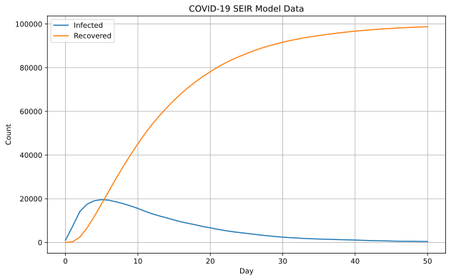
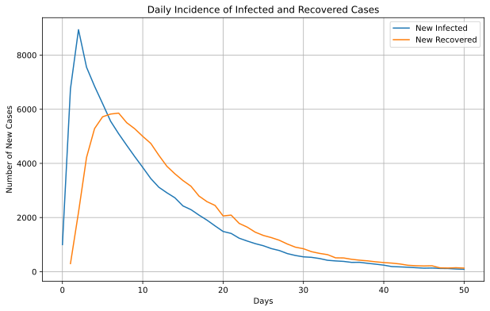
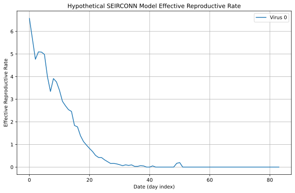
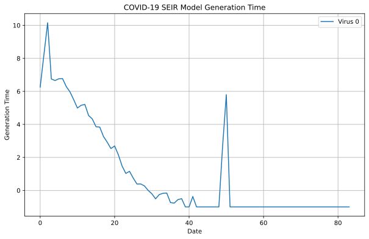

# Introduction


- [Examples](#examples)

Welcome!

This Python package is a wrapper of the C++ library
[epiworld](https://github.com/UofUEpiBio/epiworld). It provides a
general framework for modeling disease transmission using agent-based
models. Some of the main features include:

- Fast simulation with an average of 30 million agents/day per second.
- One model can include multiple diseases.
- Policies (tools) can be multiple and user-defined.
- Transmission can be a function of agents’ features.
- Out-of-the-box parallelization for multiple simulations.

This is a short introduction to epiworldpy; for complete documentation,
see the API documentation page [on the
website](https://uofuepibio.github.io/epiworldpy).

# Examples

## SIR model using a random graph

This Susceptible-Infected-Recovered model features a population of
100,000 agents simulated in a small-world network. Each agent is
connected to ten other agents. One percent of the population has the
virus, with a 70% chance of transmission. Infected individuals recover
at a 0.3 rate:

``` python
# Loading the module
import epiworldpy as epiworld
import epiworldpy.epimodels as epimodels

# Create a SIR model (susceptible, infectious, recovered).
virus = epimodels.ModelSIR(
  name              = 'hypothetical',
  prevalence        = 0.01,
  transmission_rate = 0.7,
  recovery_rate     = 0.3
)

# Adding a Small world population.
virus.agents_smallworld(n = 100000, k = 10, d = False, p = .01)

# Run for 50 days with a seed of 1912.
virus.run(50, 1912)
```

    _________________________________________________________________________
    |Running the model...
    |||||||||||||||||||||||||||||||||||||||||||||||||||||||||||||||||||||||||

    <epiworldpy._core.epimodels.ModelSIR at 0x10a52c3b0>

We can now visualize the model’s compartments/outputs:

``` python
import numpy as np
import matplotlib.pyplot as plt

# Get the data from the database
history = virus.get_db().get_hist_total()

# Extract unique states and dates; states is already unique, since epiworldpy
# encodes lists of strings as a list of unique strings ('values') and an array
# of indices ('indexes').
states = history['states']['values'][history['states']['indexes']]
dates = history['dates']
counts = history['counts']
unique_states = np.unique(states)
unique_dates = np.unique(dates)

# Remove some data that will mess with scaling
unique_states = np.delete(unique_states, np.where(unique_states == 'Susceptible'))

# Initialize a dictionary to store time series data for each state
time_series_data = {state: [] for state in unique_states}

# Populate the time series data for each state
for state in unique_states:
  for date in unique_dates:
    # Get the count for the current state and date
    mask = (states == state) & (dates == date)
    count = counts[mask][0]
    time_series_data[state].append(count)

# Start the plotting!
plt.figure(figsize=(10, 6))

for state in unique_states:
  plt.plot(unique_dates, time_series_data[state], label=state)

plt.xlabel('Day')
plt.ylabel('Count')
plt.title('COVID-19 SEIR Model Data')
plt.legend()
plt.grid(True)
plt.show()
```



Let’s plot model incidence.

``` python
import pandas as pd

# Get the data from the database.
transition_matrix = virus.get_db().get_hist_transition_matrix(False)
transition_matrix['state_from'] = transition_matrix['state_from']['values'][transition_matrix['state_from']['indexes']]
transition_matrix['state_to'] = transition_matrix['state_to']['values'][transition_matrix['state_to']['indexes']]
transition_matrix = pd.DataFrame(transition_matrix)

# Subsetting rows where states_from != states_to.
transition_matrix = transition_matrix[
  transition_matrix['state_from'] != transition_matrix['state_to']
]

# Selecting only those where counts > 0
transition_matrix = transition_matrix[
  transition_matrix['counts'] > 0
]

daily_incidence = transition_matrix.groupby(['dates', 'state_to'])['counts'].sum().unstack()

# Plot!
plt.figure(figsize=(10, 6))
plt.plot(daily_incidence.index, daily_incidence['Infected'], label='New Infected')
plt.plot(daily_incidence.index, daily_incidence['Recovered'], label='New Recovered')

plt.title('Daily Incidence of Infected and Recovered Cases')
plt.xlabel('Days')
plt.ylabel('Number of New Cases')
plt.legend()
plt.grid(True)
plt.show()
```



## SEIR model with a fully connected graph

The SEIRCONN model is similar to the SIR model but includes an exposed
state. Here, we simulate a population of 10,000 agents with a 0.01
prevalence, a 0.1 transmission rate, a 0.5 recovery rate, and 7
day-incubation period. The population is fully connected, meaning agents
can transmit the disease to any other agent:

``` python
model = epimodels.ModelSEIRCONN(
  name              = 'hypothetical',
  prevalence        = 0.01,
  n                 = 10000,
  contact_rate      = 10,
  incubation_days   = 7,
  transmission_rate = 0.1,
  recovery_rate     = 1 / 7
)

# Run for 100 days with a seed of 132.
model.run(100, 132)
```

    _________________________________________________________________________
    Running the model...
    |||||||||||||||||||||||||||||||||||||||||||||||||||||||||||||||||||||||||

    <epiworldpy._core.epimodels.ModelSEIRCONN at 0x10b4131f0>

We can get the effective reproductive number, over time, too:

``` python
reproductive_data = model.get_db().get_reproductive_number()
reproductive_data = reproductive_data[reproductive_data[:, 0] == 0]

# Start the plotting!
virus_ids = np.unique(reproductive_data[:, 0])
days = np.unique(reproductive_data[:, 1])

packs = []
for virus_id in virus_ids:
    virus_rows = reproductive_data[reproductive_data[:, 0] == virus_id]

    average_rts = []
    for d in days:
        day_rows = virus_rows[virus_rows[:, 1] == d]
        if day_rows.size == 0:
            average_rts.append(np.nan)
            continue

        average_rts.append(day_rows[:, 3].mean())

    packs.append(([days, average_rts], {'label': f"Virus {virus_id}"}))

plt.figure(figsize=(10, 6))
for pack in packs:
    plt.plot(*(pack[0]), **(pack[1]))

plt.xlabel("Date (day index)")
plt.ylabel("Effective Reproductive Rate")
plt.title("Hypothetical SEIRCONN Model Effective Reproductive Rate")
plt.legend()
plt.grid(True)
plt.show()
```



Let’s do the same for generation time:

``` python
from collections import defaultdict

generation_time = model.get_db().get_generation_time()
agents = generation_time['agents']
viruses = generation_time['viruses']
times = generation_time['times']
gentimes = generation_time['generation_times']

# Data formatting
unique_viruses = np.unique(viruses)
data = defaultdict(lambda: defaultdict(list))

for agent, virus, time, gentime in zip(agents, viruses, times, gentimes):
    data[virus][time].append(gentime)

average_data = {virus: {} for virus in unique_viruses}

for virus, time_dict in data.items():
    for time, gentime_list in time_dict.items():
        average_data[virus][time] = np.mean(gentime_list)

# Plotting
plt.figure(figsize=(10, 6))
for virus, time_dict in average_data.items():
    times = sorted(time_dict.keys())
    gentimes = [time_dict[time] for time in times]
    plt.plot(times, gentimes, label=f'Virus {virus}')

plt.xlabel('Date')
plt.ylabel('Generation Time')
plt.title('COVID-19 SEIR Model Generation Time')
plt.legend()
plt.grid(True)
plt.show()
```



## Transmission Network

This example shows how we can draw a transmission network from a
simulation. The following code simulates a population of 500 agents in a
small-world network. Each agent is connected to ten other agents. One
percent of the population has the virus, with a 50% chance of
transmission. Infected individuals recover at a 0.5 rate:

``` python
import networkx as nx
from matplotlib.animation import FuncAnimation

model = epiworld.ModelSIR(
  name           = "hypothetical",
  prevalence     = .01,
  transmission_rate = 0.5,
  recovery       = 0.5
)

model.agents_smallworld(n = 500, k = 10, d = False, p = 0.01)
model.run(50, 1912)

transmissions = model.get_db().get_transmissions()
start = transmissions['source_exposure_dates']
end = transmissions['dates']
source = transmissions['sources']
target = transmissions['targets']
days = max(end)

graph = nx.Graph()
fig, ax = plt.subplots(figsize=(6,4))

# Animation function
to_track = { source[0] }
def update(frame):
    ax.clear()

    agents_involved_today = set()
    agents_relationships_we_care_about = []

    # Get only the agents involved in the current frame.
    for i in range(len(start)):
        if start[i] <= frame <= end[i]:
            agents_involved_today.add((source[i], target[i]))

    # Get only today's agents who have some connection to agents
    # we've seen before.
    for agent in agents_involved_today:
        if agent[0] in to_track or agent[1] in to_track:
            to_track.add(agent[0])
            to_track.add(agent[1])
            graph.add_edge(agent[0], agent[1])

    # Lay and space them out.
    pos = nx.kamada_kawai_layout(graph)

    options = {
        "with_labels": True,
        "node_size": 300,
        "font_size": 6,
        "node_color": "white",
        "edgecolors": "white",
        "linewidths": 1,
        "width": 1,
    }

    # Graph!
    nx.draw_networkx(graph, pos, **options)
    ax.set_title(f"COVID-19 SEIR Model Agent Contact (Day {frame})")

ani = FuncAnimation(fig, update, frames=int(days/3), interval=200, repeat=False)
plt.figure(figsize=(10, 6))
plt.show()
```

<!-- I couldn't figure out a way to get Quarto to do animations correctly so we're
  hardcoding a GIF. -->


## Multiple Simulations

epiworldpy supports running multiple simulations using the
`run_multiple` function. The following code simulates 50 SIR models with
1000 agents each. Each agent is connected to ten other agents. One
percent of the population has the virus, with a 90% chance of
transmission. Infected individuals recover at a 0.1 rate. The results
are saved in a dataframe:

``` python
model = epimodels.ModelSIRCONN(
  name = "hypothetical",
  prevalence = 0.01,
  n = 1000,
  contact_rate = 2,
  transmission_rate = 0.9,
  recovery_rate = 0.1
)

model.run_multiple(100, 50, nthreads=2)
```

    Starting multiple runs (50)
    _________________________________________________________________________
    _________________________________________________________________________
    ||||||||||||||||||||||||||||||||||||||||||||||||||||||||||||||||||||||||| done.

## Saving Database Results

Oftentimes, especially when running multiple simulations, you may want
to save the results to disk. We have a way to ergonomically export
certain database statistics, and then write them to disk via a number of
backends, including CSV, JSON, HDF5, and Zarr.

Let’s grab the results of our previous `run_multiple` run.

``` python
# Extracting results from the database.
ans = epiworld.extract_database_results(model.get_db(), "total_hist", "transition", "reproductive")
ans["total_hist"][0:10]
```

epiworldpy supports CSV, JSON, HDF5, and Zarr for saving large
simulation results.

``` python
# CSV Backend (file per category)
write_db_results_multiple_csv(ans, base="results", directory=".")

# JSON Backend (single file)
write_db_results_json(ans, filename="results.json")

# JSON Backend (file per category)
write_db_results_multiple_json(ans, base="results", directory=".")

# Zarr Backend
write_db_results_zarr(ans, filename="results.zarr")

# HDF5 Backend
write_db_results_hdf5(ans, filename="results.hdf5")
```

In this scenario, `ans` is a dictionary of dataframes, one per requested
category. You can write your own saver, but the above are the most
common and are thus provided for you. The parameters `filename`,
`directory`, and `base` are always optional.
